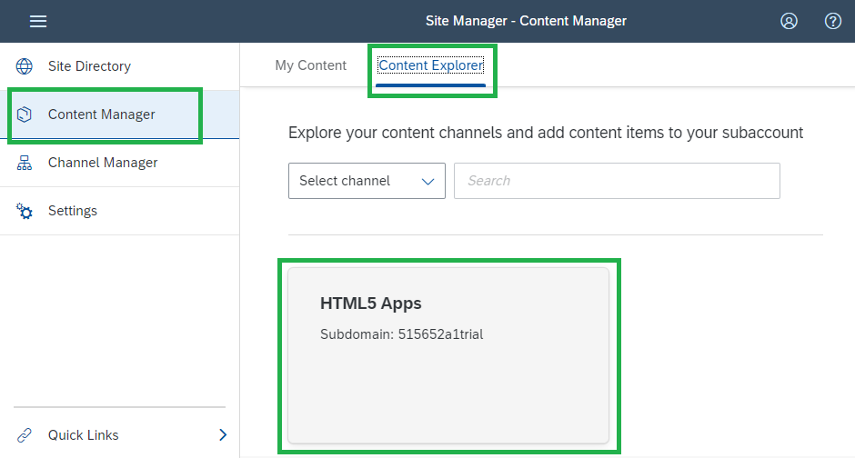
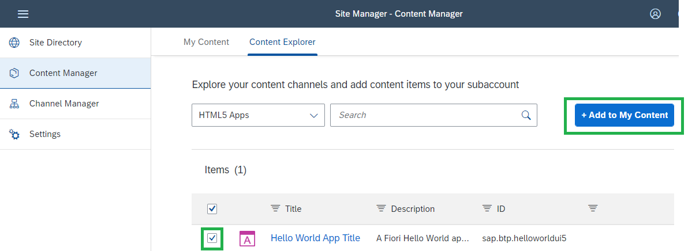
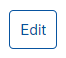
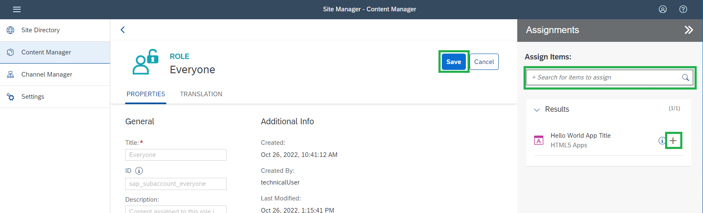

Finally you need to add your App to the Launchpad group and role.

1. Navigate to <strong>Channel Manager</strong> on the left to check your Content Providers and to <strong>refresh</strong> the list of HTML5 Applications. 
  
</li>
  
2. Click on the <strong>Content Manager</strong> and on tab <strong>Content Explorer</strong> tab, and select <strong>HTML5 Apps</strong> to see the list of HTML5 applications you have in your <strong>HTML5 Applications</strong> (the Managed Application Router provided by SAP Launchpad).   </li>
3. Select your HTML5 application which you see in the list and click the button <strong>+Add to My Content</strong>.  
  

 
4. Click on the <strong>My Content</strong tab on the top left and see your new app <strong>Hello World App Title</strong> in your content.  
  

  
<em>Note:</em> You can see the Semantic Object we defined in SAP Business Application Studio <strong>helloworld</strong> and the Action <strong>show</strong>&nbsp;in the app details <strong>Navigation</strong>. This is needed for the Launchpad integration.  </li>
5. Enter the group <strong>HelloWorldGroup</strong> you just created, click on <strong>Edit.</strong>  
  
  

  
6. Click into the <strong>Assign Items</strong> search bar.  </li>
7. After clicking <strong>into the search bar</strong>, you will see the HTML5 App <strong>Hello World App Title</strong>.  </li>
8. Click the <strong>+ button</strong> for your app  </li>
9. Don't forget to <strong>Save</strong>.  
  

  
10. Go back to Content Manager and click on the <strong>Everyone</strong> role (you can also create your company-specific roles) and click on the button <strong>Edit</strong>. 
  
   
  
11. In the <strong>Assignments</strong> section, <strong>click in the search bar</strong> and add your app with the <strong>+ button</strong>.  
  

  
12. Don't forget to <strong>Save</strong>.  </li>
13. Go to the <strong>Site Directory</strong> in the left navigation pane. Open your "HelloWorldSite". Start by clinking on it. You will see your newly created app in the Launchpad.  
  
 
  

<strong>Well done! You have successfully created a Launchpad site, giving necessary roles and groups, and added your HTML5 application to the Launchpad site  </strong>

