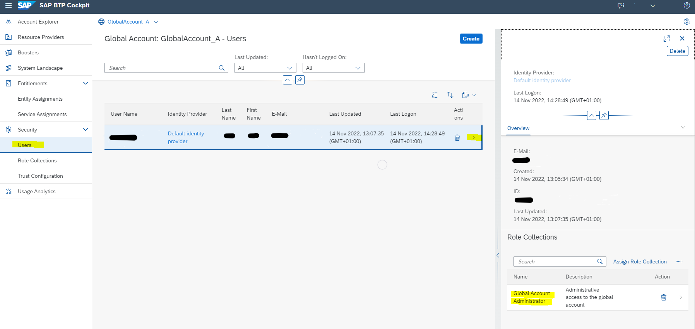

**Note:**
This step is only necessary for an Enterprise Account (e.g. pay-as-you-go Account with free-tier service plans)
SAP BTP Trial comes with preconfigured HTML5 application development.

 

**Introduction**

An SAP BTP Booster is a wizard-based UI, which automates the administration steps to set up BTP services instead of configuring all necessary services manually.
For running this HTML5 mission you need the Booster **"Prepare an Account for HTML5 development"**.

**Prerequisites Steps**

1. Open your SAP BTP Cockpit of your Global Account.
2. Make sure you have the Global Account Administrator role for your Global Account.
    Select **"Users"** in the left navigation pane, select your **user name** and click on **"Action"** in the detail view (do not click on the delete icon). A second detail view will open. 
    The "Role Collection" "Global Account Administrator" must be assigned to your user.

    

3. Select **"Boosters"** in the left navigation pane.
4. Search for the booster **"Prepare an Account for HTML5 development"**.

    

5. Select the Booster.
6. Press **"Start"**. 

7. You will see the start screen of the booster. Select the **"Components"** tab in the booster and notice the required services and subscriptions. 
8. Press **"Start"**. It will start the first step of the booster, which just checks the prerequisites.
   In case the booster step will fail, the booster execution will stop.
   In this example, we have an enterprise subscription account, with 4 missiing **entitlements**. Lets fix it.
   
9. 

9. Before proceeding to step 2, configuring the booster, please check in [SAP Discovery Center](https://discovery-center.cloud.sap/viewServices?showFilters=true&provider=all&regions=all) for which regions and infrastructures the required services are available and which one you like to choose.
