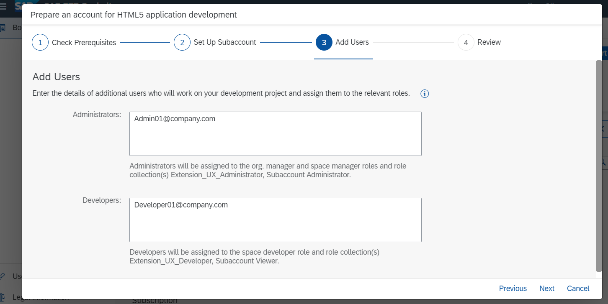

**Note:**
This step is only necessary for an Enterprise Account (e.g. pay-as-you-go Account with free-tier service plans)
SAP BTP Trial comes with preconfigured HTML5 application development.

 

### Run the Booster "Prepare an account for HTML5 application development"

**Prepare**

As shown in the previous step:
1. Login to your global SAP BTP account.
2. Select Boosters in the account menu.
3. Select the Booster "Prepare an account for HTML5 application development"
4. Click "Start"

**Execute Booster**

**`Step 1 - "Check Prerequisites"`**

As shown in the previous card, the Booster checks if you have all the entitlements and free quota that are needed to run the booster. 
If the step "Check Prerequisites" passes. Press "Next".

**`Step 2 - "Set Up Subaccount"`**

1. In this step, you create the following entries to set up your subaccount. You will select:
    * Assign a Quota for your Cloud Foundry Runtime (At least 1 unit of your service plan).
    * Subaccount name (of your choice or keep the default)
    * Preferred Infrastructure Provider 
    * Region (e.g. "Frankfurt") 
    * Subdomain name (of your choice or keep the default)
    * Cloud Foundry Organisation name (of your choice or keep the default)
    * Space name (e.g. "dev", from the typical setup with "dev", "test" and "prod")

    Note: If you do not have set an entitlement for the Continuous Integration & Delivery service it will not appear in the list. 
you can delete it if you don't want to use it. It is optional for this mission.

2. Press **"Next"**

**`Step 3 - "Add users"`**

In this step, we can add additional users as administrators and developers for the subaccount. The user who is using the Booster is added automatically as Administrator and also added as a Security Admin.

Add administrators
Add developers
Press Next.

**`Step 4 - "Review" `**

You are nearly done. Review your configuration, if everything is correct press finish.

Watch the progress screen, until it turns green for all setup steps.

When the Booster has executed successfully you will get a success window.
you can use the provided links to open your new subaccount and Business Application Studio.

