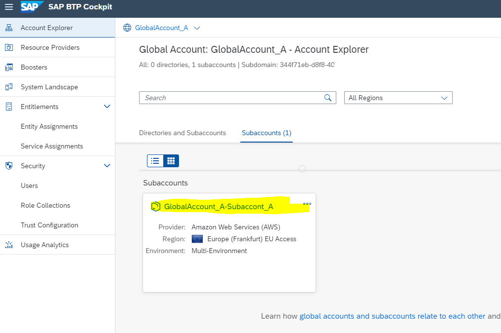
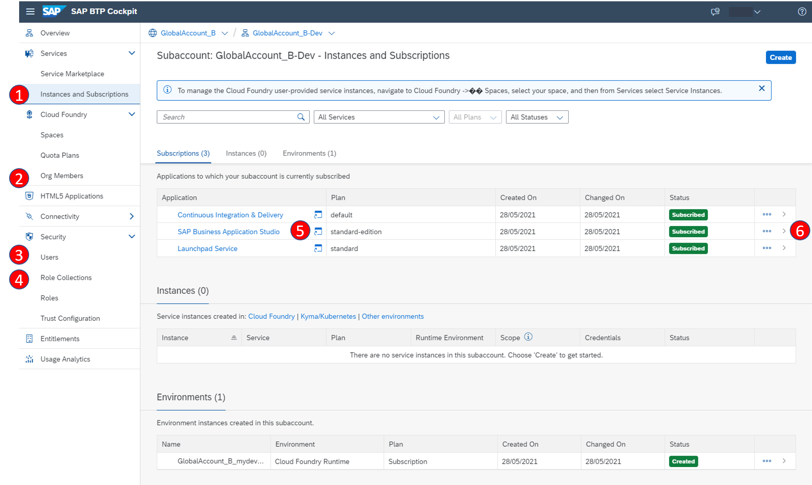

### Inspect your newly created Subaccount

You can inspect, which entities the booster created:

1. Enter your subaccount in your BTP cockpit:

2. Click "Services" in the left navigation pane and choose "Instances and Subscriptions" (#1 on the figure below). 
You should see that the following services have been subscribed:

    * SAP Business Application Studio
    * Launchpad Service
    * Continuous Integration & Delivery Service (optional)

2. Click on "SAP Business Application Studio" (#5 on the figure). This will open the BAS.

3. Click on "Launchpad Service". This will open the launchpad site.

    If you get the error message **"Access Denied"**. Your user has not been assigned the role collection "Launchpad_Admin".
Goto "Role Collections", click on "Launchpad_Admin" and assign the email address of your user

**Additional checks**

(#2 on the figure) Cloud Foundry - "Org Members":
It will list all that all users you have added as administrators with the "Organization Manager" role. Users you have added as developers have no Organization Role.

(#3 on the figure) Security - "Users":
You should see all users assigned to the subaccount. A click on the arrow adds details, including their role collections.

(#4 on the figure) Security - "Role Collections":
You can see all the role collections for the different services that are created by the Booster.
Your users must be assigned to the role collections, Subaccount Administrator, Extension_UX_Administrator, Extension_UX_Developer, and Launchpad_Admin.

