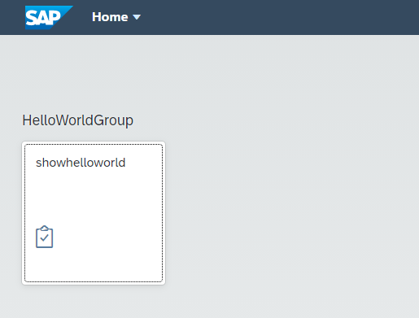

# About this Mission

You will create a simple Hello World application running on SAP Business Technology Platform (SAP BTP) leveraging SAPUI5, SAP Business Application Studio (BAS), Cloud Foundry runtime, and SAP Launchpad Service.

### SAP Fiori Freestyle and SAP Fiori Elements

In this mission you will use **SAPUI5** or **SAP Fiori freestyle**,  gives you complete flexibility about your application. For each screen, you have to write  JavaScript UI code, which may be time-consuming.

You will not use **SAP Fiori elements** in this tutorial, which uses standard templates for creating applications to increase developer efficiency considerably. 

### Steps in this Mission

This mission includes the following steps:

* Setup of **SAP BTP** account and subaccount - to give you access to the SAP BTP Cockpit administration interface

* Setup of **SAP Launchpad Service** - to give you access to create and configure the central point of entry for your users

* Setup of **SAP Business Application Studio** - to give you access to the development environment

* **Create** a simple HelloWorld app

* **Deploy** the HelloWorld app

* **Integrate** the app into the SAP Build Work Zone 

This is what the result will look like in SAP Build Work Zone:

