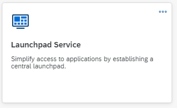
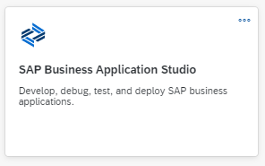

# Discover the Services used in this Mission

Learn more about the services used in this mission.

## SAPUI5

SAPUI5 is a JavaScript application framework designed to build cross-platform, responsive, enterprise-ready applications.

* [Get Started: Setup, Tutorials, and Demo Apps on ui5.sap.com](https://ui5.sap.com/#/topic/8b49fc198bf04b2d9800fc37fecbb218)
* [UI5 flexibility for key users in Service Catalog](https://discovery-center.cloud.sap/serviceCatalog/ui5-flexibility-for-key-users?region=all)

## SAP Fiori

SAP Fiori is a design system that provides a consistent user experience for SAP software across platforms and devices.  
It is at the core of SAP’s product experience and design strategy. 

* [SAP Fiori Overview: Design, Develop and Deploy on openSAP](https://open.sap.com/courses/fiori3)
* [The enterprise user experience, reimagined on sap.com](https://www.sap.com/products/fiori.html)
* [SAP Fiori Design Guidelines](https://experience.sap.com/fiori-design-web/) 

## SAP Build Work Zone

SAP Build Work Zone enables organizations to establish a central point of access to SAP, custom-built, and third-party applications and extensions, both on the cloud and on-premises. 
Utilize the SAP Build Work Zone Service to create your own Work Zone, featuring role-based and personalized business content that is accessible via both desktop and mobile devices.

* [SAP Fiori Launchpad – Overview](https://experience.sap.com/fiori-design-web/launchpad/)
* [What Is Launchpad Service?](https://help.sap.com/viewer/8c8e1958338140699bd4811b37b82ece/Cloud/en-US/9db48fa44f7e4c62a01bc74c82e74e07.html)
* [Launchpad Service in Service Catalog](https://discovery-center.cloud.sap/serviceCatalog/launchpad-service?region=all)

## SAP Business Application Studio

SAP Business Application Studio is based on Code OSS, an open-source framework used for building Visual Studio Code. It is available as a cloud service, providing developers with a desktop-like experience similar to market-leading IDEs while accelerating time-to-market with high-productivity development tools, including wizards and templates, graphical editors, quick deployment, and more.

* [What is the SAP Business Application Studio?](https://help.sap.com/docs/SAP%20Business%20Application%20Studio/9d1db9835307451daa8c930fbd9ab264/8f46c6e6f86641cc900871c903761fd4.html)
* [SAP Business Application Studio in Service Catalog](https://discovery-center.cloud.sap/serviceCatalog/business-application-studio?region=all)

