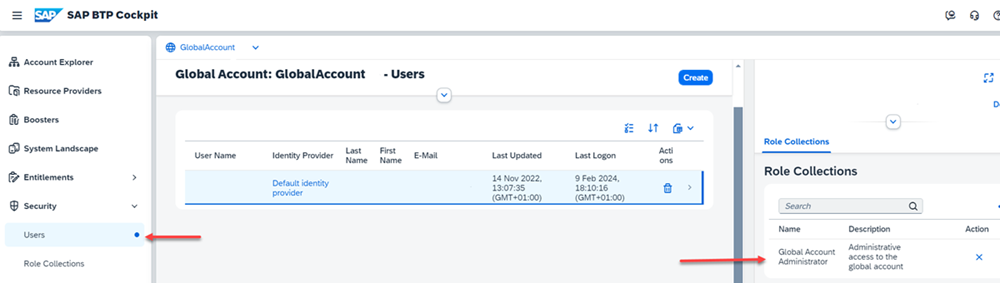

# Prerequisites

For this mission, you need either an **SAP BTP trial account** or an **SAP BTP Enterprise Account**. 

You can get an Enterprise Account following the guide [Get an Enterprise Account](https://help.sap.com/docs/btp/sap-btp-neo-environment/get-enterprise-account?locale=en-US). 

We will guide you to get a Trial Account later in this mission.

Optional: To run the **SAP Continuous Integration and Delivery** service, you will also need a public GitHub (Enterprise) account (e.g. at https://github.com/ )

### SAP BTP Enterprise Account

For your enterprise account, you will need the entitlements for

* SAP Business Application Studio 
* SAP Build Work Zone service 
* SAP Continuous Integration and Delivery service (optional if you want to try CI/CD)
* Cloud Foundry Runtime (if you want to deploy your HTML5 app to SAP BTP Cloud Foundry)
* An existing SAP Cloud Identity Services - Identity Authentication

If you are using a cloud-credit-based SAP BTP account, the entitlements are already in place. However, be aware that you will consume cloud credits if you do not use free-tier service plans.

If you are using a subscription-based SAP BTP account, you will have to configure the entitlements for your Subaccount.

SAP Business Application Studio, SAP BTP, Cloud Foundry Runtime, SAP Build Work Zone service, and SAP Continuous Integration and Delivery service will be set up manually. To use them, follow the set-up guide for Enterprise Accounts in this mission.

You will need SAP BTP global account administrator privileges in your enterprise account.

### SAP Cloud Identity Services

SAP Cloud Identity Services - Identity Authentication is the central service for authentication, single sign-on, and user management in SAP cloud solutions.

Note: This topic applies only to subscriptions created before March 20th, 2025. If you created a subscription after this date, a connection to Identity Authentication exists by default, so there is no need to read further—you can skip this procedure. For more information, see (external link to SAP Help Portal): [Switching to SAP Cloud Identity Services - Identity Authentication](https://help.sap.com/docs/build-work-zone-standard-edition/sap-build-work-zone-standard-edition/switching-to-sap-cloud-identity-services-identity-authentication?locale=en-US).

If you need guidance for setting up SAP Cloud Identity Services, see the SAP Discovery Center mission [Get Started with SAP BTP - Cloud Identity Service Provider (SAP IdP)
](https://discovery-center.cloud.sap/missiondetail/4325/4605/).

### SAP BTP Trial Account

The [SAP BTP Trial Account](https://account.hanatrial.ondemand.com/trial/#/home/trial) has entitlements for the Cloud Foundry runtime environment, Business Application Studio (development environment), SAP Work Zone service, and Continuous Integration & Delivery (CI/CD) service.

SAP Business Application Studio and SAP BTP, Cloud Foundry Runtime will be pre-configured.

The SAP Build Work Zone service and SAP Continuous Integration and Delivery service must be set-up manually. To use it follow the set-up guide for Trial Accounts in this mission.

### Prerequisite Global Account Administrator

Make sure you have the Global Account Administrator role for your Global Account.

1. Open your SAP BTP Cockpit of your Global Account.

2. Select **"Users"** in the left navigation pane, and click on your **User Name**. 

    A detail view will open. The "Role Collection" **Global Account Administrator** must be assigned to your user.

    
