# Enable Cloud Foundry Runtime in your Subaccount

The SAP BTP, Cloud Foundry runtime lets you deploy cloud-native cloud foundry applications and run them on the SAP BTP Cloud Foundry environment.

For example, you developed a SAPUI5 or Fiori application in your Business Application Studio (BAS) and you want to deploy it to SAP BTP and run it there.

### Use Existing or Create New Subaccount

You can enable an existing Subaccount in your BTP Global Account or create a new Subaccount. 

If you want to create a new Subaccount follow this procedure:

1. Enter your Global Account --> Account Explorer.

    Select "Create".

    Choose "Subaccount"

    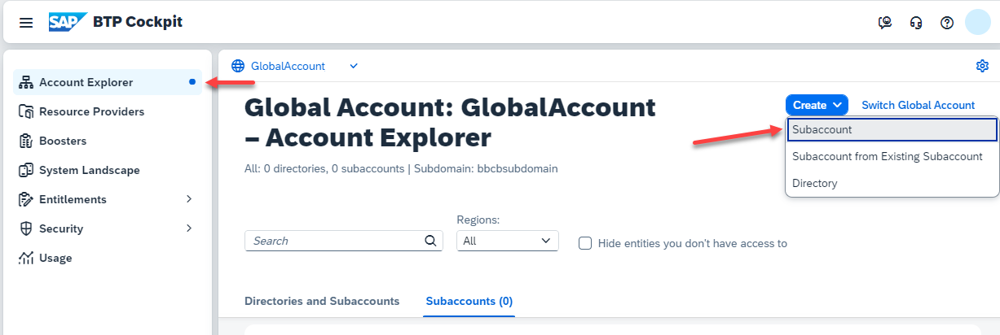

2. Provide a name for the Subaccount, the Region (choose carefully) and Subdomain.

    Choose "Create".

    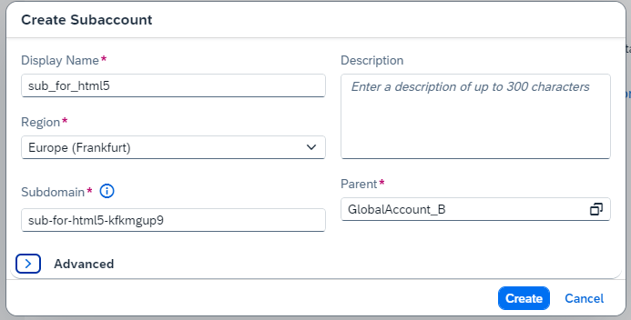

3. A new Subaccount will be created. You can enter the Subaccount by clicking the tile.

    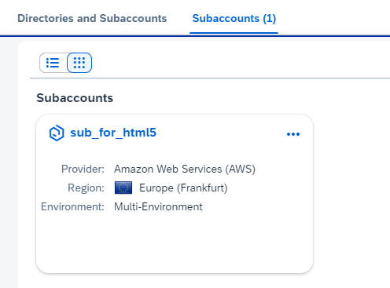

 

### Enable Cloud Foundry Runtime

1. Enter your subaccount and stay on "Overview".

    Click "Enable Cloud Foundry"

    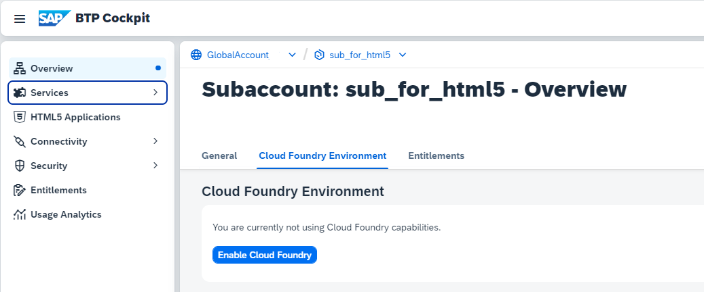

2. Provide the configuration for Cloud Foundry Runtime:

    - Service Plan ("standard")
    - Select the Landscape

        Some regions provide "Sub-Landscapes" for technical reasons. Choose your Landscape depending on your Subaccount, commercial model and region.

        For example, if your Subaccount is on eu-10 and your commercial model is "Subscription", choose eu-10-004 as cloud foundry landscape, in order to get enough free "Quota" on this landcsape.

        If your Subaccount is on eu-10 and your commercial model is "consumption based", choose eu-10 as cloud foundry landscape, you don`t need to maintain quota manually.

    - Provide an "Instance Name" 
    - Provide an Cloud Foundry "Org Name". 

    Choose "Create"
    
    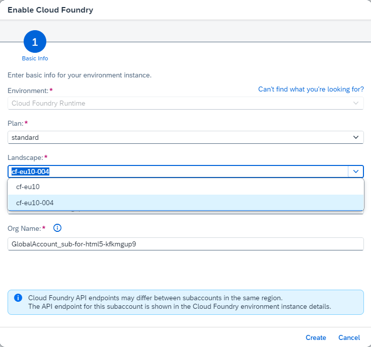

    The Cloud Foundry Org will be created.

3. Choose "Create Space"

    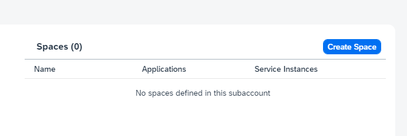

4. Provide Space Name and Roles.

    Choose "Create"

    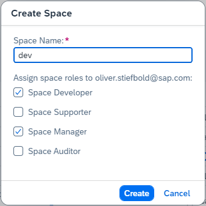

5. A Cloud Foundry Space will be created.

    Click on your Cloud Foundry Space.

    You will be forwarded to your empty CF Space "dev".

### Provide Cloud Foundry Runtime Quota (only Subscription based Accounts)

1. Navigate in your Subaccount to "Entitlements".

    Search for "Cloud Foundry".

    If you don´t have any Quota yet, click on "Edit".

    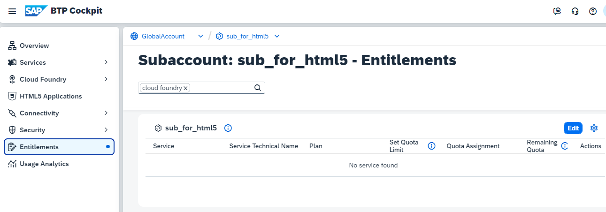

2. Click on "Add Service plans"

    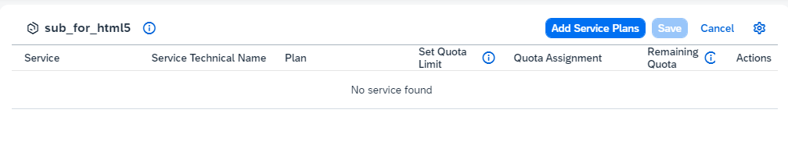

3. Search for Cloud Foundry in the pop up window.

    Select Cloud Foundry Runtime and select "Memory" as Plan.

    (Cloud Foundry Environment is for "build-code" development scenarios)

    Choose "Add 1 Service Plan".

    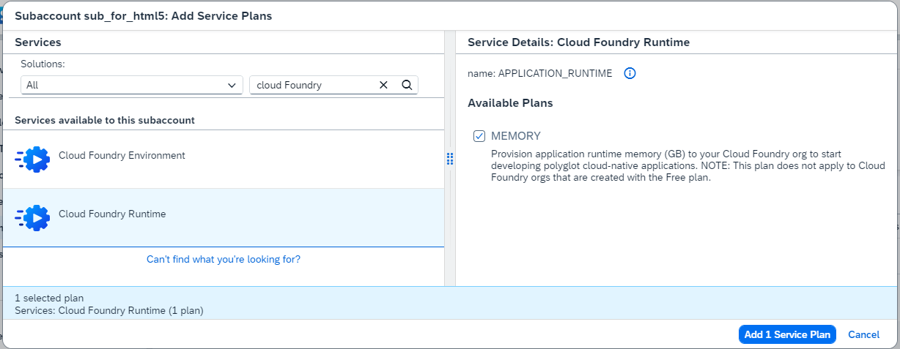

4. Increase the quota to your needs and **Save**.

    Typically one deployed CF applications needs 1 quota.

    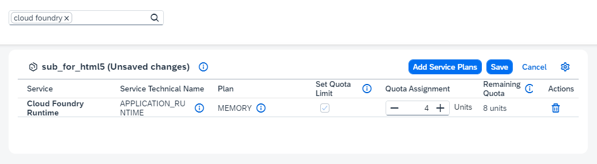
