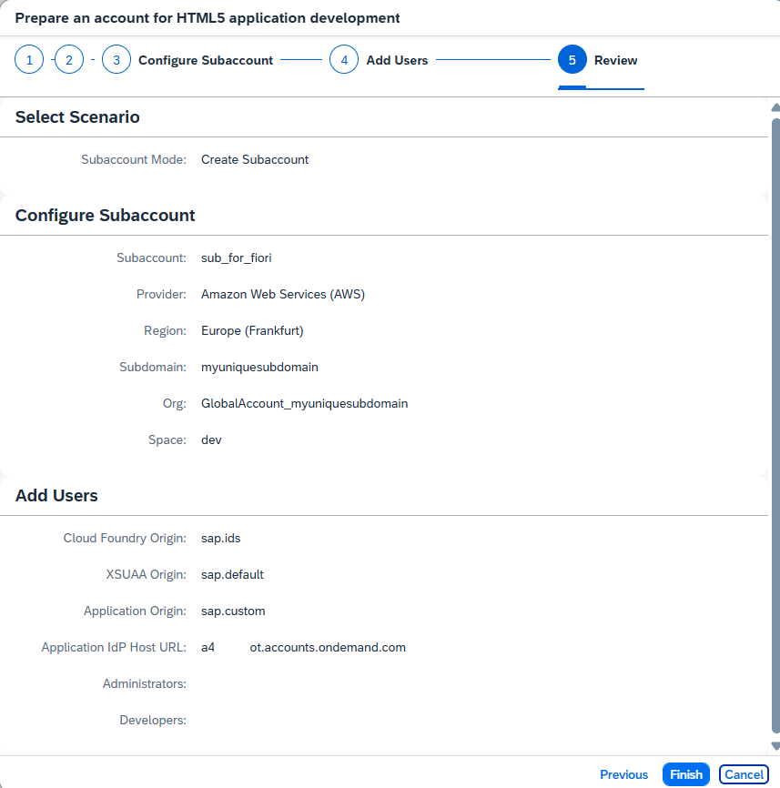
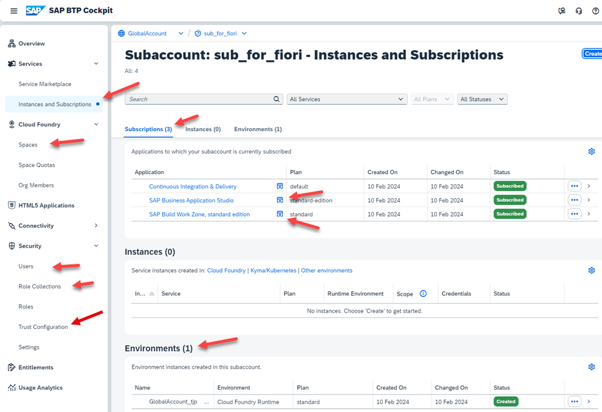

# Setup your Enterprise Account for HTML5 Development

This step is only necessary for Enterprise Accounts. 

SAP BTP Trial comes with a pre-configured HTML5 application development.

### Prerequisites 

Make sure you have the Global Account Administrator role for your Global Account.

1. Open your SAP BTP Cockpit of your Global Account.

2. Select **"Users"** in the left navigation pane, and click on your **User Name**. 

   A detail view will open. The "Role Collection" **Global Account Administrator** must be assigned to your user.

    

### Run Booster Prepare an Account for HTML5 development
 
A Booster is a wizard-based UI, which automates the administration steps to set up BTP services instead of configuring all necessary services manually.

For this mission you run the Booster "Prepare an Account for HTML5 development".

1. Open your Global Account and select **Boosters** in the left-handed navigation pane.

2. Search for the booster **Prepare an Account for HTML5 development**.

    

3. Select the Booster and click **Start**. 

4. You will see the start screen of the booster. Select the **Components** tab in the booster and notice the required services and subscriptions. 

    

5. Press **Start**. It will start the first step of the booster

### Booster Step 1: Check Prerequisites

The Booster will check the required entitlements of your Global Account for executing the Booster.

1. **Option 1 - Booster passes**

    If all prerequisites are full-filled, you will get a success message
    
    

2. **Option 2 - Booster fails**

    In case the booster step 1 fails, the booster execution will stop.

    Click on the red **"Failed"** button to see the root cause.

    

    In this example you miss all 4 required **entitlements** for the booster. 

    (Note: Continuous Integration & Delivery service is optional)

    This can be the case if you own an enterprise subscription account and you did not order the necessary subscriptions.    
 
 
  

3. **Option 3 - Booster Warning**

    In case, you do not have the Continuous Integration & Delivery Application, you will get a warning, which you can ignore. It is optional for this mission.
    
    
    

###  Booster Step 2: "Set Up Subaccount"

In this step, you create the following entries to set up your subaccount. You will select:

- Assign a Quota for your Cloud Foundry Runtime (at least 1)
- Subaccount name (user-defined or keep the default)
- Preferred Infrastructure Provider 
- Region (e.g. "Frankfurt") 
- Subdomain name (user-defined or keep the default)
- Cloud Foundry Organization name (user-defined or keep the default)
- Space name (e.g. "dev", from the typical setup with "dev", "test" and "prod")

Note: If you do not have set an entitlement for the Continuous Integration & Delivery service it will not appear in the list. You can delete it if you don't want to use it. It is optional for this mission.

Press **Next** when finished.

### Booster Step 3: "Add users"

In this step, we can add additional users as administrators and developers for the subaccount.  
The user who is using the Booster is added automatically as Administrator and also added as a Security Admin.

* Add administrators
* Add developers

Press **Next**, when finished.

### Booster Step 4: "Review" and Execute

You are nearly done. Review your configurations, if everything is correct, click **"Finish"**. 

The booster will start. Watch the progress screen, until it turns green for all setup steps.

When the Booster has executed successfully you will get a success window. 

You can use the provided links to open your new subaccount and Business Application Studio.

### Enter your new Subaccount

You can check which entities the booster created:

1. Enter your subaccount in your BTP cockpit:

    

2. Click "Services" --> "Instances and Subscriptions" in the left navigation pane.
   
    The following services have been subscribed:

    - SAP Business Application Studio
    - Launchpad Service
    - Continuous Integration & Delivery Service (optional)

    and a Cloud Foundry Environment has been created.

   

2. Click on "SAP Business Application Studio". This will open the BAS.

3. Click on "Launchpad Service". This will open the launchpad site.

   If you get the error message **"Access Denied"**, your user has not been assigned the role collection "Launchpad_Admin".

   Go to "Users", click on your user and assign the "Role Collection" "Launchpad Admin".

4. Click on "Cloud Foundry" --> "Spaces".
   
    You will see your CF space dev. Click on it to enter it.

5. Click on "Security" --> "Users".
    
    You should see all users assigned to the subaccount. A click on the arrow adds details, including their role collections.

6. Click on "Security" - "Role Collections":
    
    You can see all the role collections for the different services the booster created. 

