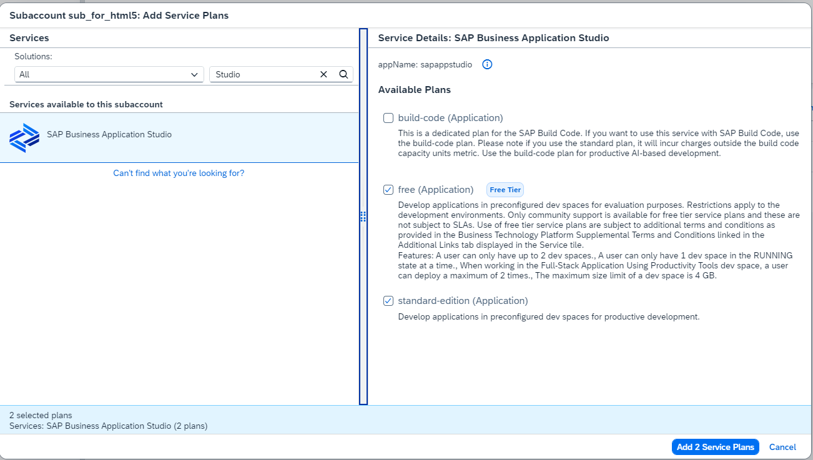
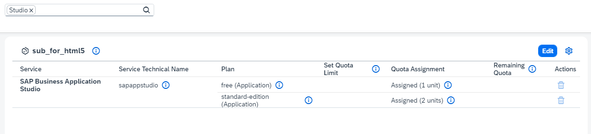
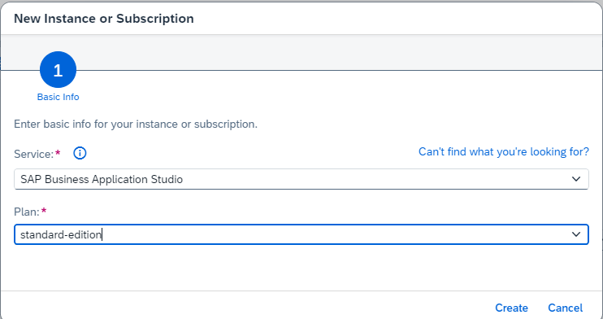
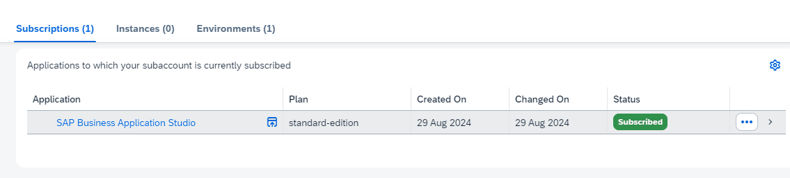
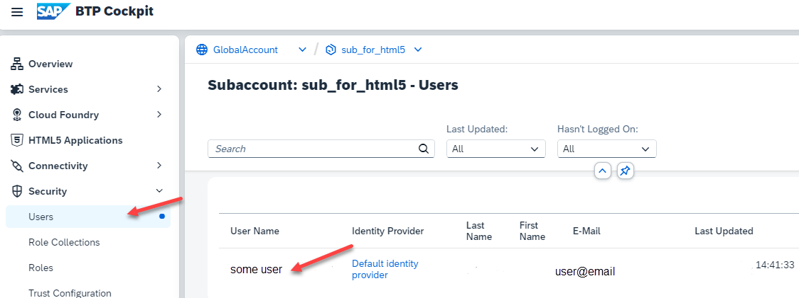
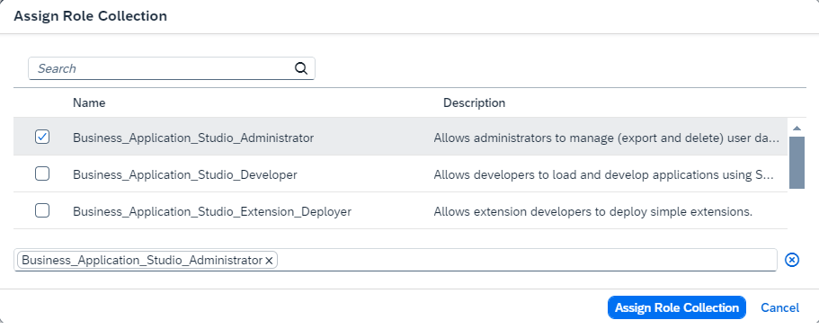
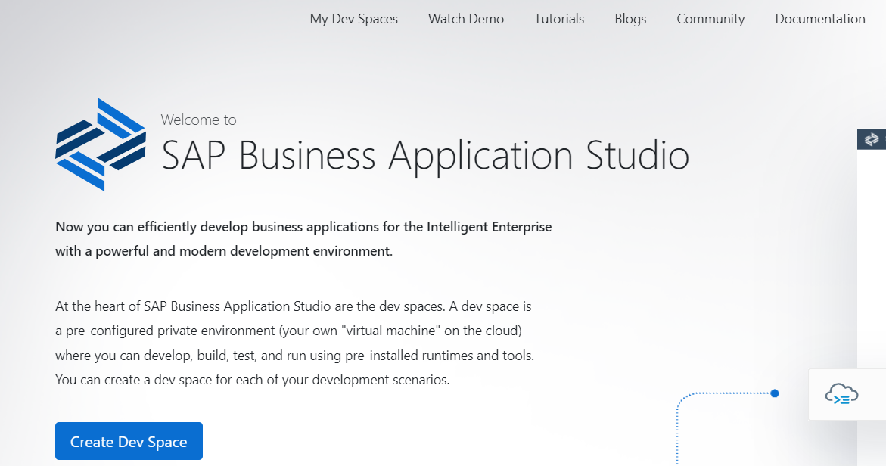

# Setup SAP Business Application Studio

SAP Business Application Studio (BAS), the next generation of SAP Web IDE is available as a cloud service. It provides developers a desktop-like experience similar to market leading IDEs with development tools such as wizards and templates, graphical editors, quick deployment, and more.

### Check and Set your Subaccount Entitlements

In case you run the commercial model "subscription you might need to entitle your Subaccount.

Note: You can only entitle your Subaccount, if you are entitled for SAP BAS in your Global Account.

1. Got to your Subaccount, where you want to deploy your BAS service.

    Goto "Entitlements" and search for "Studio".

    If your Subaccount is not entitled yet, select "Edit" --> "Add Service Plans"

    

2. Search for "Studio", select BAS and add your required service plans.

    Select "Add ... Service Plans" and dont forget to **save**.

    

3. You are entitled to use BAS in your Subaccount.

    

### Create an Business Application Studio Subscription

1. Navigate to your Subaccount.

    Select "Services" --> "Instances and Subscriptions" and choose "Create"

    

2. Choose Business Application Studio as Service and your Service plan. 

    Select "Create". Your BAS subscription will be created.

    

3. Click on the small icon to access your BAS.

    Access will be denied, because of missing authorizations/role collections of your user.

    

4. Go to to your Subaccount --> "Security" --> "Users" and select your User.

    

5. Scroll down to "Role Collections" and select "Assign Role Collection".

    Select at least "Business_Application_Studio_Administrator" Role Collection and "Assign Role Collection"

    

6. Refresh the cache of your Browser completely (easiest way is to close the browser and open it again).

7. Go back to your Subaccount --> "Services" --> "Instances and Subscriptions" and click your BAS entry again.

   You should see the BAS Welcome Page.

   You are now able to create a "Dev Space" in your SAP Business Application Studio. You will do this later in this mission.

   

