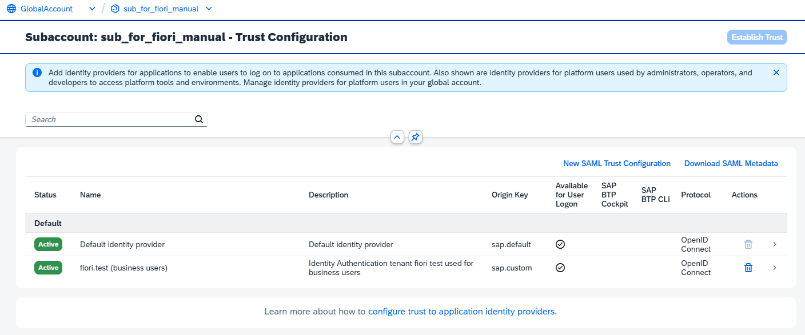
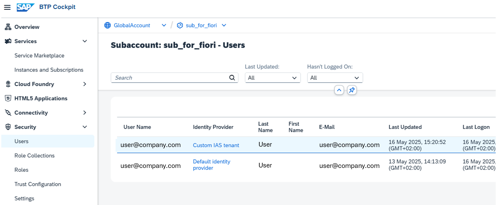
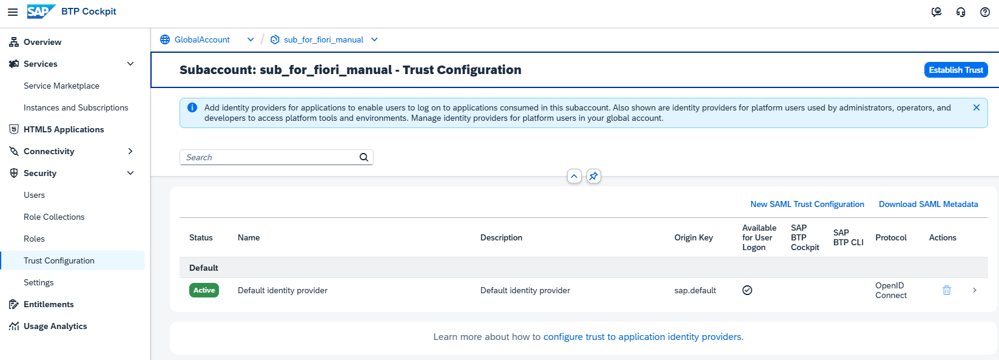
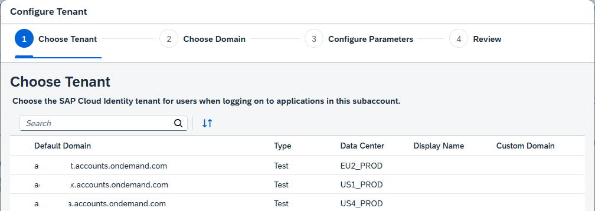
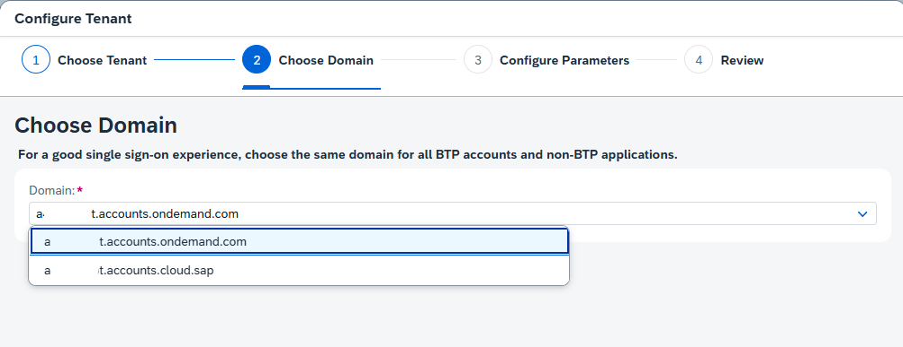
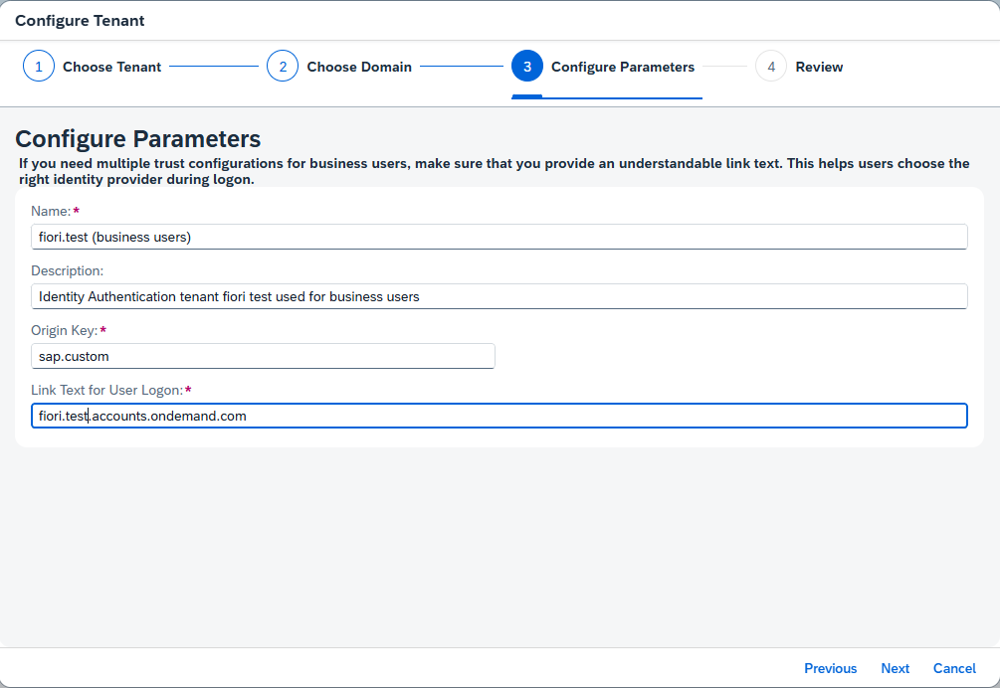
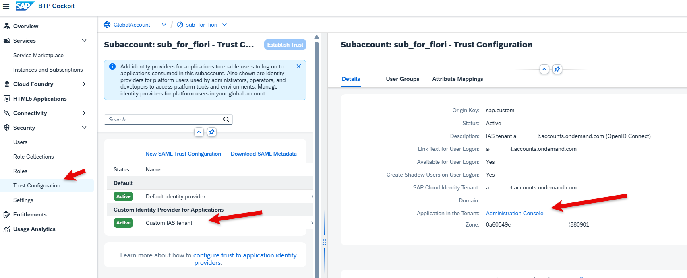

# Setup SAP Cloud Identity Services for SAP Build Work Zone in your Enterprise Account

SAP Build Work Zone enables you to easily create business sites that provide centralized access to applications, such as the Hello World app you will create.

## Prerequisites

You need a Cloud Identity Services tenant (Identity and Authentication service, IAS). If you don't have one, create one first. If you need help creating one, refer to the "Get Started with SAP BTP—Cloud Identity Service Provider" mission in the Discovery Center.

### Check the Trust Configuration in your Subaccount

SAP Build Work Zone needs a Trust Configuration for your Identity Provider. In this example, you use BTP Cloud Identity Services.

1. Open your Global Account and your Subaccount for Fiori.
2. Open "Security" --> "Trust Configuration".
3. The "Default Identity Provider" is the Provider from the BTP platform, used for the Subaccount Administrator.
4. The "Custom IAS tenant" (or any other name for your custom IAS) is the identity provider for your SAP Build Work Zone service.

    

5. You can also check the custom IAS configuration for your user.

    

If you don't have a custom IAS yet, create one in the next step.

### Create a Trust Configuration in your Subaccount

Create a Trust Configuration for your custom IAS service.

1. Open your Global Account and your Subaccount for Fiori.
2. Open "Security" --> "Trust Configuration".
3. Click "Establish Trust". A wizard pop-up will open.

    

4. If you have more than one custom IAS tenant, select the tenant you want to use.

    
   
5. If you have more than one domain, select the domain you want to use.

    

6. Configure the parameters, for example, as shown in the image. If you need help, see SAP Help Portal [Trust and Federation with Identity Providers](https://help.sap.com/docs/btp/sap-business-technology-platform/trust-and-federation-with-identity-providers?locale=en-US)

    

7. Press "Next", review your parameters, and press "Finish".
8. The Trust Configuration will be created.

    

9. Check your Custom IAS. Click on "Custom IAS tenant". Click on "Administration Console".

   Your Custom IAS should open, and if you have the privileges, you can see the Cloud Services Administration console.

    

10. Check your user for the custom IAS. Go to "Security" --> "Users".

     A user for your custom IAS should have been created. If not, create one. Click on both users to see the details. The default user should have the Subaccount Administrator Role Collection. 
     The custom IAS user should be empty if it has just been created (you will assign the Launchpad Admin later).
    
     

    

You are now ready to set up your Subaccount for HTML5 development, either with a Booster or manually.
