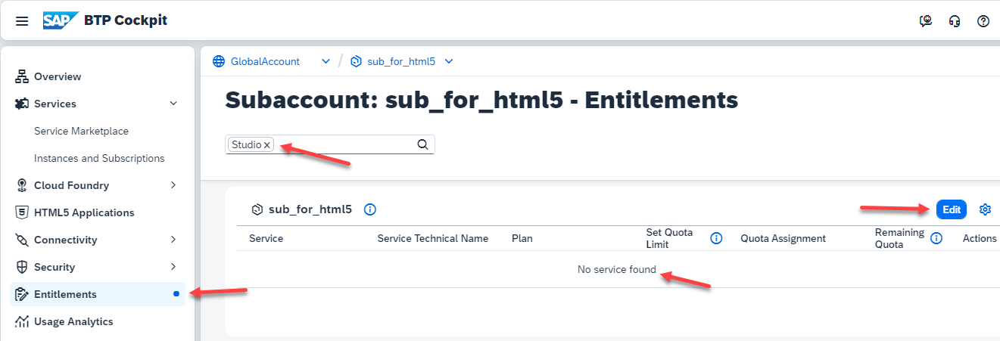
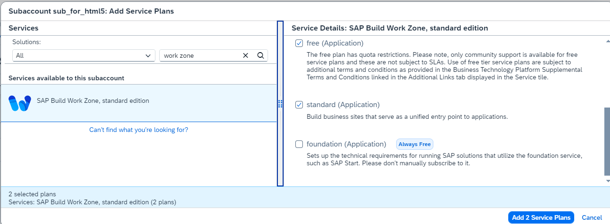
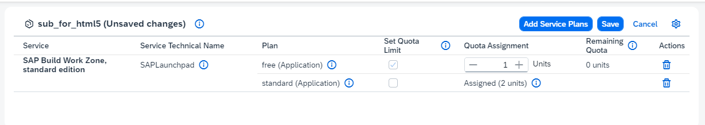
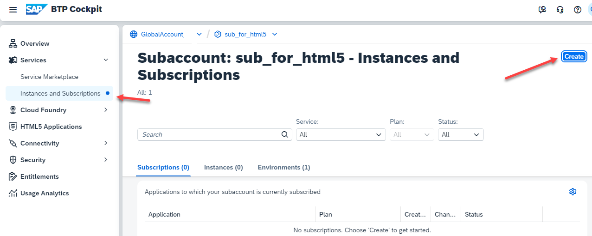
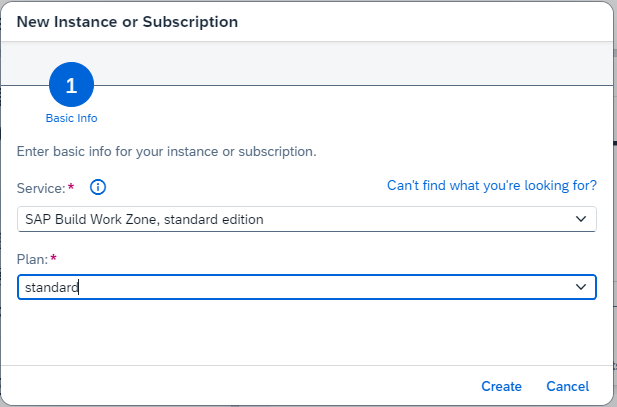
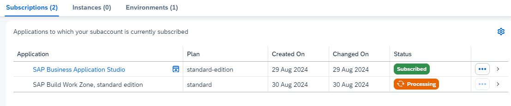
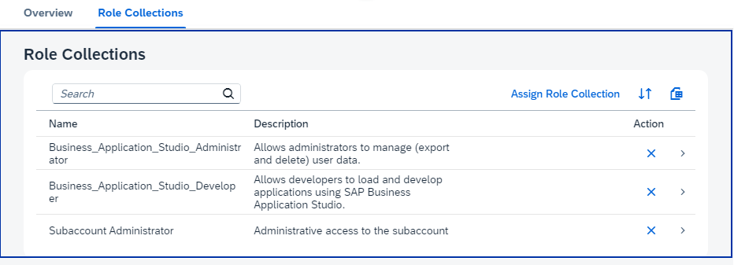
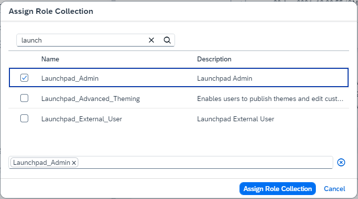
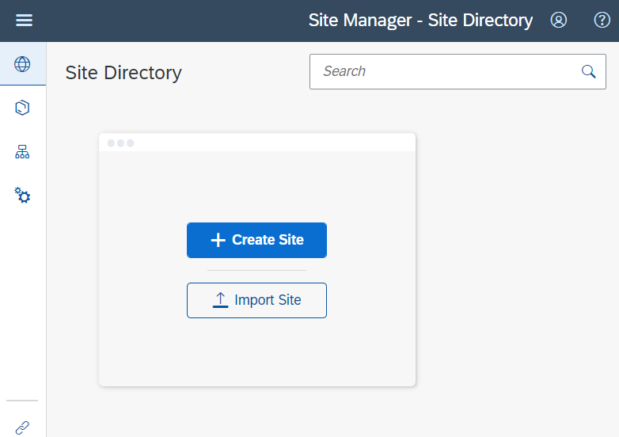

# Setup SAP Build Work Zone Service in your Enterprise Account

SAP Build Work Zone enables you to easily create business sites that provide centralized access to applications, such as the Hello World app you will create.

## Prerequisites

You need an entitlement for the "SAP Build Work Zone, standard edition" service in your Global Account.

You need a Cloud Identity Services tenant (Identity and Authentication service, IAS). If you don't have one, create one first. If you need help creating one, refer to the "Get Started with SAP BTP—Cloud Identity Service Provider" mission in the Discovery Center.

   

### Check and Set your Subaccount Entitlements

In case you run the commercial model "subscription you might need to entitle your Subaccount.

Note: You can only entitle your Subaccount if you are entitled to the SAP Build Work Zone in your Global Account.

1. Go to your Subaccount, where you want to deploy your Build Work Zone service.

    Go to "Entitlements" and search for "Build Work Zone".

    If your Subaccount is not entitled yet, select "Edit" --> "Add Service Plans".

    

2. Search for "Studio", select SAP Build Work Zone, and add your required service plans.

    Select "Add ... Service Plans".

    

3. You are entitled to use SAP Build Work Zone in your Subaccount.

    Do not forget to **Save**.

    

### Subscribe to the SAP Build Work Zone Service

1. Go to your trial subaccount, navigate to "Services" --> "Instances and Subscriptions" and choose "Create".

    

2. Select "SAP Build Work Zone, standard edition" as the Service and select "Subscription" as the service plan.

    

3. The Subscription for SAP Build Work Zone will be created.

    This takes a minute for this service.

    

4. Click on the Build Work Zone Subscription or on "Go to Application". 

    A new window will open with the message "Access Denied."

    You need to add the missing Role Collection "Launchpad_Admin" to your user. 

    The required role collections have already been created as part of the subscription to the Launchpad Service.

5. Navigate in the left-handed navigation pane of the BTP Cockpit to **Security --> Users**. Click on users.

    In a new account, you will primarily see your own user profile. Click on your user. 

6. Click on "Assign Role Collection".

    

7. Assign at least this Role Collection:

    - Launchpad_Admin

    Click "Save".

    

8. Go back to "Services" --> Instances and Subscriptions" and click "SAP Build Work Zone, standard edition" again. 

    The browser still caches the old authorization information. Refresh the cache completely or close your browser and reopen it.

    The Work Zone Site Manager should open.  

    

