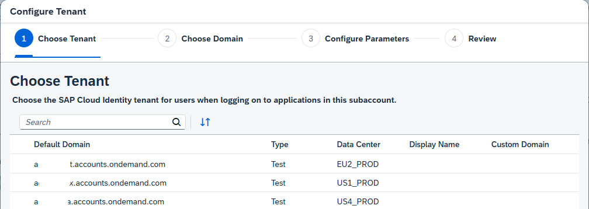
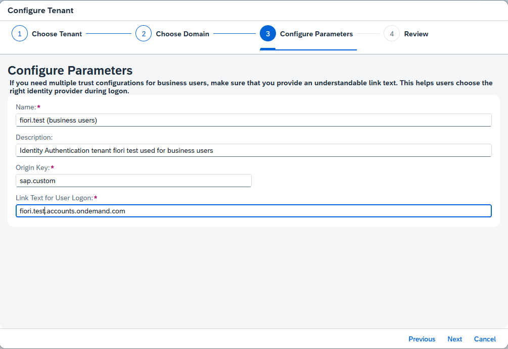

# Setup SAP Build Work Zone Service in your Enterprise Account

SAP Build Work Zone enables you to easily create business sites that provide centralized access to applications, such as the Hello World app you will create.

## Prerequisites

You need an entitlement for SAP SAP Build Work Zone, standard edition service in your Global Account

You need a Cloud Identity Services tenant (Identity and Authentication service, IAS). If you don't have one, create one first. If you need help creating one, see the mission "Get Started with SAP BTP—Cloud Identity Service Provider" in the Discovery Center.

### Check the Trust Configuration in your Subaccount

SAP Build Work Zone needs a Trust Configuration for your Identity Provider. In this example, you use BTP Cloud Identity Services.

1. Open your Global Account and your Subaccount for Fiori.
2. Open "Security" --> "Trust Configuration"
3. The "Default Identity Provider" is the Provider from the BTP platform, used for the Subaccount Administrator.
4. The "Custom IAS tenant" (or any other name for your custom IAS) is the identity provider for your SAP Build Work Zone service.

    

5. You can also check the custom IAS configuration for your user.

    

If you don't have a custom IAS yet, create one in the next step.

### Create a Trust Configuration in your Subaccount

Create a Trust Configuration for your custom IAS service.

1. Open your Global Account and your Subaccount for Fiori.
2. Open "Security" --> "Trust Configuration"
3. Click "Establish Trust". A wizard pop-up will open.

    

4. If you have more than one custom IAS tenant, select the tenant you want to use.

    
   
5. If you have more than one domain, select the domain you want to use.

    

6. Configure the parameters, for example, as shown in the image. If you need help, see SAP Help Portal [Trust and Federation with Identity Providers](https://help.sap.com/docs/btp/sap-business-technology-platform/trust-and-federation-with-identity-providers?locale=en-US)

    

7. Press "Next", review your parameters, and press "Finish".
8. The Trust Configuration will be created.

    

9. Check your Custom IAS. Click on "Custom IAS tenant". Click on "Administration Console".

   Your Custom IAS should open, and if you have the privileges, you can see the Cloud Services Administration console.

    

10. Check your user for the custom IAS. Go to "Security" --> "Users".

     A user for your custom IAS should have been created. If not, create one. Click on both users to see the details. The default user should have the Subaccount Administrator Role Collection. 
     The custom IAS user should be empty if just created (you will assign the Launchpad Admin later).
    
     

     

### Check and Set your Subaccount Entitlements

In case you run the commercial model "subscription you might need to entitle your Subaccount.

Note: You can only entitle your Subaccount if you are entitled to the SAP Build Work Zone in your Global Account.

1. Go to your Subaccount, where you want to deploy your Build Work Zone service.

    Go to "Entitlements" and search for "Build Work Zone".

    If your Subaccount is not entitled yet, select "Edit" --> "Add Service Plans"

    

2. Search for "Studio", select SAP Build Work Zone, and add your required service plans.

    Select "Add ... Service Plans".

    

3. You are entitled to use SAP Build Work Zone in your Subaccount.

    Do not forget to **Save**.

    

### Subscribe to the SAP Build Work Zone Service

1. Go to your trial subaccount, navigate to "Services" --> "Instances and Subscriptions" and choose "Create".

    

2. Select "SAP Build Work Zone, standard edition" as Service and select "Subscription" as service plan.

    

3. The Subscription for SAP Build Work Zone will be created.

    This takes a minute for this service.

    

4. Click on the Build Work Zone Subscription or on "Go to Application". 

    A new window will open with "Access Denied".

    You need to add the missing Role Collection "Launchpad_Admin" to your user. 

    The required role collections have been already created with the subscription to the Launchpad Service.

5. Navigate in the left handed navigation pane of the BTP Cockpit to **Security --> Users**. Click on users.

    In a new account you will basically see your own user. Click on your user. 

6. Click on "Assign Role Collection".

    

7. Assign at least this Role Collections:

    - Launchpad_Admin

    Click "Save".

    

8. Go back to "Services" --> Instances and Subscriptions" and click "SAP Build Work Zone, standard edition" again. 

    The browser still caches the old authorization infos. Refresh the cache completely or close your browser and reopen it.

    The Work Zone Site Manager should open.  

    

