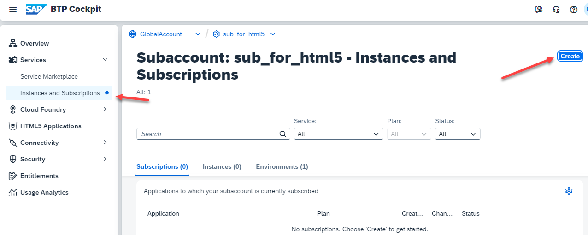
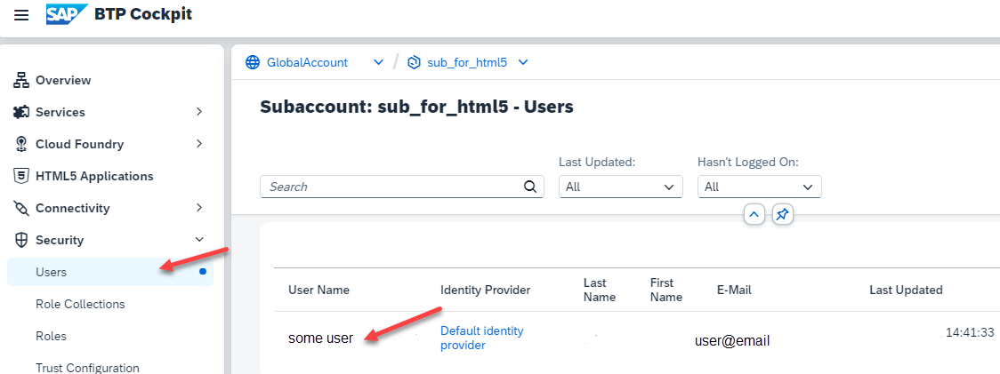

# Setup SAP Continuous Integration and Delivery

Note: Optional. You can also run this mission without using Continuous Integration and Delivery (CICD).

[SAP Continuous Integration and Delivery](https://discovery-center.cloud.sap/serviceCatalog/continuous-integration--delivery?region=all) lets you configure and run predefined continuous integration and delivery (CI/CD) pipelines that automatically build, test, and deploy your code changes to speed up your development and delivery cycles.

### Check and Set your Subaccount Entitlements

In case you run the commercial model "subscription you might need to entitle your Subaccount.

Note: You can only entitle your Subaccount, if you are entitled for SAP CICD in your Global Account.

1. Got to your Subaccount, where you want to deploy your CICD service.

    Goto "Entitlements" and search for "Continuous".

    If your Subaccount is not entitled yet, select "Edit" --> "Add Service Plans"

    

2. Search for "Continuous", select "Continuous Integration and Delivery" and add your required service plans.

    Select "Add ... Service Plans" and dont forget to **save**.

    

3. You are entitled to use CICD in your Subaccount.

    

### Create SAP Continuous Integration and Delivery Subscription

1. Go to your subaccount, navigate to "Services" --> "Instances and Subscriptions" and choose "Create".

    

2. Select "Continuous Integration and Delivery" as Service and select "default" as service plan.

    Click "Create"

    

    The SAP Continuous Integration and Delivery service will be created

3. Click on the small icon of SAP Continuous Integration and Delivery to access your CICD.

    Access will be usually denied, because of missing authorizations with role collections.

    

4. Go to to your Subaccount --> "Security" --> "Users" and select your User.

    

5. Scroll down to "Role Collections" and select "Assign Roll Collection".

    Select at least "Business_Application_Studio_Administrator" Role Collection and "Assign Role Collection"

    

6. Refresh the cache of your Browser completely (easiest way is to close the browser and open again).

7. Go back to your Subaccount --> "Services" --> "Instances and Subscriptions" and click your BAS entry again.

    You should see the bAS Welcome Page.

    You are now able to create a BAS "Dev Space". You will do this later.

    

### Configure your SAP Continuous Integration and Delivery 

You will configure your CI/CD service later in this mission.

You can also continue with CI/CD in this tutorial: [Get Started with an SAP Fiori Project in SAP Continuous Integration and Delivery](https://developers.sap.com/tutorials/cicd-start-fiori.html#0b3b59d9-f2cc-4222-b7a1-97d810147886)
