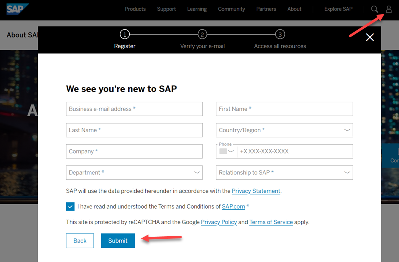
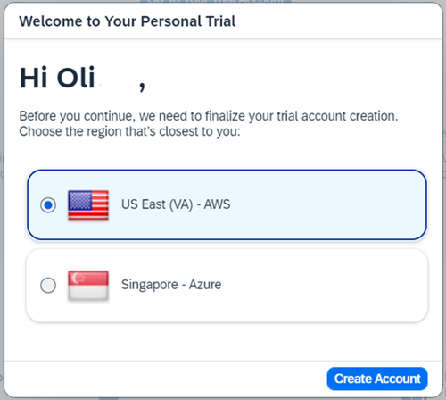
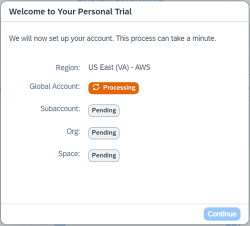
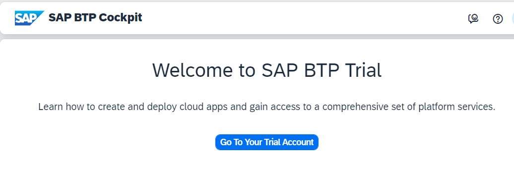
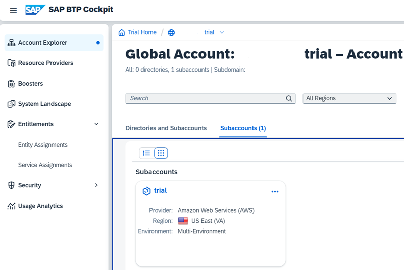

# Sign up for a free Trial Account for SAP BTP

**Note:** You can skip this step in case you already have an SAP BTP Trial account.

The SAP BTP trial account comes already with pre-configured entitlements for  

- Cloud Foundry Runtime, 
- SAP Business Application Studio and 
- SAP Launchpad Service 

and you have the SAP BTP **global account administrator** privilege.

In the next steps, you will create an SAP Universal ID and get a SAP BTP trial account .

### Sign up for a new Trial Account

1. Visit https://www.sap.com/ and click the **Log On** icon in the upper-right corner.

2. If you already have an SAP account (e.g. a P, S, C, D or I number) click `Log in` and provide username and password. 

3. If you do not have an account yet, provide your registration information and click `Submit` to create an account. 

   

4. Access the [SAP BTP Trial Cockpit](https://cockpit.hanatrial.ondemand.com/trial/#/home/trial).

5. If you create a new account you will have to choose your **Region**. 

   Click **Create Account**.
 
   

   A new trial account will be created.

   

6. It will take a minute to provide the trial account. You will see a progress window during this time. 

    Choose `Continue` once the account is provisioned.

7. Choose `Go To your Trial Account` in your "Welcome to SAP BTP Trial" home page.

   

8. The **Account Explorer** in your SAP BTP Cockpit will open.

    It shows your **Global Account** and a pre-configured "trial" subaccount. 
   
   

