# Prerequisites for setting up SAP Build Work Zone in BTP Account

SAP Build Work Zone enables you to easily create business sites that provide centralized access to applications, such as the Hello World app you will create.

SAP Build Work Zone Service is not pre-configured in your BTP trial account. You must first subscribe to the service.

In order to set up SAP Build Work Zone in your Enterprise or Trial Account, you first need to establish Trust and Federation between SAP Authorization and Trust Management Service and SAP Cloud Identity Services.

You use your SAP Cloud Identity Services tenant as an identity provider or a proxy for your own identity provider, which hosts your business users.

For more information, see [SAP Help Portal](https://help.sap.com/docs/btp/sap-business-technology-platform/establish-trust-and-federation-between-uaa-and-identity-authentication?locale=en-US) (external link.

### Set up Cloud Identity Services

Navigate to Instances and Subscriptions in your subaccount. Check if you have already set up a Cloud Identity Service. If not, create one. It is mandatory to use SAP Build Work Zone.

1. First, check your entitlement in your Global Account. Go to your Subaccount (trial) and navigate to "Entitlements". Search for "Cloud Identity Services". If it is present, you can set it up.

    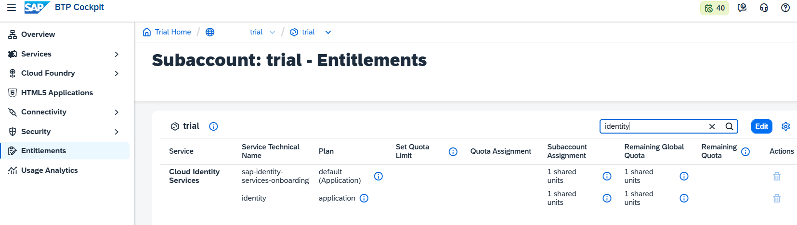

2. To set it up, navigate to "Service Marketplace." Repeat the Search and click "Cloud Identity Services."

    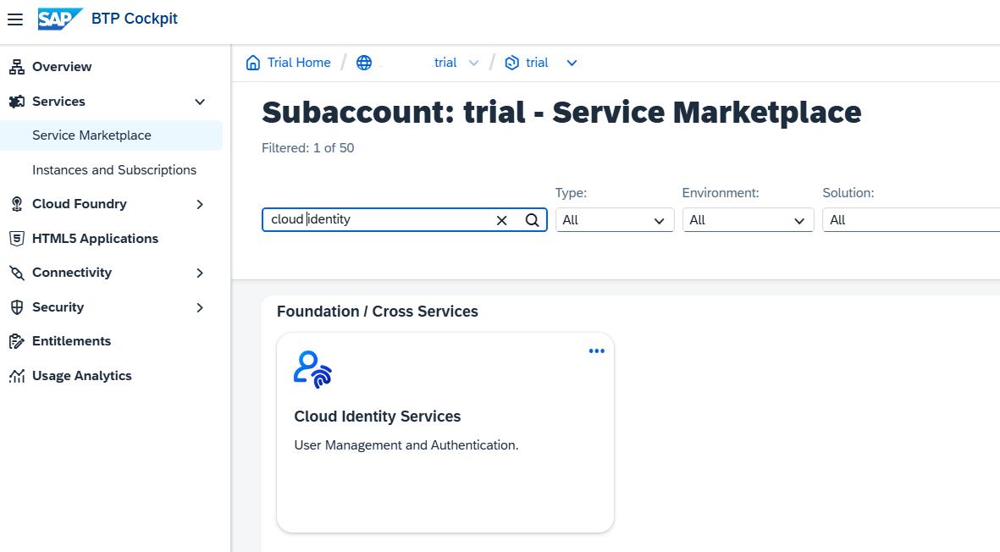

3. In the detail view, click "Create".

    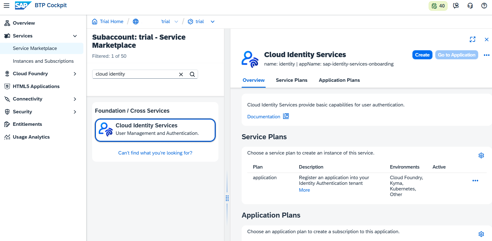

4. The pop-up wizard will start. Step 1: Choose the "Service Plan "default.

    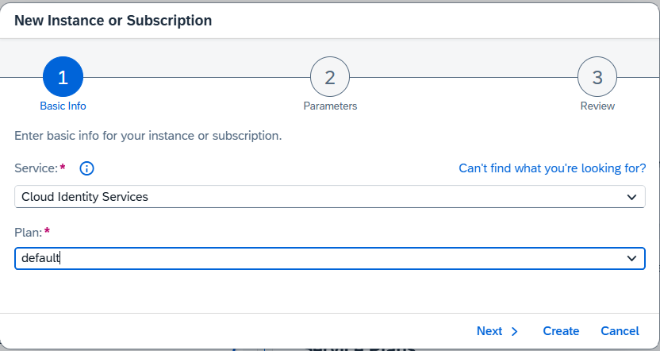

5. Step 2: Choose service type "TEST" (except if you are in a productive environment).

    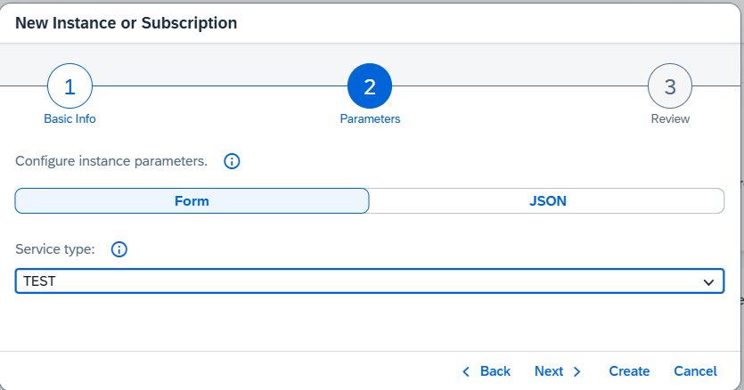

6. Step 3: Review your settings and choose "Create". 

   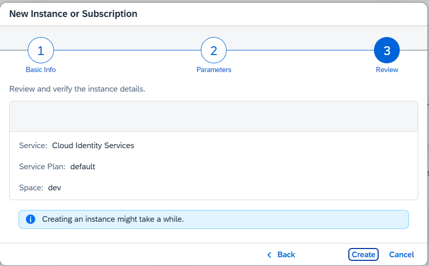

7. Navigate to Instances and Subscriptions. The Cloud Identity Service should be subscribed to and run. Before you click on your service, you have to activate your account first.

   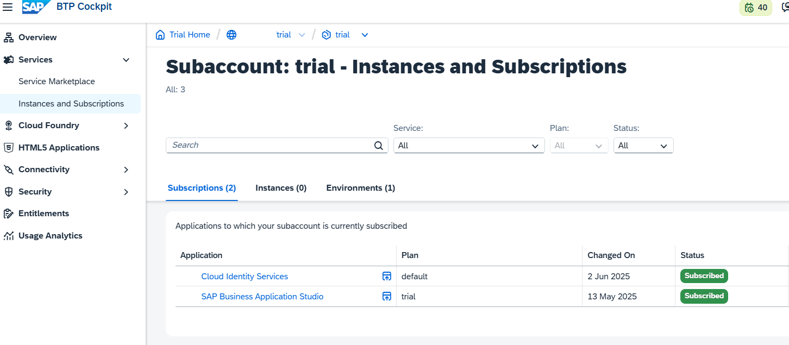

8. You will receive an email for your subaccount admin email address.

    Press "Click here to activate your account".

   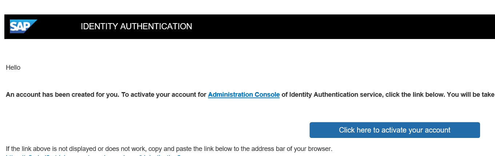

9. You will be forwarded to an activation dialog. Provide a password for your newly created admin user in your Cloud Identity Service.

    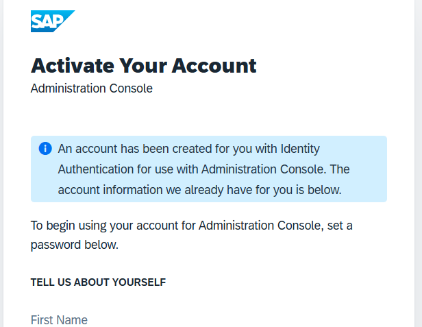

10. You will receive an activation notice.

     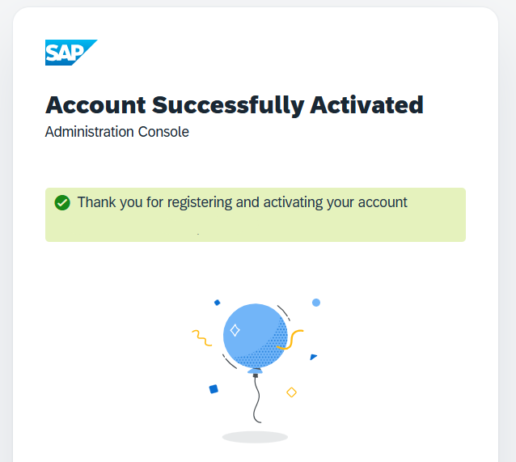

11. You can click on your Cloud Identity Service in Instances and Subscriptions. You will probably have to authenticate yourself.

     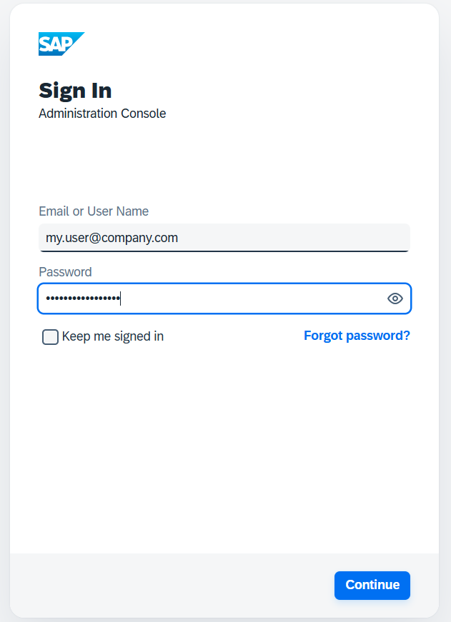

     If you work with more than one CI service, you might receive an error. Log off and log in again, or close your browser and reopen it.

     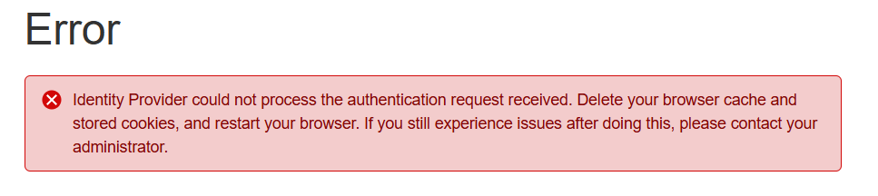

12. Your Trial Cloud Identity Services Trial Account will open.
 
     Feel free to review your account and explore the available options. For the basic setup, you are done.

     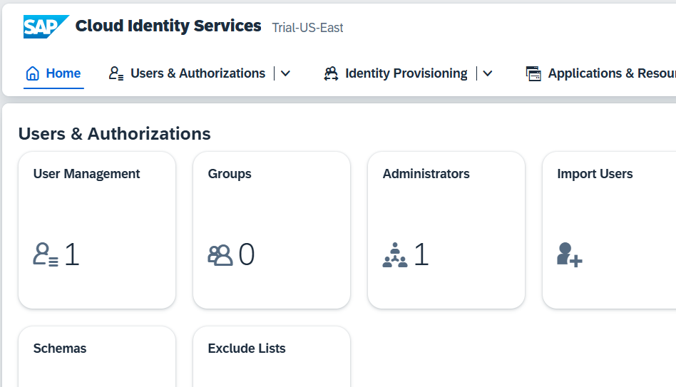

### Establish Trust in BTP Trial

If you create an SAP Build Work Zone service in your Account now, you will fail. First, you have to establish trust between your Subaccount and your Cloud Identity Service.

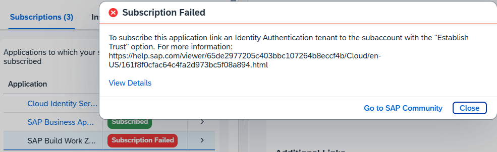

1. In your subaccount, navigate to "Security" --> "Trust Configuration". If you do not have a Custom Identity Provider for your business users yet, click "Establish Trust." A pop-up wizard opens.

    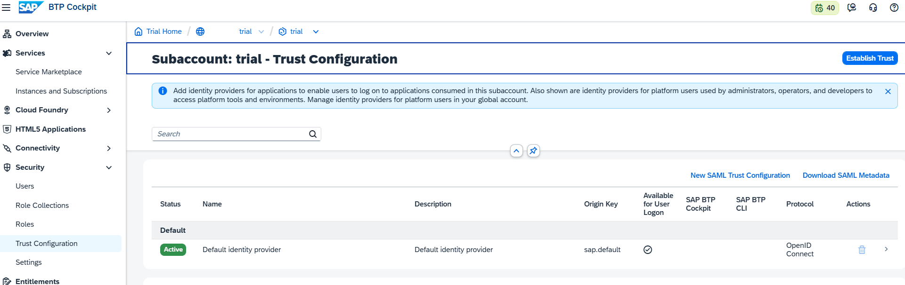

2. Step 1: Choose a tenant for your Cloud Identity Services (in a trial environment, you usually have just one).

    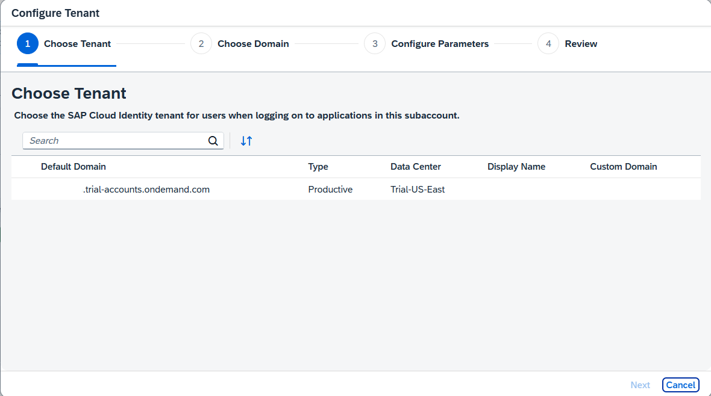

3. Step 2: Choose a domain for your custom identity provider. 

    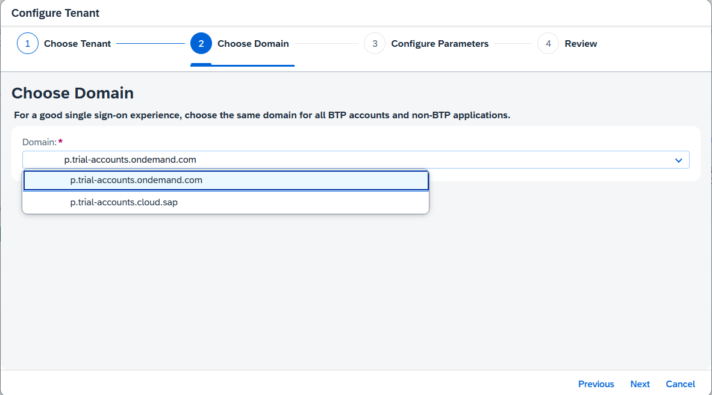

4. Step 3: Configure your settings for your tenant. E.g., as shown in the figure.

    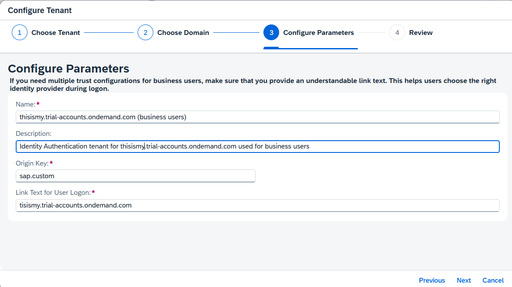

5. Review your settings a click create. Your Custom Identity Provider for your Applications will be created.

    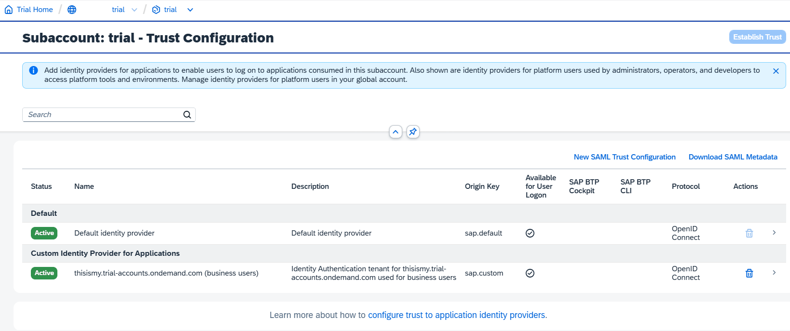

6. Go to "Security" --> "Users" and check your user(s), which are managed by the Custom Identity and Authentication tenant.

    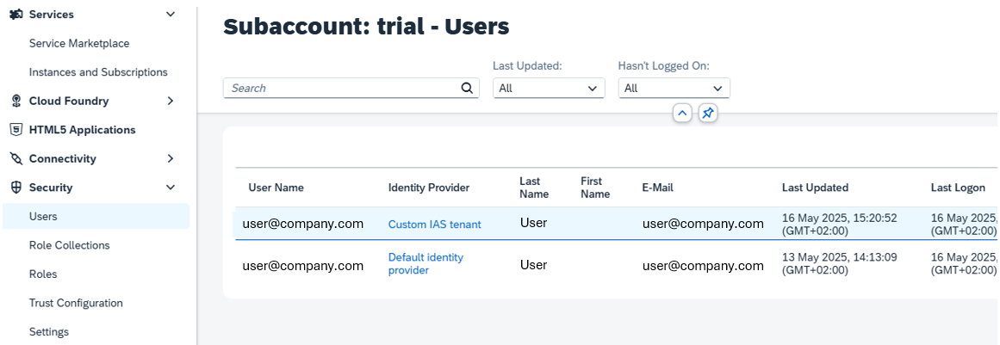

You have now established trust, and you can now create a SAP Build Work Zone subscription.
