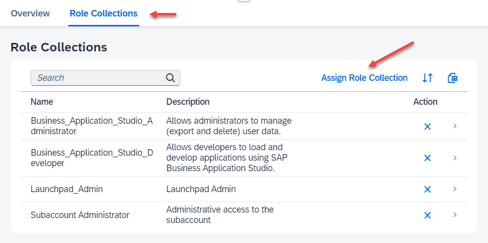

# Setup SAP Build Work Zone Service in your Trial Account

SAP Build Work Zone enables you to easily build business sites that provide centralized access to applications, such as the hello world app you will create.

SAP Build Work Zone Service it not pre-configured in your BTP trial account. You first need to subscribe the service.

### Subscribe to the SAP Build Work Zone Service

1. Go to your trial subaccount, navigate to "Services" --> "Instances and Subscriptions" and choose "Create".

    

2. Select "SAP Build Work Zone, standard edition" as Service and select "Subscription" as service plan.

  

3. The Subscription for SAP Build Work Zone will be created.

   

4. Click on the Work Zone Subscription. A new window will open with "Access Denied".

    You need to add the missing Role Collection "Launchpad_Admin" to your user. 

    The required role collections have been already created with the subscription to the Launchpad Service.

5. Navigate in the left handed navigation pane of the BTP Cockpit to **Security --> Users**. Click on users.

    In a trial account you will basically see your own user. Click on your user. 

6. Click on "Assign Role Collection".

    

7. Assign these Role Collections:

    - Launchpad_Admin
    - Business_Application_Studio_Administrator
    - Business_Application_Studio_Developer

    Click "Save".

    

8. Go back to "Services" --> Instances and Subscriptions" and click "SAP Build Work Zone, standard edition" again. 

    The Work Zone Site Manager should open. 
    
    (In some cases the browser still caches the old authorizations. In this case close and restart the browser)

    

     
### Enable Cloud Foundry in your Trial Environment

SAP BTP trial comes with a pre-configured Cloud Foundry environment. In case you need to enable it again, for example for an additional subaccount, follow this procedure: 

1. Enter your trial subaccount.

2. Go to Services --> Instances and Subscriptions.
    
    If you have no Cloud Found Environment, create one. Click "Create".

    

3. Select Cloud Foundry Runtime service. 

    Keep the default values in Step 1 and Step 2 or provide user defined values.

    Click "Create"

4. The Cloud Foundry Environment with and CF organization will be created.

5. Go to "Cloud Foundry" --> "Spaces".

    Click "Create Space".

    

6. Provide a Space Name, e.g. "dev". Keep the default values for roles for your user.

    Click "Create"

7. A Cloud Foundry Space will be created:

    
