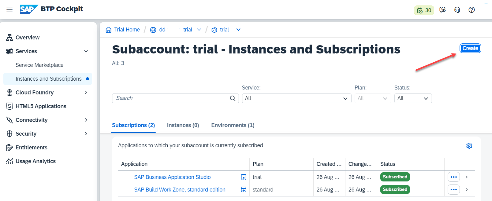
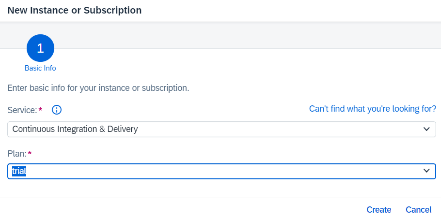
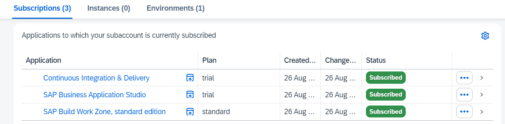
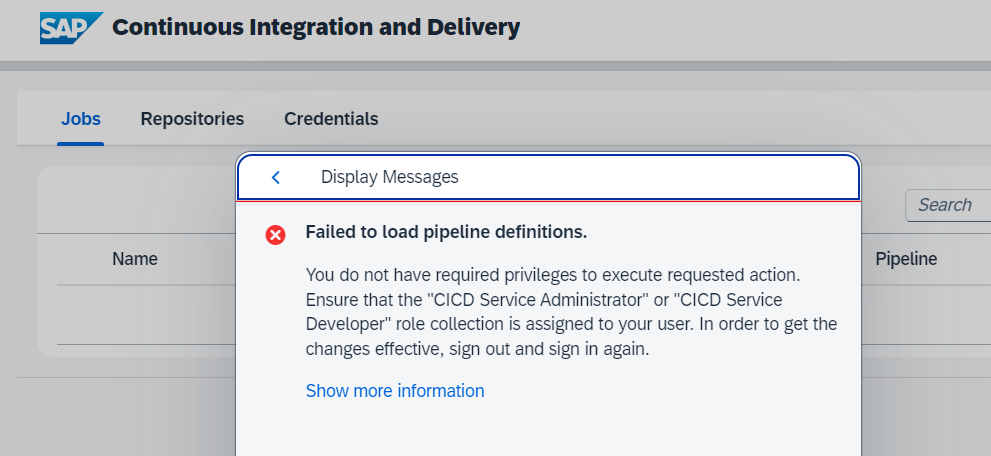
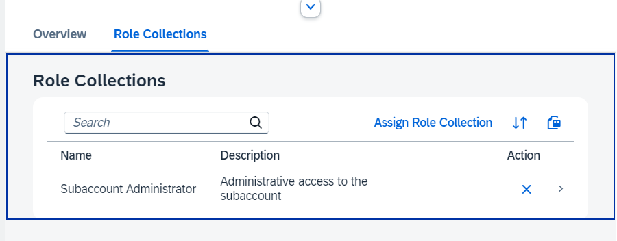
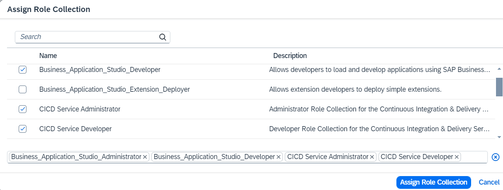
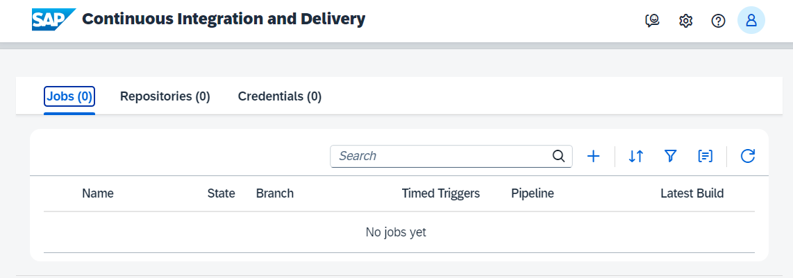

# Setup SAP Continuous Integration and Delivery (Trial)

Note: Optional. You can also run this mission without using Continuous Integration and Delivery (CICD).

[SAP Continuous Integration and Delivery](https://discovery-center.cloud.sap/serviceCatalog/continuous-integration--delivery?region=all) lets you configure and run predefined continuous integration and delivery (CI/CD) pipelines that automatically build, test, and deploy your code changes to speed up your development and delivery cycles.

### Create SAP Continuous Integration and Delivery Subscription

1. Go to your trial subaccount, navigate to "Services" --> "Instances and Subscriptions" and choose "Create".

    

2. Select "SAP Continuous Integration and Delivery" as Service and select "trial" as service plan.

  

3. The Subscription for CICD Service will be created.

   

4. Click on the CICD Subscription. A new window will open with "Access Denied".

    You need to add the missing CICD Role Collections to your user. 

    

    

5. Navigate in the left handed navigation pane of the BTP Cockpit to **Security --> Users**. Click on users.

    In a trial account you will basically see your own user. Click on your user. 

6. Click on "Assign Role Collection".

    

7. Assign these Role Collections:

    - CICD Service Administrator
    - CICD Service Developer

    Click "Save".

    

8. Refresh the cache of your Browser completely (easiest way is to close the browser and open again).

9. Go back to "Services" --> Instances and Subscriptions" and click "SAP Continuous Integration and Delivery" again. 

    The SAP Continuous Integration and Delivery home page should open. 
    
    

### Configure your SAP Continuous Integration and Delivery 

You will configure your CI/CD service later in this mission.

You can also continue with CI/CD configuration in this tutorial: [Get Started with an SAP Fiori Project in SAP Continuous Integration and Delivery](https://developers.sap.com/tutorials/cicd-start-fiori.html#0b3b59d9-f2cc-4222-b7a1-97d810147886)
