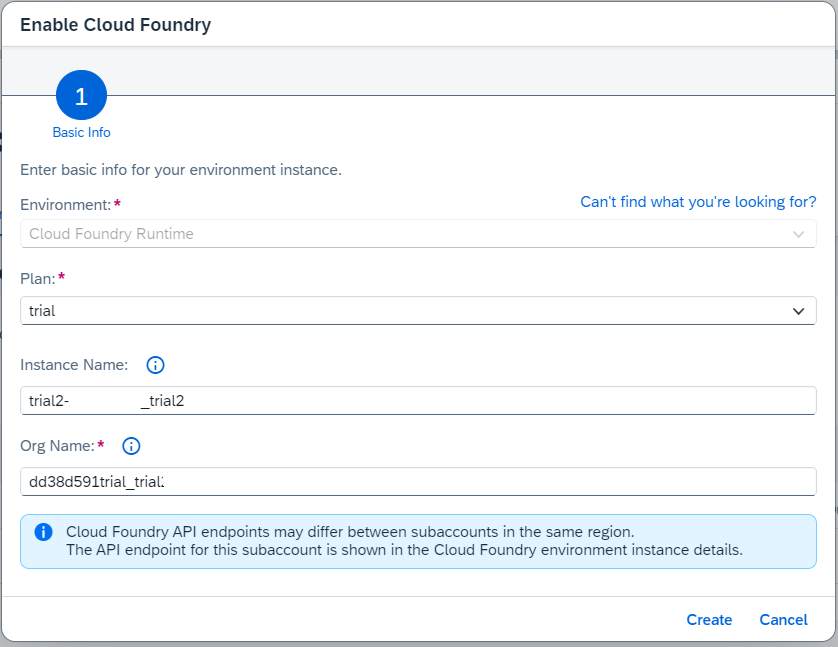

# Enable Cloud Foundry in your Trial Environment

SAP BTP trial comes with a pre-configured Cloud Foundry environment. In case you need to enable it again, for example, for an additional subaccount, follow this procedure: 

1. Enter your trial subaccount.

2. Go to "Overview".
    
    If you have no Cloud Found Environment, create one. Click "Enable Cloud Foundry".

    

3. Enter Instance Name and Org Name or keep default values.

    In the trial, you will have only "trial" as a service plan.

    Choose "Create".

    

4. The Cloud Foundry Environment with and CF organization will be created.

5. Create a Cloud Foundry Space.

    Click "Create Space".

    

6. Provide a Space Name, e.g., "dev". Keep the default values for roles for your user.

    Click "Create".
    
    
    

7. A Cloud Foundry Space will be created.

    Click on the "dev" Space:

    

8. You will be forwarded to the dev "Space":

    
    
9. Make sure you are entitled to use Cloud Foundry in your Subaccount

    

