# Create a SAPUI5/SAP Fiori Freestyle app

This tutorial uses the basic template to create a SAPUI5 app. The basic template is intended for all developers who want to start developing their own SAPUI5 app from scratch. 

If you develop a business apps you may prefer using [Fiori Elements](https://experience.sap.com/fiori-design-web/smart-templates/) consuming services from Cloud Application Programming Model (CAP) or ABAP RESTful Application Programming Model (RAP). Fiori Elements provide less flexibility but speed up development by reducing the amount of frontend code needed to build SAP Fiori apps. 


### Open SAP Business Application Studio

1. Click Instances and Subscriptions under Services

2. Select the tab Subscriptions, and click on SAP Business Application Studio. You will be forwarded to your SAP Business Application Studio Home Page with automatic login to the application.

   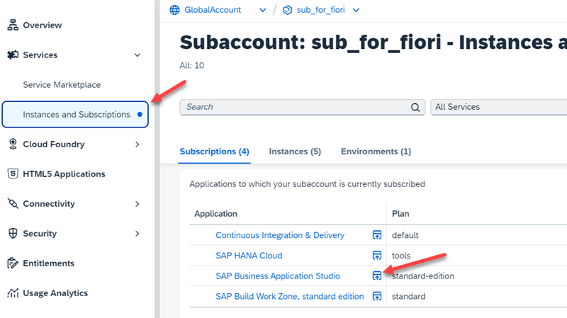

3. Please, accept the Privacy Statement

4. Discover the SAP Business Application Studio home page.

    Note the "Create Dev Space" button.

    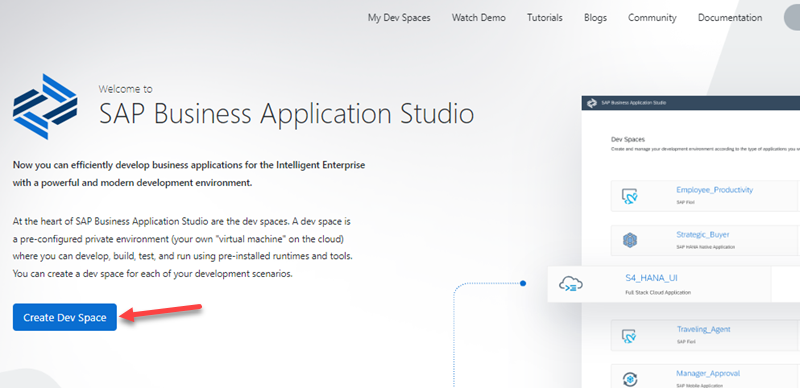


### Create a Dev Space in SAP Business Application Studio

1. Click on **Create Dev Space** on the SAP Business Application Studio home page.

2. Provide a name for your Dev Space (for example, "Fiori"). 

    Select as type **SAP Fiori**. 

    If you are not yet familiar with BAS extensions do not select any additional extensions here. 
   
    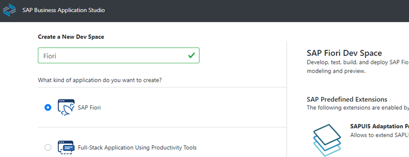

3. Click again **Create Dev Space** in the lower right corner.

    You will be forwarded to the overview homepage of your Dev Space(s). 
   
    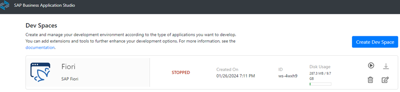

    Once started the status changes from "STPPED" to "STARTING" to "RUNNING” and the dev space name  will turn into a blue hyperlink.

    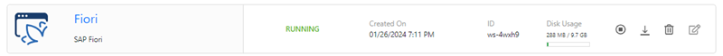


4. Click on the dev space link (e.g. "Fiori") to enter the space.

   After a few seconds ... you will see your BAS dev space. 


### Create an SAPUI5 Application with Basic Template


**Procedure**

1. Click on **New Project from template** in the Get Started tab or **Create Project" in the BAS Explorer.

    If you closed the Get Started page, you can always get it back from the menue under Help --> Get Started.

   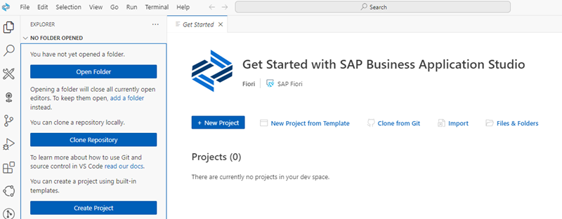

2. In the New Project Wizard select **SAP Fiori Application**. Click **Start**.

   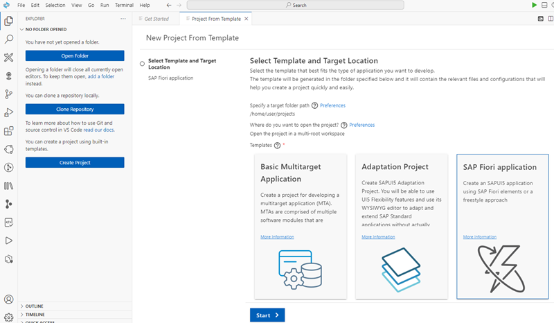

3. In the **Template Selection** keep template type "Fiori" and choose **Basic**. Click **Next**.  

    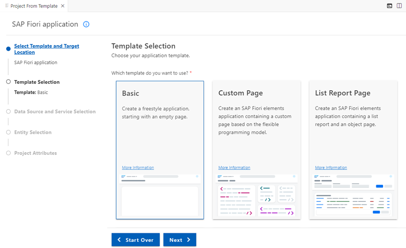

4. In the **Data Source and Service Selection** choose **None** for Data source. You create a "Hello World" without data binding. 

    Choose **Next**.

    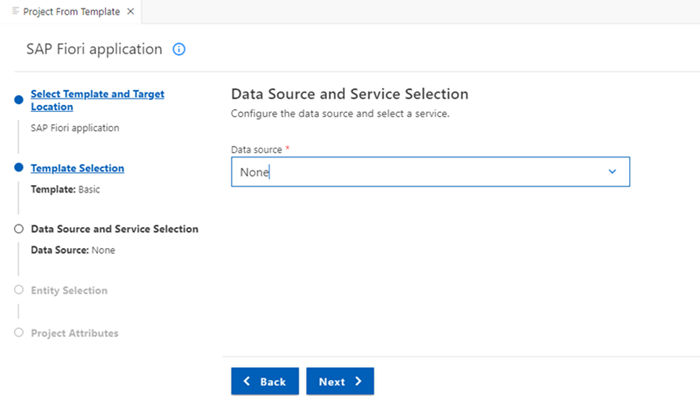

5. Under **Entity Selection** name your SAPUI5 view. 

    This name will appear in the launchpad service for the app. Keep <code>"View1"</code> for now. 

    Choose **Next**

    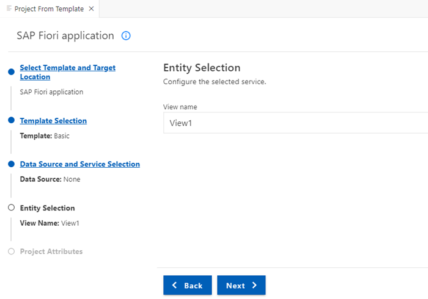


6. In the next step, **Project Attributes** choose names and a description for your "Hello World" app (examples see figure): 

    - Module name: `helloworldui5`

    - Application title: `Hello World App Title`

    - Application namespace `sap.btp`

    - Description: `A Fiori Hello World application`

    - Keep Project folder path and Minimum SAPUI5 version

    - Add deployment configuration to MTA project: `Yes`

    - Add FLP configuration: `Yes`

    - Configure advanced options: `No`

    Choose **Next**.
    
    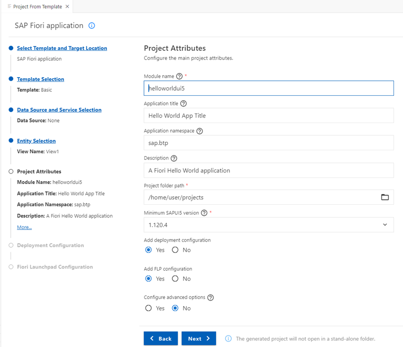

7. In the next step, **Deployment Configuration** choose **Cloud Foundry** as a target.

    - Target: Cloud Foundry
    - Destination Name: None
    - Add application to managed application router: `Yes` 

      (Managed application router is the standard html5 repository from the SAP Work Zone service and eases deployment). 

    Choose **Next**.

    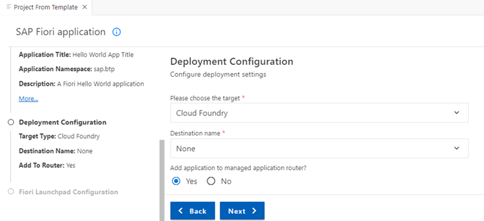


8. The **SAP Build Work Zone** service needs some "Fiori Launchpad Configuration". 

    - Semantic Object: `semanticobjecthelloworld`
    - Action: `show`
    - Title: `Show Hello World App`


      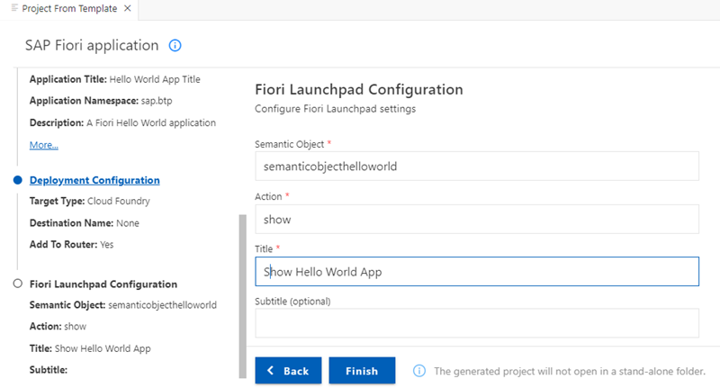


    Choose **Finish**. It will take some time until all dependencies are installed.


9. Click on **Open folder** for this tutorial. 
    
    (If you are already familiar with the concept of workspaces you can also choose "Add project to workspace")

    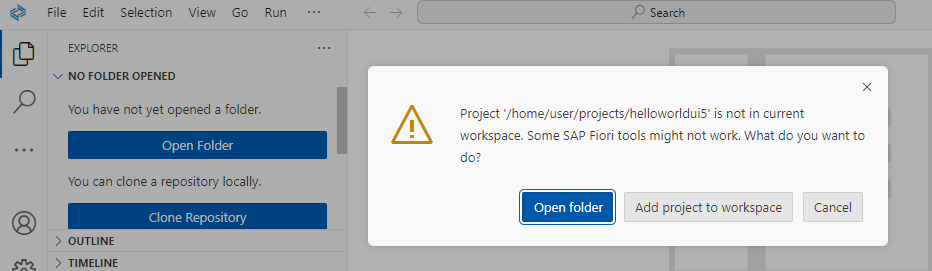

10. After your App is generated, you should see the "Storyboard" of your Fiori application and in the Explorer.

    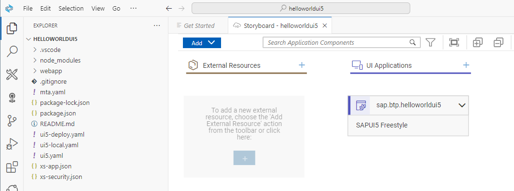

11. Right click on the Fiori app and choose "Open Application Info". In the "Application Info" you can see additional details of your app and you can start from here additional tasks.

    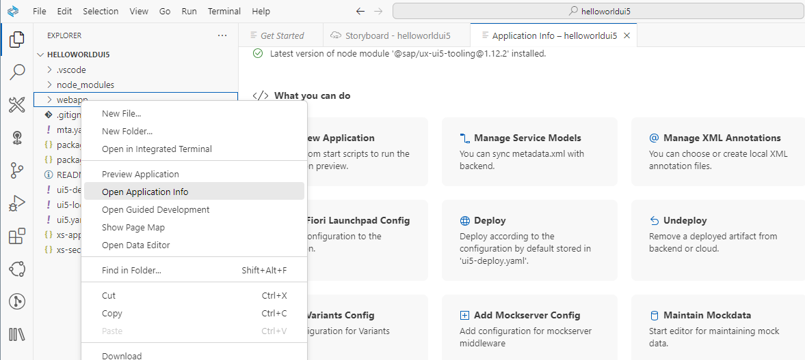

12. Optional: Open your Projects folder via menu: File --> Open Folder ... and enter "/home/user/projects" and select your project name.

    
### Preview your application


1. Right-click on the folder `webapp` and choose "Preview Application".

    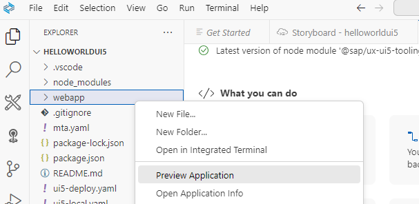

2. Choose the script "start-noflp" first. You may try the other start options afterwards.

    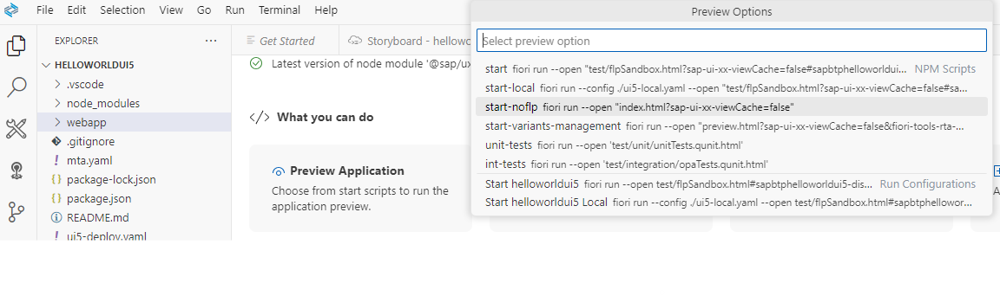

3. The preview application opens. As we did not develop any content so far you can just see the title: "Hello World App Title".

    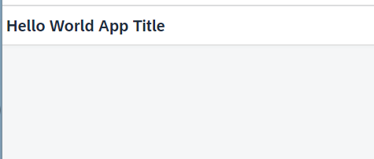

4. You can stop the script by "deleting" it or type `Ctrl+C` in terminal.

    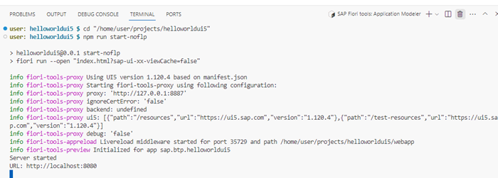


 
### Optional: Develop some content

1. Maybe you want to change the title of your app from "Hello World App Title" to "Hello World".

    Open your `View1` in Text-Editor. Note the definition of `<Page id="page" title="{i18n>title}">`.
    
    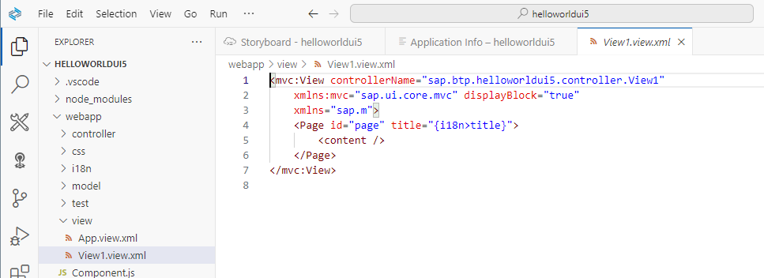

2. Open the file `18n.properties` in the sub-folder `i18n`.

    Change your title if required.

    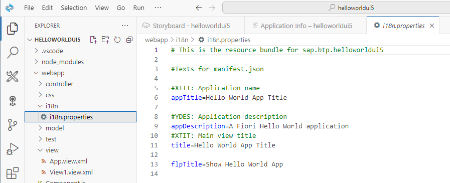


3. Right-click on your `view1.view.xml` and select "Open with..."

    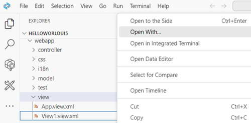

4. You can select here the graphical "Layout Editor" or the classic "Text Editor".

    We continue with classic Text Editor.

    Extend your app with a Text field and a Button and a FlexBox to align the items. Note, the button has the event `press=".onPress"`. You will use it later.

    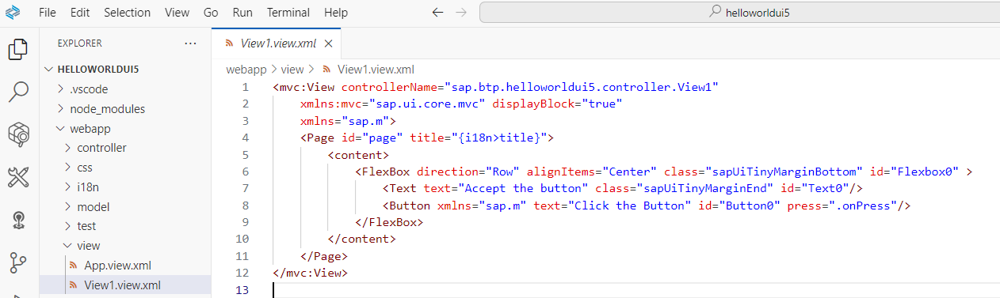

    ```XML 
    <mvc:View controllerName="sap.btp.helloworldui5.controller.View1"
        xmlns:mvc="sap.ui.core.mvc" displayBlock="true"
        xmlns="sap.m">
        <Page id="page" title="{i18n>title}">
            <content>
                <FlexBox direction="Row" alignItems="Center" class="sapUiTinyMarginBottom" id="Flexbox0" >
                    <Text text="Accept the button" class="sapUiTinyMarginEnd" id="Text0"/>
                    <Button xmlns="sap.m" text="Click the Button" id="Button0" press=".onPress"/>
                </FlexBox>
            </content>
        </Page>
    </mvc:View>
    
    ```

    For more information about the items, see:

    - [Flexbox](https://ui5.sap.com/#/entity/sap.m.FlexBox/sample/sap.m.sample.FlexBoxBasicAlignment)
    - [Text](https://ui5.sap.com/#/entity/sap.m.Text)
    - [Button](https://ui5.sap.com/#/entity/sap.ui.webc.main.Button/sample/sap.ui.webc.main.sample.Button)

5. Optional: Preview your application.

6. Add an event handler for the button event `press=".onPress"`.

   Therefore open the view controller `View1.controller.js`

   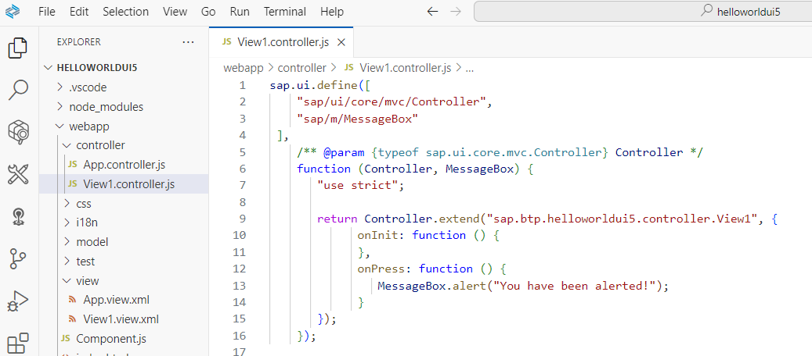

    ```Javascript 
    sap.ui.define([
        "sap/ui/core/mvc/Controller",
        "sap/m/MessageBox"
    ],
        /** @param {typeof sap.ui.core.mvc.Controller} Controller */
        function (Controller, MessageBox) {
            "use strict";

            return Controller.extend("sap.btp.helloworldui5.controller.View1", {
                onInit: function () {
                },
                onPress: function () {
                    MessageBox.alert("You have been alerted!");
                }
            });
        });
    ```

5. Preview your application and click the button.

    

Feel free to continue your work using [SAPUI5 Demo Kit](https://ui5.sap.com/#/).
 
