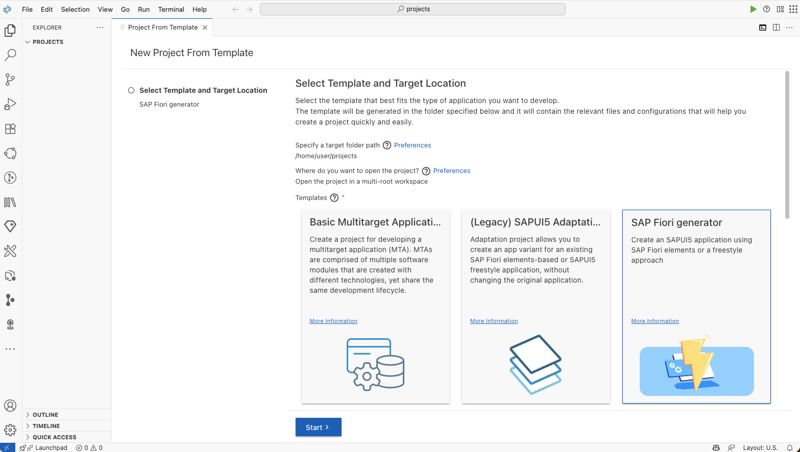
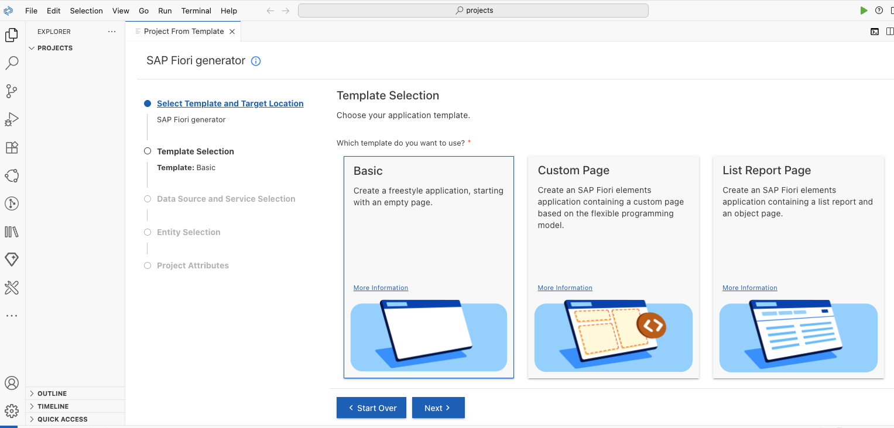
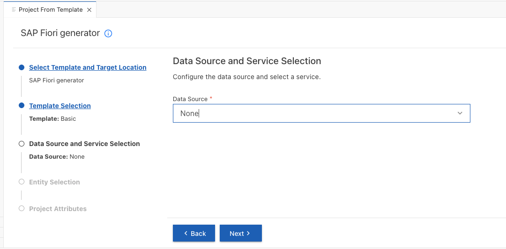
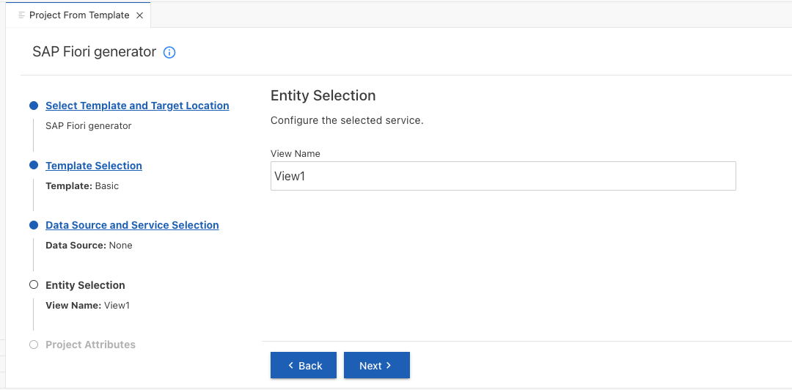
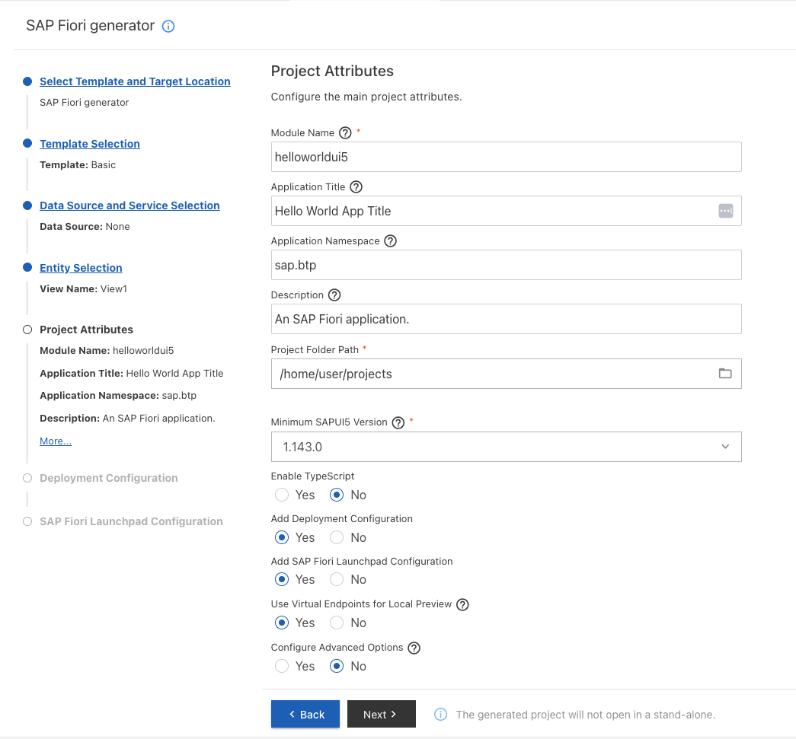
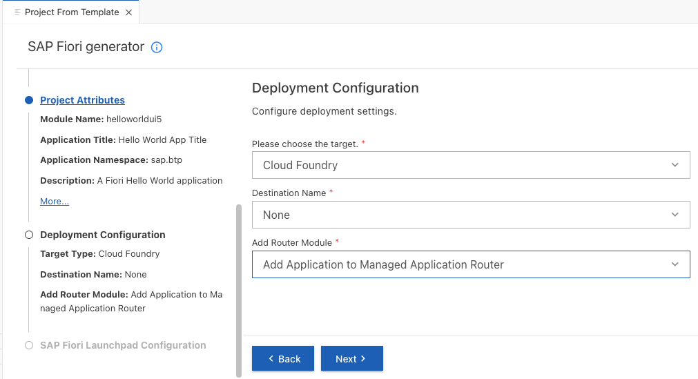
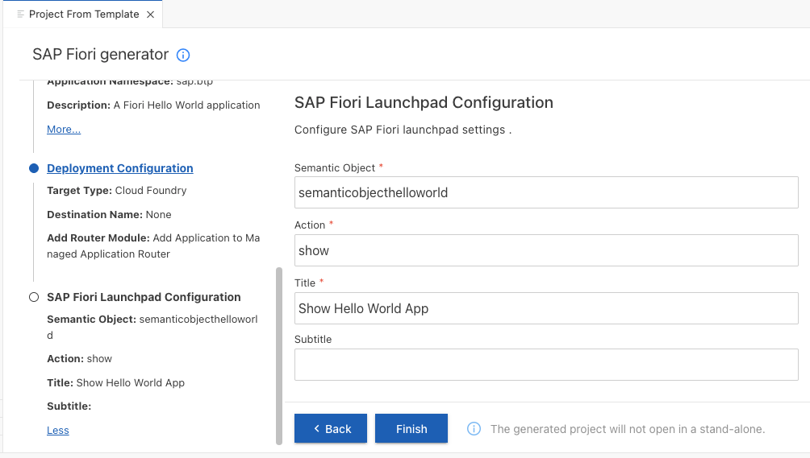
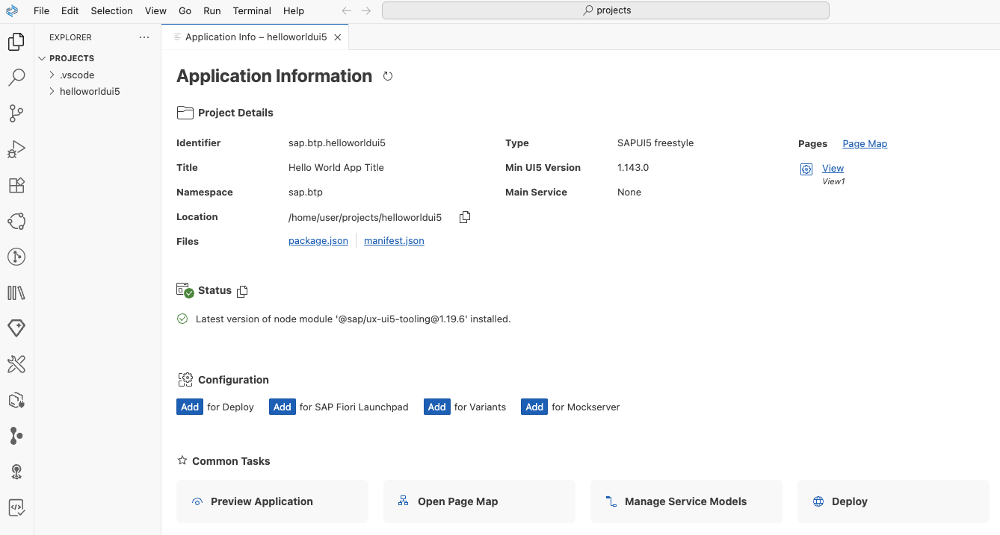
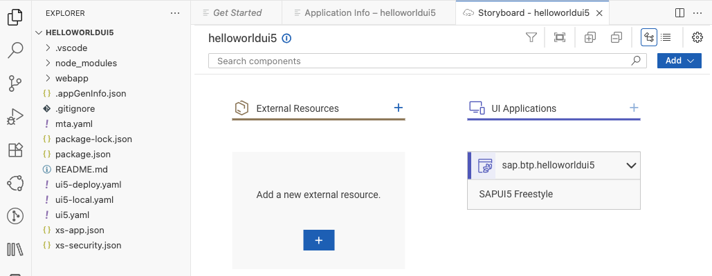
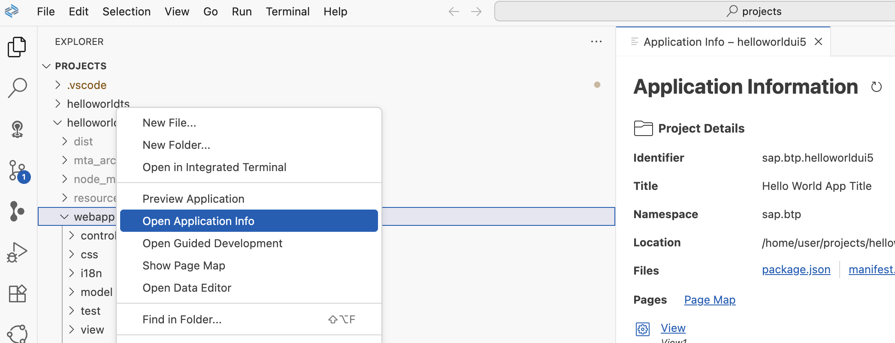

# Create a SAPUI5/SAP Fiori Freestyle app

This tutorial uses the "Basic" template to create a SAPUI5 app. The basic template is intended for all developers who want to start developing their own SAPUI5 app from scratch. 

If you develop a business app, you may prefer using [Fiori Elements](https://experience.sap.com/fiori-design-web/smart-templates/), consuming services from Cloud Application Programming Model (CAP) or ABAP RESTful Application Programming Model (RAP). Fiori Elements offers less flexibility but accelerates development by reducing the amount of frontend code required to build SAP Fiori apps. 

### Open SAP Business Application Studio

1. Click Instances and Subscriptions under Services

2. Select the tab Subscriptions, and click on SAP Business Application Studio. You will be forwarded to your SAP Business Application Studio Home Page with automatic login to the application.

   

3. Please accept the Privacy Statement

4. Discover the SAP Business Application Studio home page.

    Note the "Create Dev Space" button.

    

### Create a Dev Space in SAP Business Application Studio

1. Click on **Create Dev Space** on the SAP Business Application Studio home page.

2. Provide a name for your Dev Space (for example, "Fiori"). 

    Select as type **SAP Fiori**. 

    If you are not yet familiar with BAS extensions, do not select any additional extensions here. 
   
    

3. Click again on **Create Dev Space** in the lower right corner.

    You will be forwarded to the overview homepage of your Dev Space(s). 
   
    

    Once started, the status changes from "STPPED" to "STARTING" to "RUNNING,” and the dev space name  will turn into a blue hyperlink.

    

4. Click on the dev space link (e.g., "Fiori") to enter the space.

   After a few seconds, you will see your BAS dev space. 

### Create an SAPUI5 Application with Basic Template

**Procedure**

1. Click on **New Project from template** in the Get Started tab or **Create Project" in the BAS Explorer.

    If you closed the Get Started page, you can always get it back from the menu under Help --> Get Started.

   

2. In the New Project Wizard, select **SAP Fiori Generator**. Click **Start**.

   

3. In the **Template Selection** select **Basic**. Click **Next**.  

    

4. In the **Data Source and Service Selection** choose **None** for Data source. You create a "Hello World" without data binding. 

    Choose **Next**.

    

5. Under **Entity Selection** name your SAPUI5 view. 

    This name will appear in the launchpad service for the app. Keep <code>"View1"</code> for now. 

    Choose **Next**

    

6. In the next step, **Project Attributes** choose names and a description for your "Hello World" app (examples see figure): 

    - Module name: `helloworldui5`

    - Application title: `Hello World App Title.`

    - Application namespace `sap.btp`

    - Description: `A Fiori Hello World application.`

    - Keep the Project folder path and the Minimum SAPUI5 version

    - Keep "Enable TypeScript" eq "No". Optional: "Yes". In this case, the Fiori Generator will generate a TypeScript file. You cannot use the small JavaScript example from this tutorial later.

    - Add deployment configuration to MTA project: `Yes`.

    - Add FLP configuration: `Yes`.

    - Use Virtual Endpoints: "Yes".

    - Configure advanced options: `No`.

    Choose **Next**.
    
    

7. In the next step, **Deployment Configuration** choose **Cloud Foundry** as a target.

    - Target: Cloud Foundry
    - Destination Name: None
    - Add application to managed application router: `Yes`

      The Managed Application Router is the standard HTML5 repository from the SAP Work Zone service, which eases deployment. 

      You can also use "Application Frontend Service," which is more convenient for larger projects, but it is not part of this tutorial. For more information, see ["What Is Application Frontend Service?"](https://help.sap.com/docs/application-frontend-service/application-frontend-service/what-is-application-frontend-service?locale=en-US&version=LATEST).

    Choose **Next**.

    

8. The **SAP Build Work Zone** service needs some "Fiori Launchpad Configuration".

    You will need this configuration to add this app to your Work Zone Site.

    - Semantic Object: `semanticobjecthelloworld`
    - Action: `show`
    - Title: `Show Hello World App`

      

    Choose **Finish**. It will take some time for all dependencies to be installed.

10. Click on **Open folder** if this popup appears. This opens the project folder. If you are already familiar with Workspaces, you can also add the project to your Workspace.

    

11. After the project is generated, the "Application Information" page and the "Storyboard" open. The Application Information page provides a helpful overview, from here you can also start tasks for this project.

    

12. The Storyboard provides a graphical overview of your application components (data models, services, UI front-ends of the application), as well as the connections between them.

    

14. If you want to reopen the Application Infopage, you can right-click "webapp" in your project and reopen it.

    

15. Optional: Open your Projects folder via menu: File --> Open Folder ... and enter "/home/user/projects" and select your project name.

    
### Preview your application

1. Right-click on the folder `webapp` and choose "Preview Application".

    

2. Choose the script "start-noflp" first. You may try the other start options afterwards.

    

3. The preview application opens. Since you have not developed any content yet, you will only see the title: "Hello World App Title".

    

4. You can stop the script by "deleting" it or typing `Ctrl+C` in the terminal.

    

 

Feel free to continue your development work using [SAPUI5 Demo Kit](https://ui5.sap.com/#/).
 
