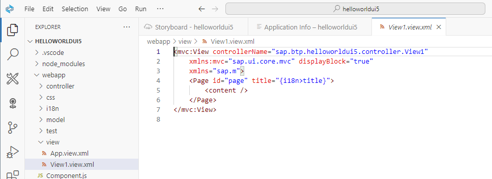
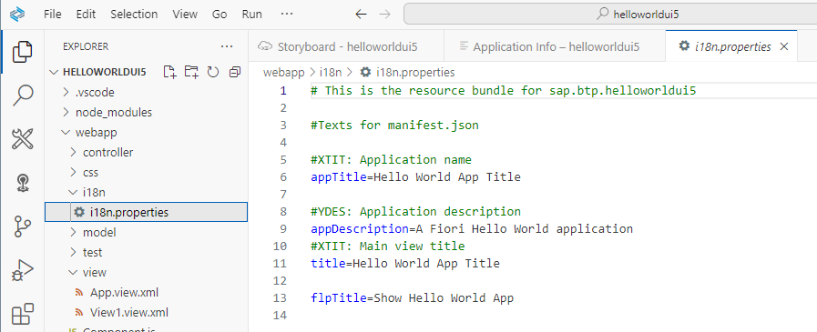
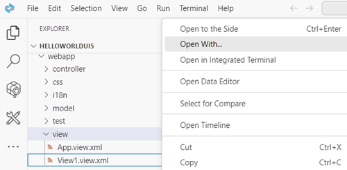
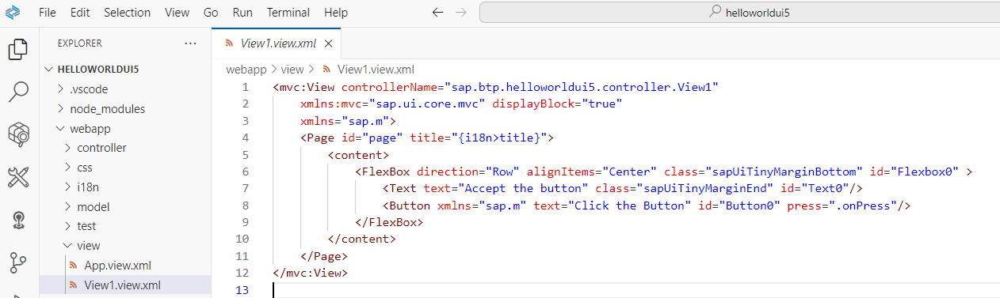
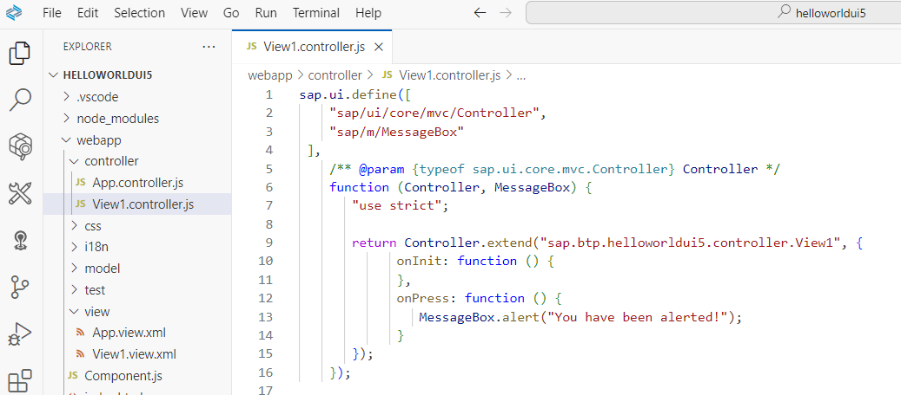
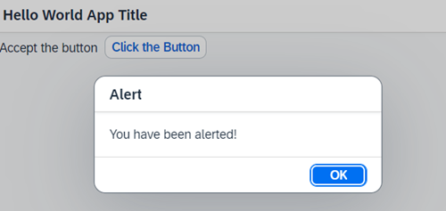

### Optional: Develop some content

1. Maybe you want to change the title of your app from "Hello World App Title" to "Hello World".

    Open your `View1` in the Text Editor. Note the definition of `<Page id="page" title="{i18n>title}">`.
    
    

2. Open the file `18n.properties` in the sub-folder `i18n`.

    Change your title if required.

    


3. Right-click on your `view1.view.xml` and select "Open with..."

    

4. You can select here the graphical "Layout Editor" or the classic "Text Editor".

    You continue with the classic Text Editor.

    Extend your app with a Text field, a Button, and a FlexBox to align the items. Note, the button has the event `press=".onPress"`. You will use it later.

    

    ```
    
    <mvc:View controllerName="sap.btp.helloworldui5.controller.View1"
        xmlns:mvc="sap.ui.core.mvc" displayBlock="true"
        xmlns="sap.m">
        <Page id="page" title="{i18n>title}">
            <content>
                <FlexBox direction="Row" alignItems="Center" class="sapUiTinyMarginBottom" id="Flexbox0" >
                    <Text text="Accept the button" class="sapUiTinyMarginEnd" id="Text0"/>
                    <Button xmlns="sap.m" text="Click the Button" id="Button0" press=".onPress"/>
                </FlexBox>
            </content>
        </Page>
    </mvc:View>
    
    ```


5. For more information about the items, see:

    - [Flexbox](https://ui5.sap.com/#/entity/sap.m.FlexBox/sample/sap.m.sample.FlexBoxBasicAlignment)
    - [Text](https://ui5.sap.com/#/entity/sap.m.Text)
    - [Button](https://ui5.sap.com/#/entity/sap.ui.webc.main.Button/sample/sap.ui.webc.main.sample.Button)

6. Optional: Preview your application.

7. Add an event handler for the button event `press=".onPress"`.

   Therefore, open the view controller `View1.controller.js`.

   

    ```
    
    sap.ui.define([
        "sap/ui/core/mvc/Controller",
        "sap/m/MessageBox"
        ],
        /** @param {typeof sap.ui.core.mvc.Controller} Controller */
        function (Controller, MessageBox) {
            "use strict";
            return Controller.extend("sap.btp.helloworldui5.controller.View1", {
                onInit: function () {
                },
                onPress: function () {
                    MessageBox.alert("You have been alerted!");
                }
            });
        });
    
    ```

5. Preview your application and click the button.

    

Feel free to continue your work using [SAPUI5 Demo Kit](https://ui5.sap.com/#/).
 
