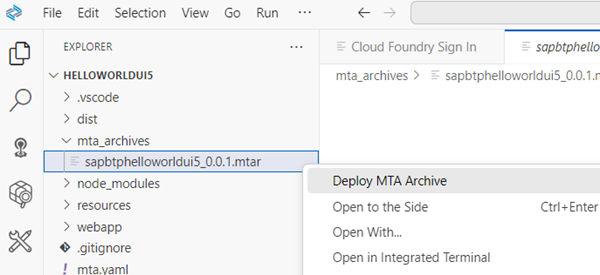

## Build and Deploy your Application in Cloud Foundry Runtime

### Build your project

1. Build your application in SAP Business Application Studio. 

    Right-click on the **mta.yaml** file and choose **Build MTA project**. 

    With this a folder "mta_archives" and a mtar file is created.

    

    Alternatively you can open the terminal and type `mbt build`.

2. Check the result in the project folder `mta_archives/sapbtphelloworldui5_0.0.1.mtar`.

### Connect your SAP Business Application Studio with your Cloud Foundry Environment

You need a connection from your Dev Space to your Cloud Foundry subaccount to deploy your application into the HTML5 Repository of your Subaccount. 

1. Open your Cloud Foundry extension in BAS and Create a Cloud Foundry target.

    Typically you run your BAS on the same account as your Cloud Foundry runtime. If not, go to your CF Subaccount and note down CF **API Endpoint**, **Org Name** and your **Space**.

    Provide username (e.g. email adress) and password or follow the instructions for SSO Passcode.

    

2. Alternatively you can use Command Palette to login to Cloud Foundry. You will not create a CF target this way.   

    In the menue, click View --> Command Palette  .

    Search for and select `CF: Login to Cloud Foundry`.

3. Select your Cloud Foundry Org (predefined) and CF space.

    

4. Save your current CF target and provide a name for the target.

    

 
You have successfully created a connection between your SAP Business Application dev space and your SAP BTP Cloud Foundry space.

### Deploy your Fiori app to Cloud Foundry

Deploy the HelloWorld application to your SAP BTP Cloud Foundry dev space. 

Make sure you are logged into your Cloud Foundry subaccount 

1.  Open the project folder **mta_archives** and right-click on the built file `mta_archives/sapbtphelloworldui5_0.0.1.mtar` and select **Deploy MTA Archive**.

    Deployment target is the Cloud Foundry subaccount you are logged into. 
  
      

    
    
    
2. You can see the progress of the deployment in the terminal. 

    It takes a while to complete the task. You will see a success message in the console once it's done. 
     
    

  
3. Switch to your Subaccount in BTP Cockpit.   

   Select **HTML5 Application** on the left navigation pane. 

   You will see the deployed application in the repository. 

   

   Note: You now consume one additional unit of your Cloud Foundry quota.

4. Click on the application name `sapbtphelloworldui5`. Your deployed app will open in a new window.

     

Congratulations! You deployed your first Fiori app!

### Add Deployment Configuration to existing Projects

In case you have no deployment configuration, because you forgot for example to add it during project creation, you can still add it. 

1. Open your Business Application Studio (BAS).

2. Open from menu "View" the Command Palette (Ctrl+Shift+P).

   Search the command `Fiori: Add Deployment Configuration`.

3. The Deployment Configuration Generator opens. 

    Provide or change the values.

    

4. Choose "Finish". The configuration will be added to your Project in `mta.yaml`. It contains deployment information about modules, resources and parameters.

 

