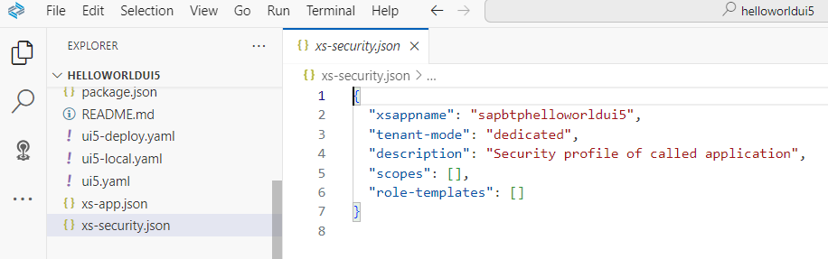
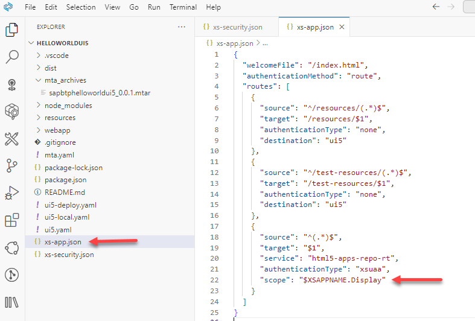

## Protecting your application

**Procedure**

1. Open SAP Business Application Studio and in case open again the **Explorer** (Shortcut Ctrl+Shift+E).
  

2. Open the `xs-security.json` file. 

    You see that you have not yet defined "scopes", "role-templates", or "role-collections". 
  
    

3. Add "scopes", "role-templates", and "role-collections".

    The scope is, for example, `$XSAPPNAME.Display` or `$XSAPPNAME.Create`. 
      
    In this case, you just view the app, so you just need `$XSAPPNAME.Display` for  role templates and role collections.
 
    ```JSON
    
    {
      "xsappname": "sapbtphelloworldui5",
      "tenant-mode": "dedicated",
      "description": "Security profile of called application",
      "scopes": [
        {
        "name": "$XSAPPNAME.Display",
        "description": "Display the app as Platform or Business User"
        }
      ],
      "role-templates": [
        {
        "name": "HelloWorldDisplayRole",
        "description": "Hello World Display Role Template",
        "scope-references": [
            "$XSAPPNAME.Display"
        ]
        }
      ],
      "role-collections": [
            {
            "name": "HelloWorldDisplayRoleCollection",
            "description": "Hello World Display Role Collection",
            "role-template-references": [
            "$XSAPPNAME.HelloWorldDisplayRole"
                ]
            }
        ]
    }

    ```
  

4. Open the `xs-app.json` file.

    Add a scope to the route for the webapp. The authorization scope is required to access the target path. 
   
    Add the scope definition:  `"scope": "$XSAPPNAME.Display"`.

    In the picture, the scope definition is already added.

    

    ```JSON
    
    {
      "source": "^(.*)$",
      "target": "$1",
      "service": "html5-apps-repo-rt",
      "authenticationType": "xsuaa",
      "scope": "$XSAPPNAME.Display"
    }
    
    ```  
    
    These are just basic settings. For more information, see SAP Help Portal [Application Router Configuration](https://help.sap.com/docs/btp/sap-business-technology-platform/application-security-descriptor-configuration-syntax) and [@sap/approuter on npmjs](https://www.npmjs.com/package/@sap/approuter).
    
 
4. Right-click on the project's `mta.yaml` file and choose **Build MTA project**. 
   
5. Deploy your `mta_archives/sapbtphelloworldui5_0.0.1.mtar` to your Cloud Foundry space.

    Make sure you are logged into your Cloud Foundry subaccount.

    It takes a while to complete the task. You will see a success message in the console once the process is complete.
  
6. Open your Subaccount in the SAP BTP Cockpit and select **HTML5 Applications** on the left navigation pane. 

   Open your application `sapbtphelloworldui5`. Your deployed app will open in a new window. 

   What you should see is: `Forbidden`. If not, clear your browser cache completely. Close the browser and reopen it or make a hard reload via browser developer tools.

7. Open Security --> Roles and search for "hello". You will see the newly created role "HelloWorldViewerRole" from the role template "HelloWorldViewerRole".

8. Open Security --> Role Collections and search for "hello". You will see the newly created role collection "HelloWorldViewerRoleCollection". 
  
9. Open Security --> Users and select your user. Scroll down in the detail screen and select "Assign Role Collection" in the Role Collection context menu `...`. 

    Assign HelloWorldViewerRoleCollection to your user.

11. Start your application again. Usually, you still see "Forbidden". You have to log out and log in again to the web application. Alternatively, you can close the browser completely and then open it again.   

     You should see your app again.

     


