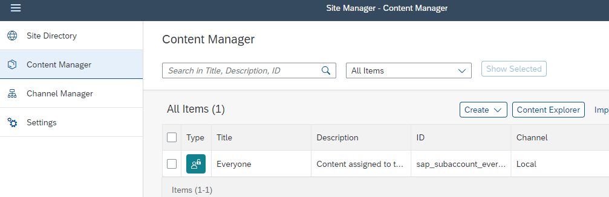

# Add your Fiori App to SAP Build Work Zone


This tutorial shows how to create, add or change a deployment configuration for SAP Build Work Zone (formerly known as Fiori Launchpad or FLP) to a Fiori Freestyle/ SAPUI5 Project in Business Application Studio.


### Prerequisites

You have set-up your Subaccount with 

 - Cloud Foundry environment 
 - Business Application Studio 
 - SAP Build Workzone

You have finished the previous tutorial and created and deployed a SAPUI5 app.


### Add FLP Configuration to your Project

1. Open your Business Application Studio (BAS), your Dev Space and your project "helloworldui5".

2. Check if you have already created an FLP configuration. 
   
    Open in project explorer the file helloworldui5 --> webapp --> manifest.json. 
    
    Search for `crossNavigation``.

    


    ```json 
    "crossNavigation": {
      "inbounds": {
        "semanticobjecthelloworld-show": {
          "semanticObject": "semanticobjecthelloworld",
          "action": "show",
          "title": "{{flpTitle}}",
          "signature": {
            "parameters": {},
            "additionalParameters": "allowed"
          }
        }
      }
    }
    ```

3. If you have no FLP configuration, add one. 

    Open View --> Command Palette (Ctrl + Shift + P) and type "Fiori: Add Fiori Launchpad Configuration".

    The Fiori Launchpad Configuration Generator opens. Provide the following parameters:

    - Semantic Object: semanticobjecthelloworld 
    - Action: show
    - Title: Show Hello World App (for example)

    where

    - Semantic Object:      a unique name of your choice
    - Action:               an action "ID of your choice, for example	"display"
    - Title:              	Your Title of an application
    - Subtitle (Optional):	Your Subtitle to be used by the tile

4.  Scroll down your manifest.json Check the value of `"sap.cloud"`.

    In case you named your managed approuter for example "sapbtphelloworldui5", it should be:

    ```JSON
    "sap.cloud": {
        "public": true,
        "service": "sapbtphelloworldui5"
    }
    ```

5. Build and deploy your application if it has changed.


### Integrate your HelloWorld app into SAP Build Work Zone

1. Open your Subaccount in your SAP BTP Cockpit.

2. Navigate to Services --> Instances and Subscriptions in the left navigation pane.

3. Select in Subscriptions "SAP Build Work Zone, standard edition".

    

    The Launchpad Site Manager opens in a new window.

    Note: If you get the error message "Access Denied", your user has not been assigned the role collection Launchpad_Admin. Go to Security --> Users, click on your user and assign the Launchpad_Admin role collection to your user.

4. Create a new Site. Name it for example "Hello World Site"

    


5. Open the Channel Manager. 

    Refresh the Content Channel. Otherwise it will stay empty.

    

6. Open Content Manager, and the Content Explorer.

    

7. In Content Manager --> Content Explorer, click on the Channel "HTML5 Apps".

    


8. In Content Manager --> Content Explorer, add your Fiori UI to the Site Content Manager.

    In this example another Fiori app has been already added to the Site Content Manager

    


9. Go back to Content Manager and create a "Group".

    

10. Name it for example "HelloWorldGroup" and assign your Fiori app to the group.

     Click "Save".

     

11. Go back to Content Manager and repeat the same for the Role "Everyone".

     

12. This should be the result:

     

13. Go Site Directory and enter your site "Hello World" by clicking on the small "Go To Site"-icon.

     

14. Click on your "showtinyBooks" tile.

     

15. You Hello World app will open:

     


