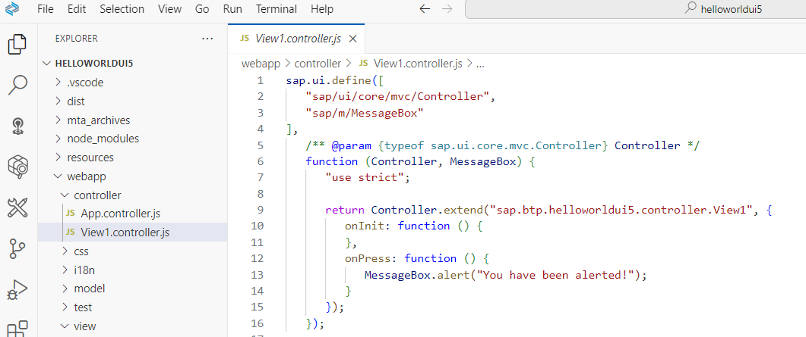
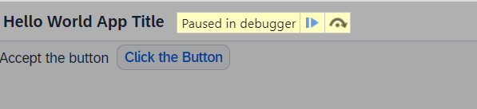
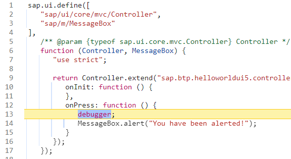
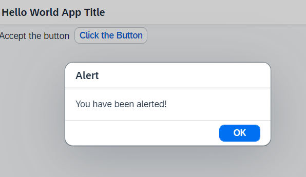
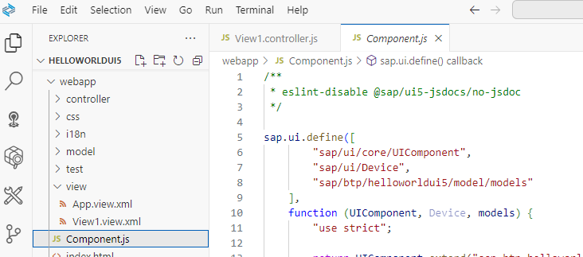
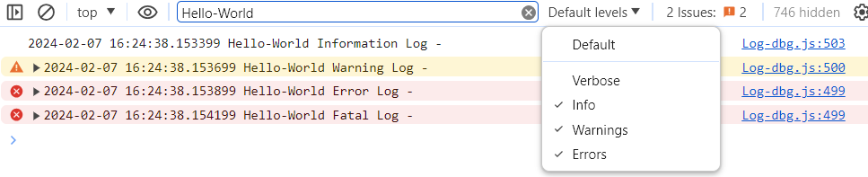

# Debug your Application 

### Set a Breakpoint and Debug

Breakpoints are helpful when you debug the event handling of an SAPUI5 object. You can either set breakpoints in:

- The developer tools of your browser (usually F12)
- In the SAPUI5 Diagnostics window (Ctrl + Shift + Alt + S). See also [SAPUI5 Debugging](https://sapui5.hana.ondemand.com/sdk/#/topic/c9b0f8cca852443f9b8d3bf8ba5626ab#loioc9b0f8cca852443f9b8d3bf8ba5626ab)
- In your Business Application Studio.

Setting a breakpoint in the code of your app is quite comfortable, as you can do it quickly rather then finding it in the browser.

In this example you choose your `View1.controller.js` where you control your View1. 

**Procedure**

1. Open SAP Business Application Studio and open the **Explorer** (the pages icon on the top left)
  
2. Open your `webapp/controller/View1.controller.js` file. 

   

3. Add `debugger;` to your controller function :

    ```JavaScript
    sap.ui.define([
       "sap/ui/core/mvc/Controller",
       "sap/m/MessageBox"
    ],
       /** @param {typeof sap.ui.core.mvc.Controller} Controller */
       function (Controller, MessageBox) {
          "use strict";

          return Controller.extend("sap.btp.helloworldui5.controller.View1", {
             onInit: function () {
             },
             onPress: function () {
                debugger;
                MessageBox.alert("You have been alerted!");
             }
          });
       });

    ``` 

    (Do not forget to remove `debugger;` when done)

4. Preview your app. 

   Open the Developer Tools of your Browser.

   Click in the app the button "Click the Button".

   The app will stop at the debugger statement.

   

   

5. Click in the Browser "Resume Script Execution" (F8).

   The app will execute. You

   Click "Alert" Button in your Hello-World app. 

   


6. Repeat the steps if you like.    


### Log your Application


1. Open SAP Business Application Studio and open the **Explorer** (the pages icon on the top left)
   

2. Open your `helloworldui5/webapp/Component.js` file. 


    


3. You need to add the [sap/base/Log](https://sapui5.hana.ondemand.com/sdk/#api/module:sap/base/Log) API to your webapp in order to use write logs to the console. 
  
    - Add `"sap/base/Log"` to `sap.ui.define` 
    - Add `Log` as additional function parameter and  
    - Add an example for each **Log Severity** 
 
   ```JavaScript
    
   sap.ui.define([
         "sap/ui/core/UIComponent",
         "sap/ui/Device",
         "sap/btp/helloworldui5/model/models",
         "sap/base/Log"
      ],
      function (UIComponent, Device, models, Log) {
         "use strict";

         return UIComponent.extend("sap.btp.helloworldui5.Component", {
               metadata: {
                  manifest: "json"
               },

               init: function () {
                  // call the base component's init function
                  UIComponent.prototype.init.apply(this, arguments);

                  Log.info("Hello-World Information Log");
                  Log.debug("Hello-World Debug Log");
                  Log.warning("Hello-World Warning Log");
                  Log.error("Hello-World Error Log");
                  Log.fatal("Hello-World Fatal Log");

                  // enable routing
                  this.getRouter().initialize();

                  // set the device model
                  this.setModel(models.createDeviceModel(), "device");
               }
         });
      }
   );
   ```

4. Open `helloworldui5/webapp/index.html` . 

   If you want to see all log levels, you have to add the **Log Level** `data-sap-ui-logLevel="debug"` to your index.html.

   ```JavaScript
      <script
          id="sap-ui-bootstrap"
          src="resources/sap-ui-core.js"
          data-sap-ui-logLevel="debug"
         
          ....
   ```

5. Preview your app. Open the **console** of your browser for example with "F12" and scroll down. 

   Search for "Hello-World" to find your logs and set the "Default-Levels".

   
   

Congrats! You made your first log entry!
