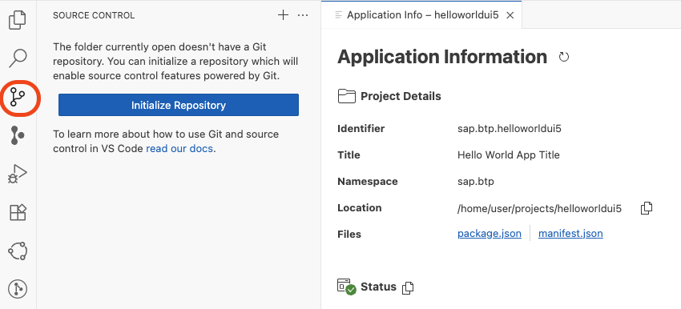
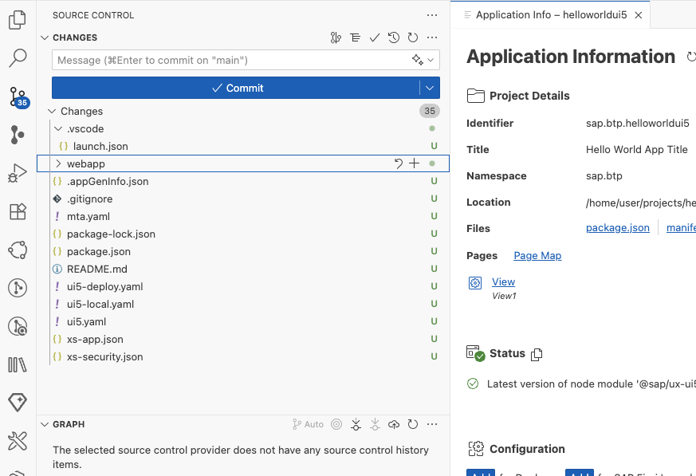
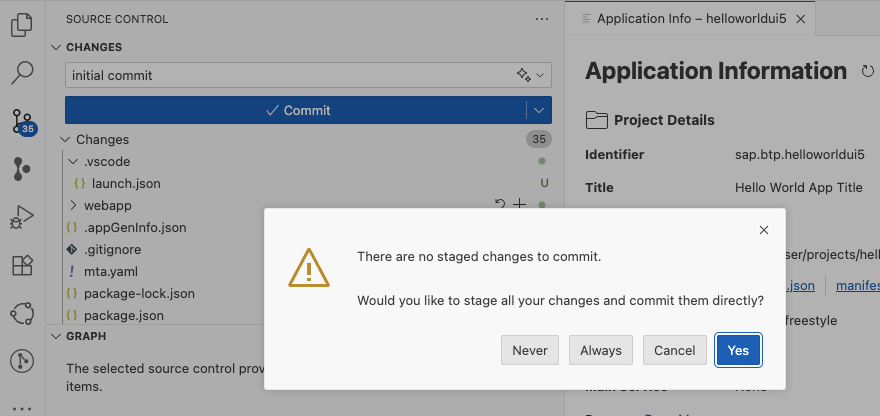
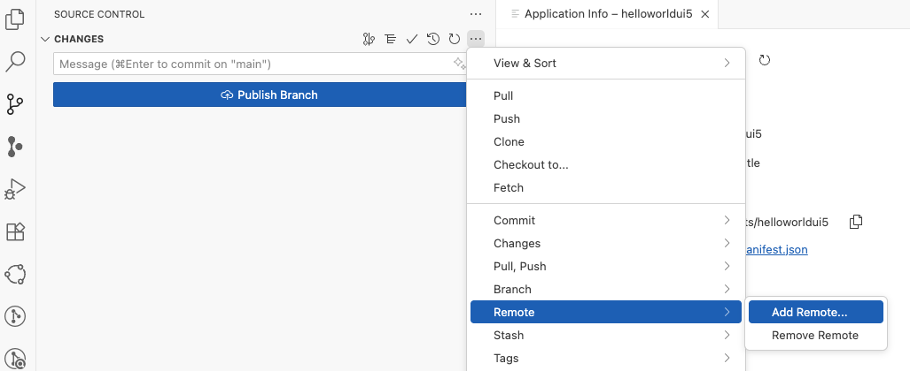
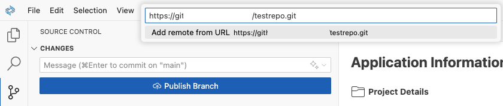
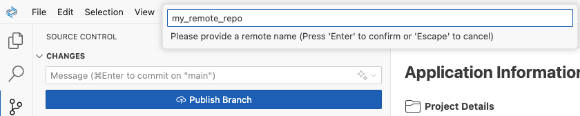
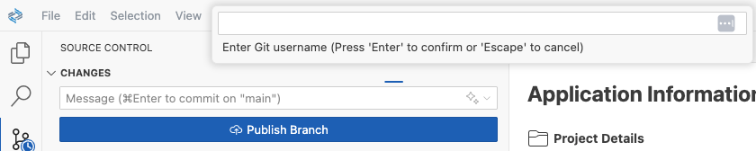
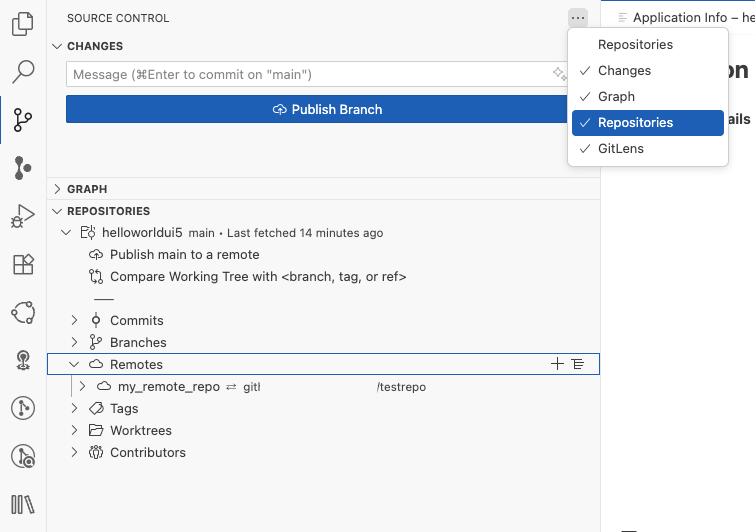
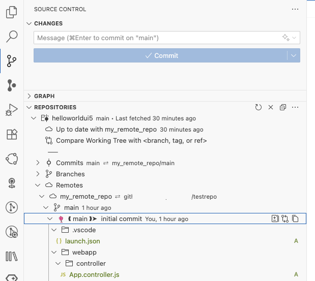
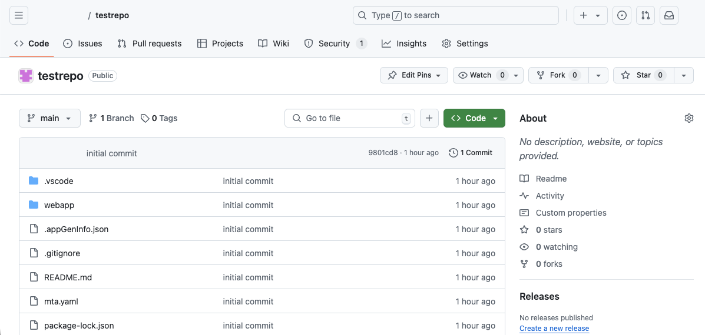

## Add your Project to a Git Source Control and a Remote Repository 

SAP Business Application Studio (BAS) enables you to connect and interact with the Git source control system, allowing you to work with remote Git repositories. For more information, refer to the [SAP Help Portal](https://help.sap.com/docs/bas/sap-business-application-studio/git-source-control?locale=en-US&version=LATEST).

SAP Business Application Studio is based on Code OSS, an open-source framework used for building Visual Studio Code. Git Source Control is a standard feature and is well-covered in the standard documentation. This tutorial focuses on the basic steps.

### Initialize Repository 

1. Find in the Activity Bar the view "Source Control" (You can also right-click in the Activity Bar and select "Source Control" in the pop-up menu). Click on the small icon.

   From here, you can also find further documentation from VS Code ("read our docs").

   Select "Initialize Repository".    

   

2. "Initialize Repository" creates the necessary "local" Git repository metadata files and shows your workspace files as untracked changes ready to be staged.

   So far, all changes are "untracked," meaning they are not "staged" (cf. "git add" command).

   

3. You can now stage or unstage each individual change. In this example, you stage all changes and commit them.

   Optional: Provide a Commit message in "Message" above the changes. 
   
   Select "Commit". Agree to stage all and commit.

   

4. You can now publish your branch. If you click on "Publish Branch", you get the message "Your repository has no remotes configured to publish to."

   

### Add a Remote Repository

1. Click on "Changes" in the Source Control view. This will show the "More Actions" menu. Click on the three dots, open the context menu, and select "Add Remote".

    

2. Provide your target repository URL.

   

3. Provide a remote repository name. This repo must be completely empty.

   

4. Enter your Git User Name

   

5. Enter your Git password or (developer) token for the repository.

   

6. You can now decide to store the user and password in your development environment.

    You can also decide to run periodically to fetch changes from your remote. (Select "No" if you are unsure).

7. You can check your remote connection. Click in Source Control on the three dots "..." and select the sub view "Repositories". Expand Repositories and check your Remote Configuration.  

    

### Publish Branch to your Remote Repository 

Your remote repository must be new and "fresh" without a Commit history. Otherwise, you must first pull the remote repository, integrate your changes, and resolve any merge conflicts. 

1. In your Source Control View --> Changes, click on "Publish Branch".

   You can see the result in your "Repositories" sub-view.

   

2. And you can see the changes in your remote repo.

   

You committed your work to a remote Git repository.
