## Setting Up Continuous Integration and Delivery (CI/CD) Service

SAP Continuous Integration and Delivery (CI/CD) is a service on SAP BTP that enables you to configure and run predefined continuous integration and delivery pipelines. It connects with your Git repository and builds, tests, and deploys your code changes.

SAP Continuous Integration and Delivery has, among others, a ready-to-use pipeline for SAP Fiori in the Cloud Foundry Environment. For further information, see [SAP Help Portal](https://help.sap.com/docs/CONTINUOUS_DELIVERY/99c72101f7ee40d0b2deb4df72ba1ad3/618ca03fdca24e56924cc87cfbb7673a.html?language=en-US&locale=en-US).

In this mission, you will use GitHub as a remote repository.


### Step 1 - Check Entitlement and Instance of your CI/CD service
  

1. Go to your SAP BTP Enterprise or Trial Account and open the SAP BTP Cockpit.

2. Check your **Entitlements**. Choose **Entity Assignments** and check that you are entitled to use the BTP Service **Continuous Integration & Delivery (CI/CD)** in your subaccount. 

   It is a "shared unit", so no quota assignment for your subaccount is required.

2. Choose **Account Explorer** in the left-hand navigation pane and choose your **Subaccount** in which you want to run CI/CD.

3. In your Subaccount, choose **Instances and Subscriptions** and check if the Continuous Integration & Delivery service is already subscribed. 

   This is the case if you executed the booster in the previous section with the option to activate CI/CD.


### Step 2 - Activate CI/CD service

1. If you did not already subscribe to the CI/CD service, choose **Service Marketplace** in the left-hand pane.

2. Type **Continuous Integration & Delivery** in the search box and choose the service tile.

   For **Service Plan** choose	for an enterprise account **default** - Subscription (enterprise) or for a trial account choose **Subscription (trial)**.

3. Choose Create.

4. Choose Create in the pop-up without changing any values. Wait until the status changes to **Subscribed**.

5. From the left-handed cockpit navigation pane, choose **Security** and then **Security → Users**.

6. Select your user. A detail screen for the user will open on the right-hand side.

7. In the detail screen, scroll to **"Role Collections** and click **Assign Role Collection**.

8. From the dropdown list, select **CICD Service Administrator** and **CICD Service Developer** and confirm your choice with Assign Role Collection.


### Step 3 - Access Continuous Integration and Delivery Service


1. In your SAP BTP subaccount, navigate to Services → Instances and Subscriptions in the left-hand pane.

2. Choose the Go to Application icon located next to the Continuous Integration & Delivery subscription.

   

3. Use your credentials to log in to the application if required.

4. You will see an empty Continuous Integration and Delivery service. <br>
   You will create two jobs in this tutorial for two remote repositories. <br>

   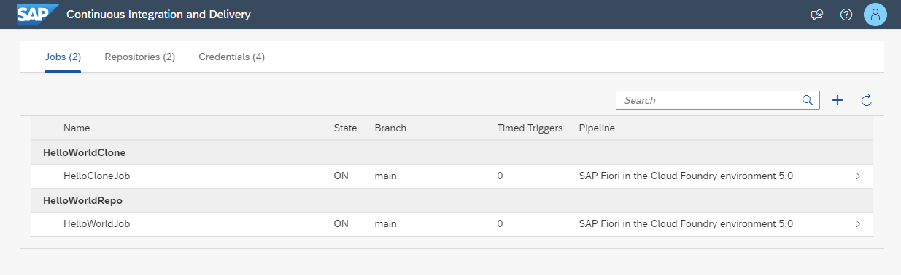


### Step 4 - Create Credentials for Accessing GitHub and BTP


1. Choose **Credentials** on the top-level navigation.

2. Click in the "+" icon, **Create Credential**.

3. Create Credentials for accessing the GitHub repo.

   - Credentials Name: any 
   - Username: your GitHub user name
   - Password: your GitHub password. You may have to use a Personal Access Token.
     
   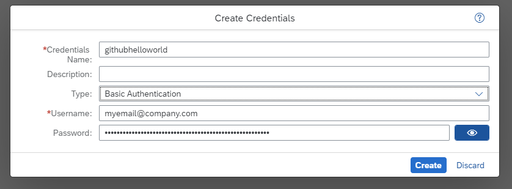

4. Create Credentials for accessing the BTP platform, which will be needed to deploy the build archive. 

   - Provide a name for the entry, e.g., "deployonbtp.
   - Choose Authentication Type, e.g., Basic Authentication 
   - Provide the user and password for a user who has the assigned role collection for CI/CD usage.
   - For productive usage, consider creating and using a technical user.

   

### Step 5 - Create a CI/CD Entry for your GitHub Repository


1. Click on "Repositories" in the top-level navigation.

2. Click in the "+" icon, **Add repository**.

7. Provide the required information, e.g.:

   - Name: e.g. HelloWorldRepo
   - Clone URL: your GitHub Repo URL, which contains the **helloworldui5** project from the previous section.
   - Credentials: the one we just defined 
   
   Generate a **WebHook Event Receiver**: Choose "Generate"

   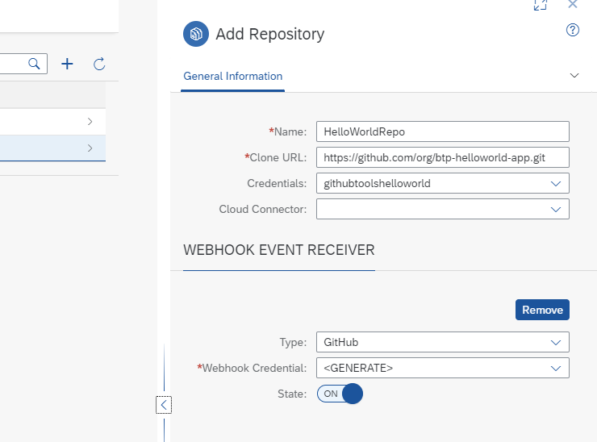

9. Check the generated Webhook Data. Click on Webhook Data.

   You will need this Data for your GitHub Repository and the CI/CD pipeline.
   
   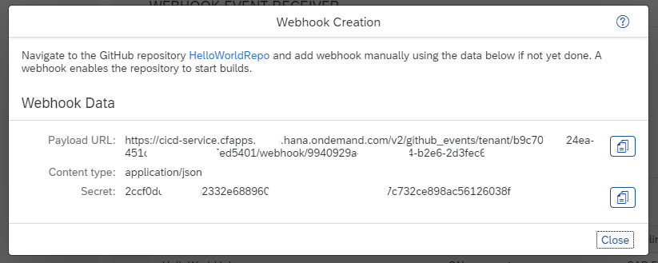


### Step 6 - Create the Webhook Credentials for the CI/CD pipeline


1. Click on Credentials again, choose "+" Add Credentials.

2. Provide the data, using the secret from your repository definition.  

   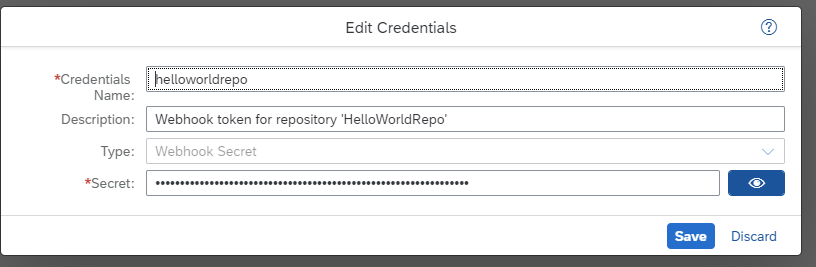
  
   


### Step 7 - Create the Webhook in your GitHub Repository

1. Open your GitHub Repository, which contains your **helloworldui5 project** from the previous section.

2. Click on **Settings** and then on **Hooks**.

   

3. Click on **Add Webhook**.

   Copy Payload URL and Secret from your generated Webhook Data from your CI/CD repository definition. SSL verification will be auto-enabled.

   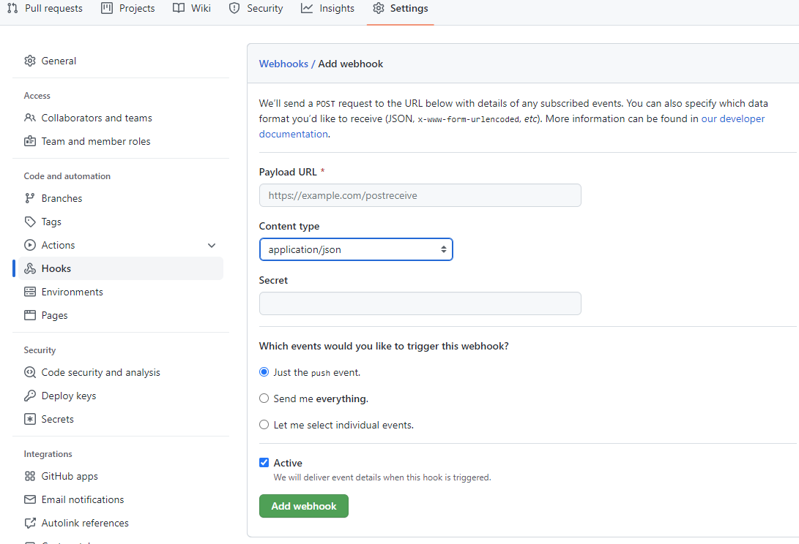

4. Click on **Add Webhook** and check the result. 

<br>  


### Step 8 - Create a Job with your CI/CD Service Job Editor


1. Click on **Jobs** in the CI/CD service. Choose `"+"` **Create Job**.

2. Provide the **General Information**:

   - Job Name: Any
   - Repository: The one you just defined.
   - Branch: **main**  (typically main, if you did not change it)
   - Pipeline: **SAP Fiori in the Cloud** (this is a predefined pipeline)
   - 
   
3. **STAGES** 

   - Configuration Mode: **Job Editor**  
   - Build Tool Version: Java 11 Node 16
     
   Choosing Job Editor means you will use a form to provide the necessary pipeline data, not a .pipeline/config.yml file.
   
   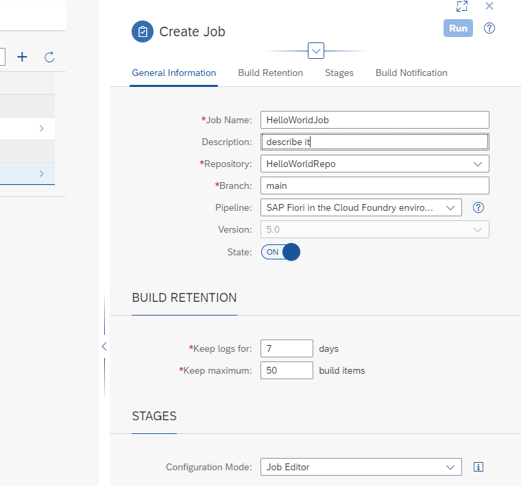
   
 
5. **Skip some Stages**  

   **Switch `OFF`** the following stages, because it is not part of a beginner tutorial. 
 
     * Addition Unit Tests
     * Malware Scan 
     * Compliance 


6. Switch **`ON`** your **Release** Stage. Provide the deployment information to your Cloud Foundry Space.
   
   - **API Endpoint:** copy from your Subaccount "Overview" page  
   - **Org Name:** copy from your Subaccount "Overview" page 
   - **Space:** copy from your Subaccount "Overview" page  
   - **Deploy Type:** standard 
   - **Credentials:** deployonbtp or how you named it. 

   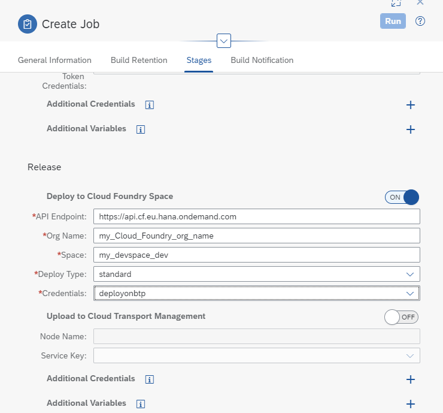


6. Clicke **`Create`**.

7. Click **`Run`**. 

   Build and deployment will take some minutes.    You can see the log of the build process during execution of the buld pipeline.
   
   If everything is ok, you will get a green result log 
   
      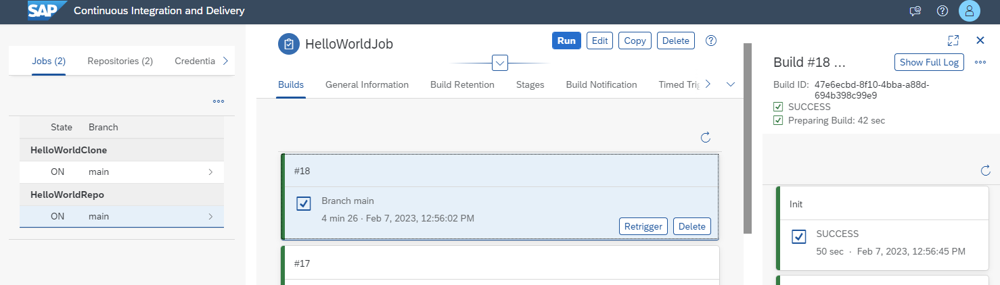
      
 

9. Congratulations! If the Release Stage is also green, your Job has been deployed. 

   Check the result in your Subaccount **HTML5 Applications** :  (Note: You can create the "helloworldclone" app in a different tutorial)
   
      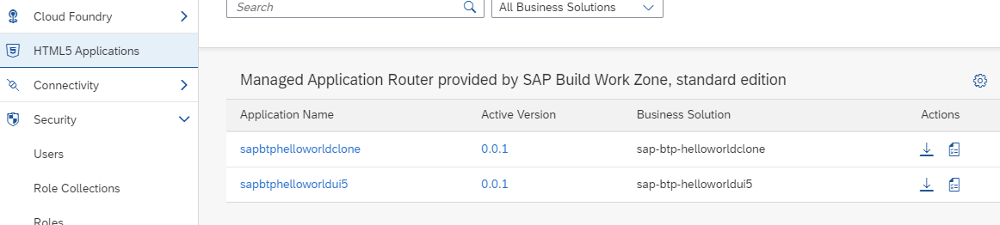
   


### Step 9 - Use a config file instead of Job Editor   


If you use subfolders in your Fiori project, you have to use **.pipeline/config.yml** pipeline definition in your Git repository.

You can create one from your Job Editor definitions. 

Click on the small **`YML icon`** in your Job definition and an editor will open, containing your job definition as a YAML file.

      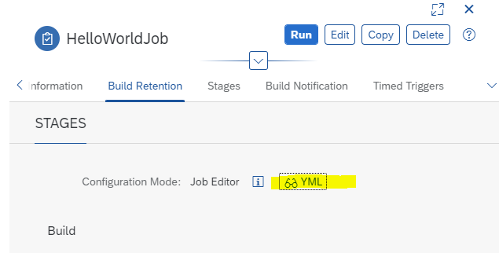
      
If your subfolder is, for example, **helloworldclone**, you have to add in your "Build Stage" **source: helloworldclone**. E.g.:
````
stages:
  Build:
    source: helloworldclone
    npmExecuteLint: false
````

The whole config.yml could look like this:

```
---
general:
  buildTool: "mta"
service:
  buildToolVersion: "MBTJ11N16"
stages:
  Build:
    source: helloworldclone
    npmExecuteLint: false
  Additional Unit Tests:
    npmExecuteScripts: false
  Malware Scan:
    malwareExecuteScan: true
  Acceptance:
    cloudFoundryDeploy: false
    npmExecuteEndToEndTests: false
  Compliance:
    sonarExecuteScan: false
  Release:
    cloudFoundryDeploy: true
    cfApiEndpoint: "https://api.cf.eu10.hana.ondemand.com"
    cfOrg: "mysubdomain"
    cfSpace: "dev"
    cfCredentialsId: "deployonbtpcredentials"
    deployType: "standard"
    tmsUpload: false
steps:
  artifactPrepareVersion:
    versioningType: "cloud_noTag"
  cloudFoundryDeploy:
    mtaDeployParameters: "-f --version-rule ALL"
```

You need to create a folder and file named **.pipeline/config.yml** in the root of your GitHub repository and provide the necessary configurations.
Switch the **Configuration Mode** of your Job to **Source Repository** and **Run**.


   


### Appendix   


#### Hints, Tips, and Troubleshooting

Using the Job Editor instead of config.yml works only if you don't have subfolders in your Git repository. 
The Job Editor of CI/CD does not support configuring subfolders. 

You can solve this using a pipeline definition with the  configuration file (configuration.yml). 

Check the Quota of your Cloud Foundry Runtime in your Subaccount. 
If you don't have enough free Quota, the release stage of the CI/CD service will fail, as well as manual deployment. 

For example, if you want to deploy two HTML5 apps, you need two units of Cloud Foundry Runtime as a quota in your Subaccount.

See also this [SAP Blog](https://blogs.sap.com/2022/02/11/optimise-your-sap-btp-cloud-foundry-runtime-costs/).


#### Further information

SAP Help Portal: [Continuous Integration and Delivery](https://help.sap.com/docs/CONTINUOUS_DELIVERY?locale=en-US)

SAP Help Portal: [Continuous Integration and Delivery by SAP](https://help.sap.com/docs/CICD_OVERVIEW)


