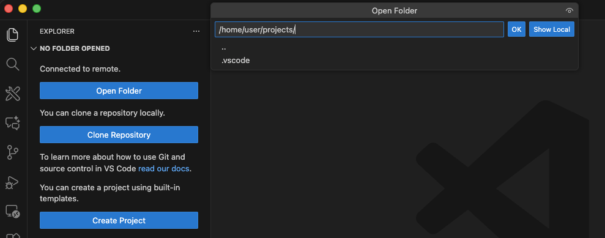
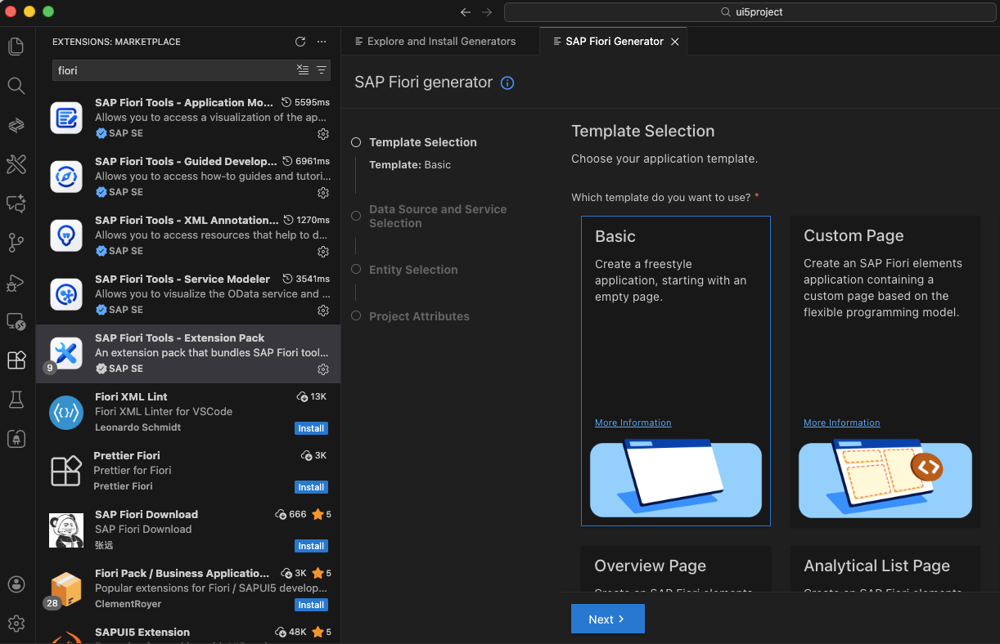
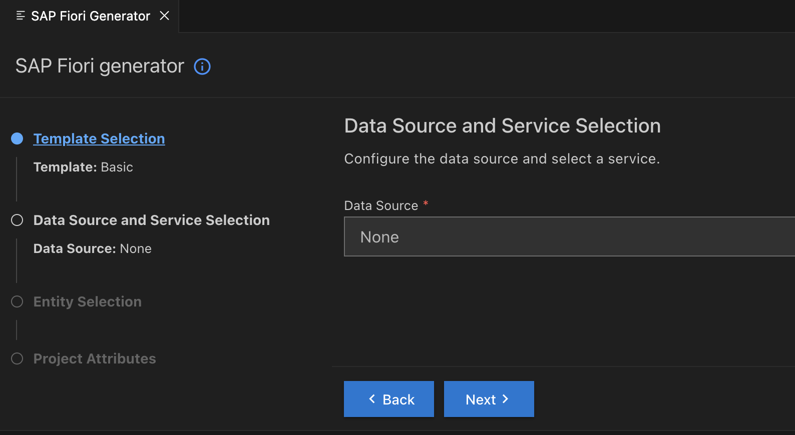
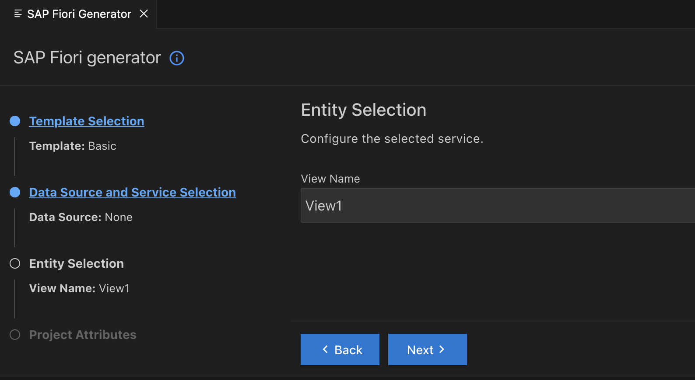
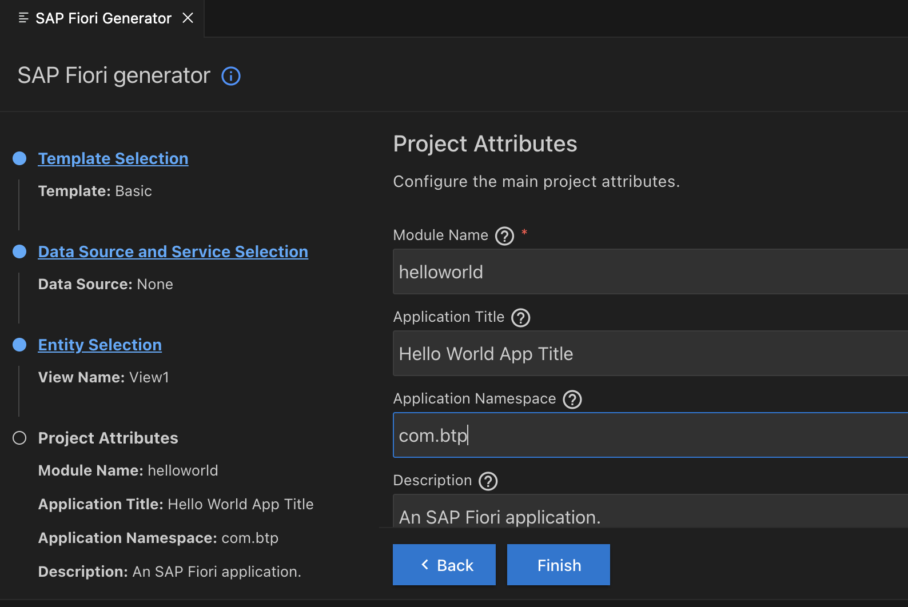
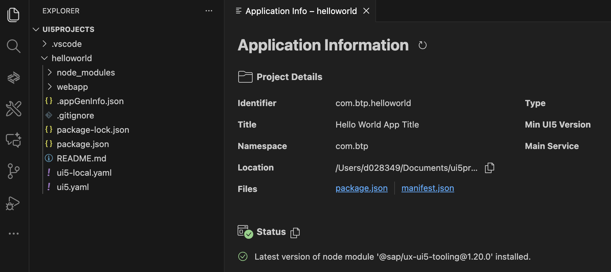
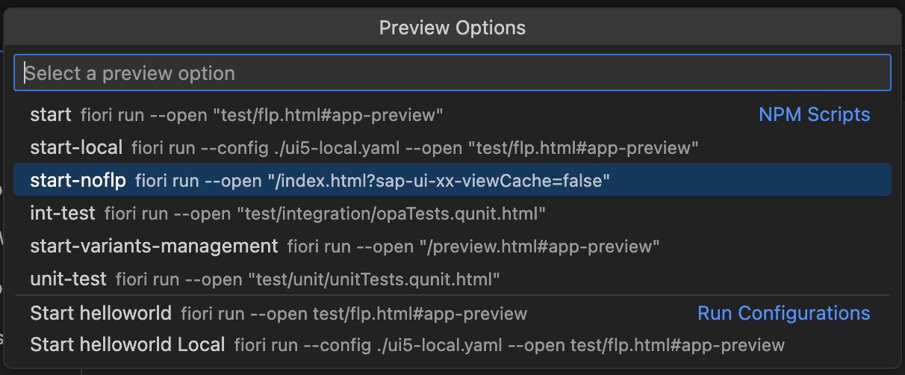
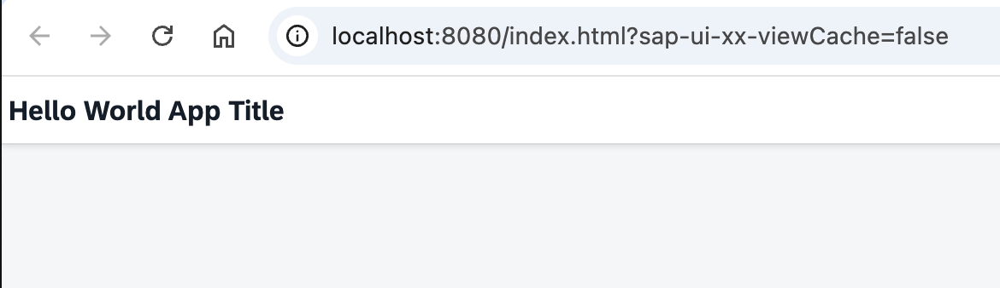

# Set Up Visual Studio Code for SAPUI5 Development locally

"SAP Fiori tools" is an extension pack available for Visual Studio Code and SAP Business Application Studio, designed to increase the efficiency of SAP Fiori elements app development. SAP Fiori tools allow users to easily generate SAP Fiori elements apps, modify the app’s functionality, generate new pages, and preview the application with both backend and mock data.

### Set Up Visual Studio Code locally

1. Make sure you have locally installed Visual Studio Code. To install VS Code, open the VS Code installation instructions [Setting up Visual Studio Code](https://code.visualstudio.com/docs/setup/setup-overview) and follow the installation instructions.

   On this website, you can also find all the information about this IDE itself.

2. Install the JavaScript runtime environment [Node.js](https://nodejs.org). 

   Consider using a Package Manager, for example, "homebrew" for macOS, for installing and versioning Node.js. In that case, follow the installation instructions from the Package Manager. 

   Check the successful installation in VS Code. Open a Terminal in VS Code and enter 'node --version'.

3. Install [UI5 CLI](https://ui5.github.io/cli/stable/) in Node.js. To install it globally, enter 'npm install --global @ui5/cli'. For other installation options, follow the Readme instructions. 

   Check the installation in the terminal. Enter 'ui5 --version'.

4. Optional: Install typescript. 

5. Install [SAP Fiori Tools - Extension Pack](https://marketplace.visualstudio.com/items?itemName=SAPSE.sap-ux-fiori-tools-extension-pack) in VS Code. Click on the "Extension" icon in the VS Code activity bar.

   Check the added Fiori commands in VS Code. Open Command Palette or type '>Fiori' into the VS Code search field.

6. Optional: Consider installing UI5 Linter in node.js, a static code analysis tool for UI5 projects [@ui5/linter](https://www.npmjs.com/package/@ui5/linter): 'npm install --global @ui5/linter'.

   UI5 linter can be started from the terminal or is also available with Fiori tools in the Command Palette: '>Fiori: Run UI5 linter'.

7. If you want to use the Remote Landscape option for accessing your Business Application Studio workspaces from your local VS Code instance, install the [SAP Business Application Studio toolkit](https://marketplace.visualstudio.com/items?itemName=SAPOSS.app-studio-toolkit) extension.

8. Optional: You can install additional VS Code Extensions to support AI-assisted coding. One will be later used here: Cline. Cline is an open-source AI coding agent that can integrate MCP Servers. 

   For installation instructions, see [Installing Cline (External Link)](https://docs.cline.bot/getting-started/installing-cline).

### Optional: Create a local SAP Fiori Project with App Generator

1. Open the SAP Fiori Application Generator: Type in the VS Code Search field: **`>Fiori: Open Application Generator`**. 
   
   On the first call, it will be installed in VS Code. Select a template, e.g., "Basic", click "Next", and continue providing the same Input as described in the "Hello World" tutorial for Business Application Studio.

   

2. Select template "Basic" and "Next".

    

3. Select as Data Source "None". For now, you just want to have a simple web page.

    

4. Name the view auf the ui5 app. Keep "View1" or provide your name.

    

5. Provide additional project attributes. Keep the preselected options. Choose "Next".

    

6. Wait until the project is generated. Preview the app from "Application Info" or right-click on "webapp" and select "Preview".

    

7. Select a preview option. Start with "start-noflp" for minimal setup.

    

8. Check the result in your browser.

    

#### Further Information

For more information on creating a local SAP Fiori project, see the tutorial [Set Up SAP Fiori Tools in Your Development Environment](https://developers.sap.com/tutorials/fiori-tools-vscode-setup.html)   

EOF
