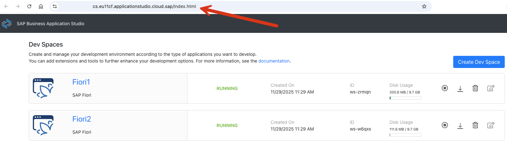
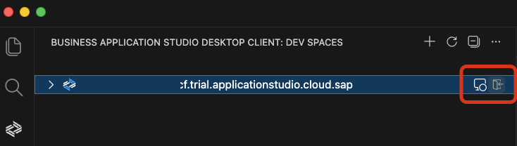
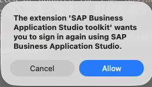
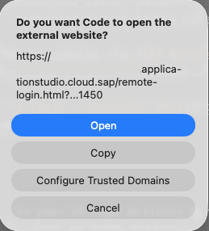
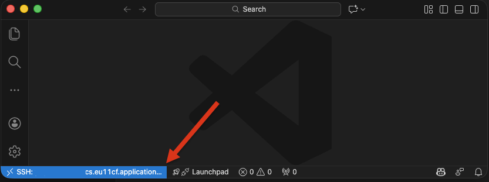

### Set Up an IDE Remote Landscape

SAP Business Application Studio is based on Code OSS, available as a cloud service. This service has restrictions regarding the use of extensions. For example, the [UI5 MCP Server](https://github.com/UI5/mcp-server/blob/main/README.md) cannot be configured for SAP Business Application Studio (BAS).

You can connect your SAP Business Application Studio dev spaces (landscape) to the Visual Studio Code desktop application and access a dev space directly from a local Visual Studio Code. This allows you to leverage VS Code capabilities, including GitHub Copilot Chat and MCP servers.

For more information on setting up Business Application Studio Toolkit, see:

- SAP Help Portal: [Access SAP Business Application Studio from VS Code](https://help.sap.com/docs/bas/sap-business-application-studio/working-remotely?locale=en-US&version=LATEST).

- GitHub: [SAP Business Application Studio Toolkit](https://github.com/SAP/app-studio-toolkit/blob/main/packages/app-studio-toolkit/README.md).

### Access SAP Business Application Studio Workspace from local IDE

1. Click the BAS toolkit icon in your VS Code Activity Bar.

   

2. Click "Connect Landscape". Provide the Landscape URL for your BAS Dev Space.

   

   Find the URL for your BAS Dev Spaces in your SAP BTP BAS instance (remove the index.html file).

   

3. Click the "Log In" icon for your Landscape 

   

4. Click "Allow" and "Open".

    

   

5. You are authenticated. Return to your VS Code.

   

6. Access your remote landscape. Click on your devspace

   

7. A remotely connected VS Code Window will open.

   Open the folder "home/user/projects". 
   
   You can create your projects now here (optional).

   
