# Add an SAP MCP Server to your local IDE

The Model Context Protocol (MCP) server is an open standard that enables AI models to utilize external tools and services through a unified interface, thereby extending their capabilities.

MCP servers are not bound to a specific IDE or MCP host. You can use any MCP client, such as VS Code, or any other MCP-compatible client.

SAP offers UI5 and Fiori MCP servers for integration with AI coding assistants. The servers assist AI models in creating or modifying SAP Fiori applications based on user prompts.

1. `@ui5/mcp-server` on [npm](https://www.npmjs.com/package/@ui5/mcp-server?activeTab=versions), on [GitHub Repository](https://github.com/UI5/mcp-server)

2. `@sap-ux/fiori-mcp-server` on [npm](https://www.npmjs.com/package/@sap-ux/fiori-mcp-server)

3. Optional, this tutorial does not use Data Sources: `@cap-js/mcp-server` on [npm](https://www.npmjs.com/package/@cap-js/mcp-server)


### Requirements

- Node.js Version v20.11.x, v22.0.0, or higher
- npm Version v8.0.0 or higher
- An MCP client, VS Code is used in this tutorial, or any other MCP-compatible client


### Option 1: Set up GitHub Copilot in VS Code 

VS Code comes with an integrated AI-powered assistant, "GitHub Copilot", which can also be extended with Model Context Protocol (MCP) servers.
 
1. Open VS Code and the View "Chat". On the bottom right, hover over the Copilot icon in the Status Bar and select Use AI Features.

   For more information, see [VS Code setup guide](https://code.visualstudio.com/docs/copilot/setup).
 
   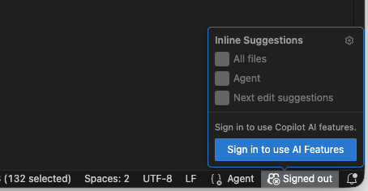 

2. Choose how you want to authenticate for GitHub. 

   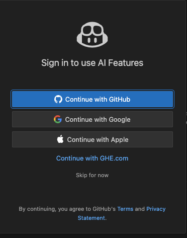 

3. You will be forwarded to your authentication page, from where you can navigate back to VS Code. You can now use GitHub Copilot AI Features in VS Code if your GitHub Account is enabled to use Copilot.


#### Add MCP Servers to GitHub Copilot

Note: To use MCP servers, the "MCP servers in Copilot" setting must be enabled in your GitHub account settings.

1. Open VS Code. Open Command Palette and type '>MCP: Add Server'.

   Select "NPM Package".

   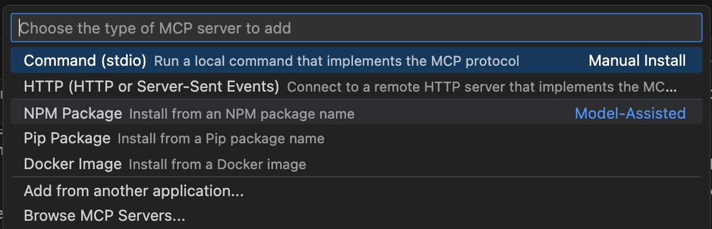


2. Provide the package name `@ui5/mcp-server` and 'Enter'.

   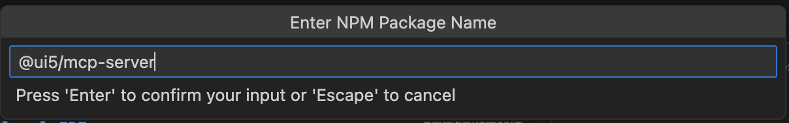

3. Allow (or Cancel) Package installation. Select Enter to leave the additional options empty or provide your parameters based on the MCP Server documentation.

4. You can check the configuration you just created. In Command Palette, enter `>MCP: List Servers`. Choose your UI5 MCP Server and select "Show Configuration". The entry in 'mcp.json' should look like this:

    ```JSON

    "@ui5/mcp-server": {
			"type": "stdio",
			"command": "npx",
			"args": [
				"@ui5/mcp-server"
			]
	 }

    ```
 


5. Open your Chat Configuration with the little screwer in your chat window:

   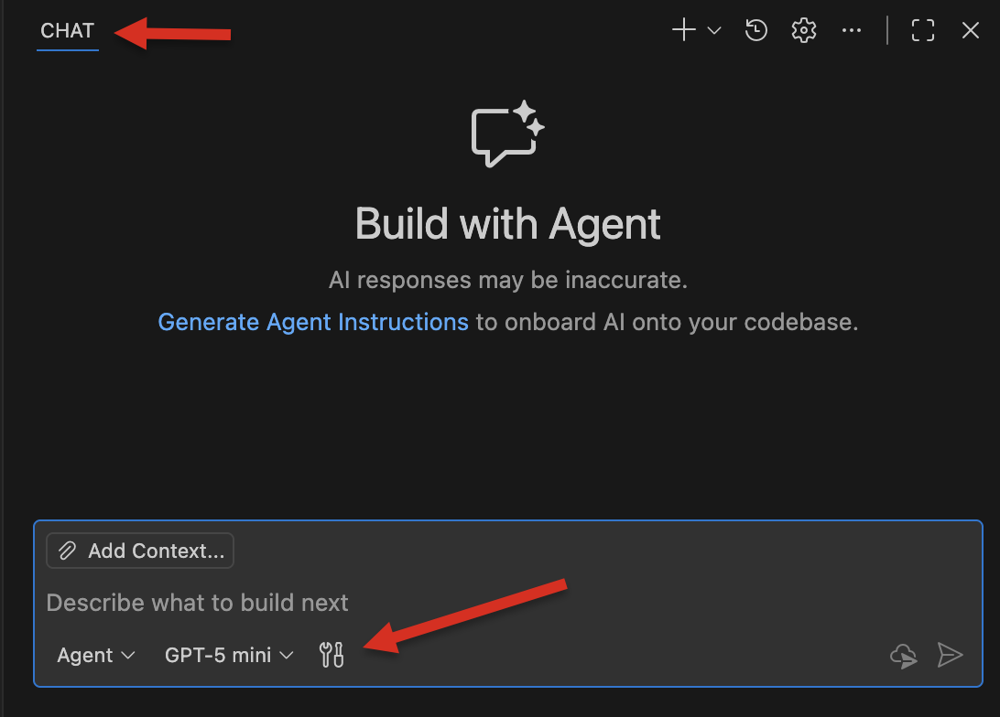 


6. Select the tools from the UI5 MCP server you want to use. Or deselect the tools you do not want to use.

   Note: the Fiori MCP server has already been installed by the Fiori Extension. You can also select the tools you want to use.

   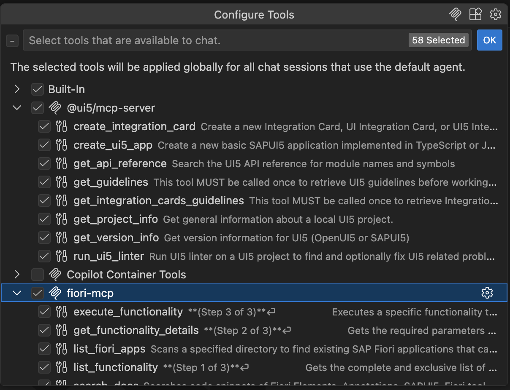

7. Test your MCP server by asking something about UI5 details: 

   "Explain the difference between the sap.ui.require and sap.ui.define APIs".

   The answer could appear as follows (LLMs are non-deterministic). Compare it with the result when SAP MCP Servers are switched off.

   ```

   ## Key Differences

   - `sap.ui.define` creates a module definition that can be imported by other parts of the application, while `sap.ui.require` only loads modules for immediate use.
   - `sap.ui.define` requires a return value from the factory function, whereas `sap.ui.require` does not.
   - `sap.ui.define` is typically used at the top level of module files, while `sap.ui.require` can be used anywhere in the code for on-demand loading.

   ````

8. Optional: Improve your GitHub Copilot Customization by adding Custom instructions, Prompts, Custom Agents, Language Models or add. MCP Servers.

   See [Customization options (External Link)](https://code.visualstudio.com/docs/copilot/customization/overview).


### Option 2: Set up Cline Agent in VS Code

You can use additional VS Code Extensions to support AI-assisted coding, for example, "Cline". Cline is an open-source AI coding agent that can integrate MCP Servers. 

For more information about Cline, see [Welcome to Cline (External Link)](https://docs.cline.bot/introduction/welcome)

1. Open your VS Code Extension "Cline" from the Activity bar. Sign Up or Login. 

   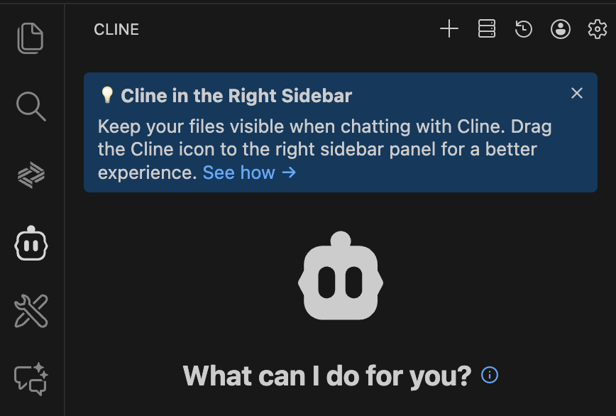

2. Optional: Open the VS Code View "Chat". Drag the Cline icon from the Activity bar into the header line of the Chat View.

   This allows you to have Cline next to others in the Chat View.

   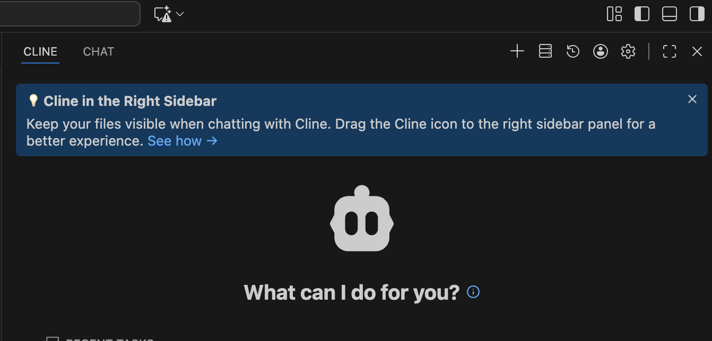

3. In the Cline view, click the "gear" icon "Settings". Choose a language model. The free models are sufficient for this tutorial. Check the rest of the Settings. 

   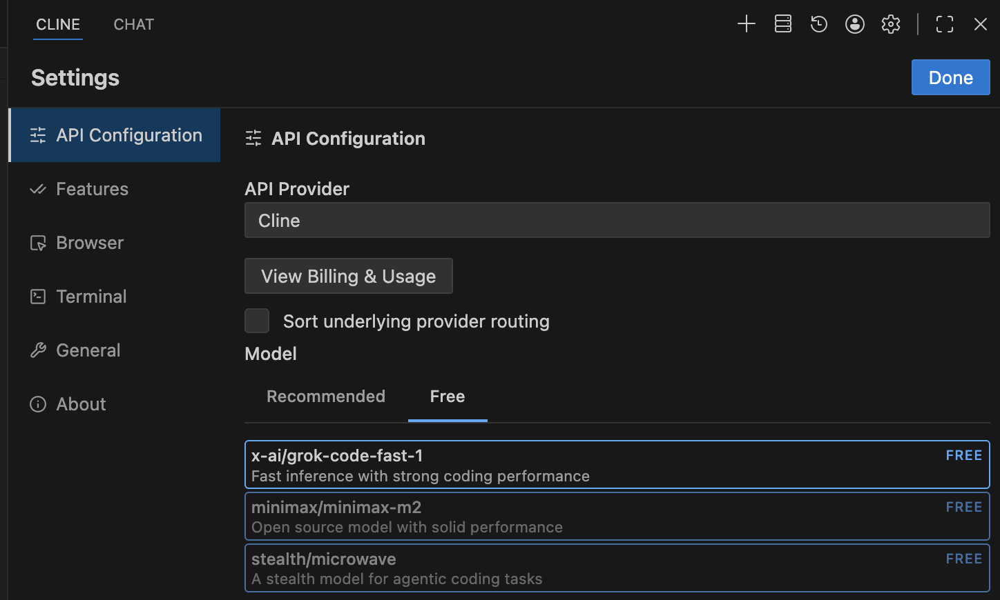

4. In the Cline view, click the "server" icon "MCP Servers". Select the "Configure" Tab and "Configure MCP Servers".

    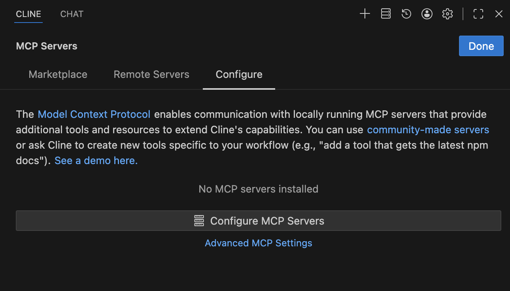


5. "cline_mcp_settings.json" will open. You have to configure the UI5 MCP server manually:

   ```JSON

   {
   "mcpServers": {
      "@ui5/mcp-server": {
         "type": "stdio",
         "command": "npx",
         "args": [
         "@ui5/mcp-server"
         ]
      }
   }
   }

   '''

6. Make sure the MCP server runs after configuration. 
 
   Cline provides a clear overview and description of the tools contained within. You can choose which one you want to "Auto-approve" for use with Cline. Your decision will be stored in the "cline_mcp_settings.json" file.

   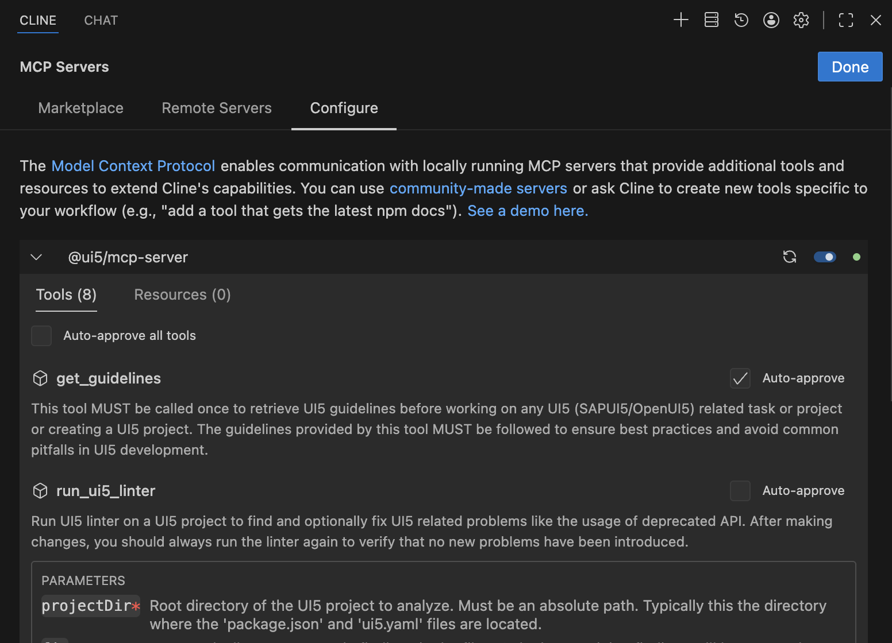

7. Test your installation, e.g., with the prompt: "Explain the difference between the sap.ui.require and sap.ui.define APIs".
 
   Try it with the activated and deactivated MCP Server.


8. Optional: Improve your Cline configuration by adding a ".clineignore" file. '.clineignore' is a project-level configuration file that tells Cline which files and directories to ignore when analyzing your codebase. 

   See [Prompt Engineering Guide (External Link)](https://docs.cline.bot/prompting/prompt-engineering-guide).


###  Extend your Project using SAP MCP Server

You can now use your AI features to extend the UI5 project you created in the previous tutorial.

1. Open Cline chat. Provide the Prompt:

   ```
   Add a button named "Hello World" to the Fiori app, with the on-click message "Hello World".
   ```

2. Cline will inform you about its steps. Approve or reject results.

   The final result should look like this:

   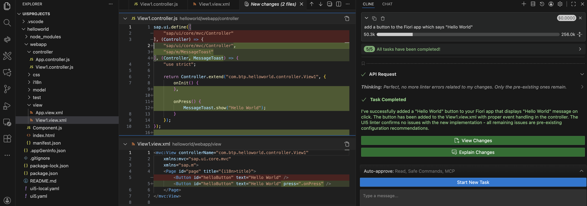

3. And the app preview should look like this:

   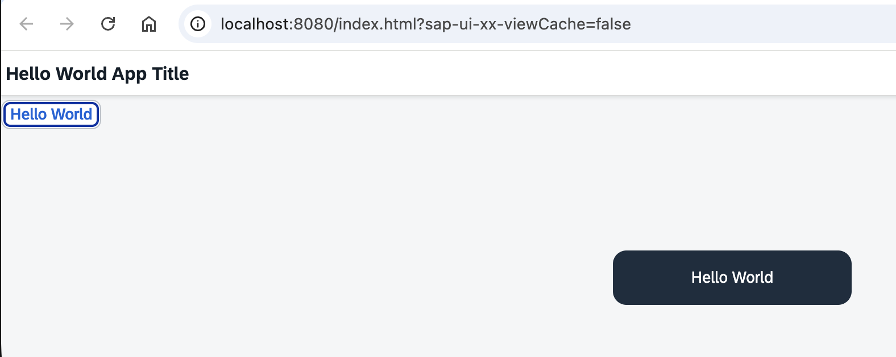

Congrats! Continue with your ideas.

EOF
