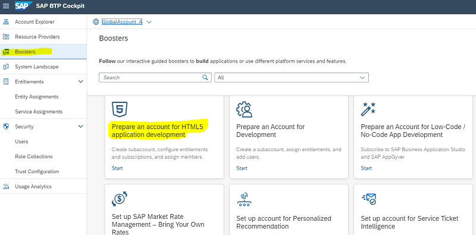
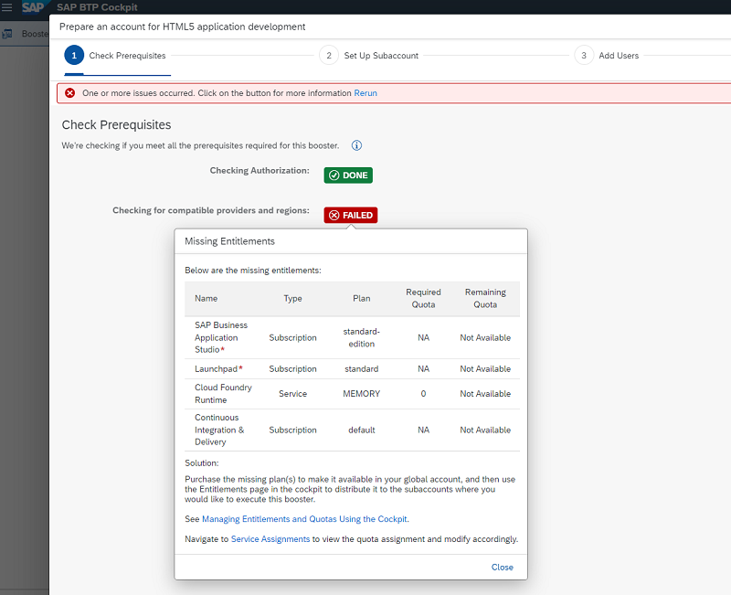
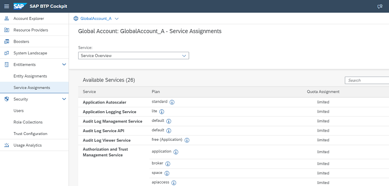
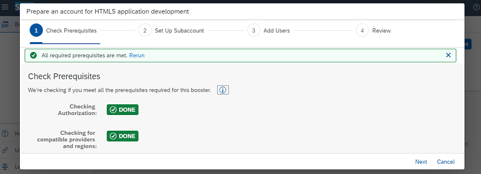
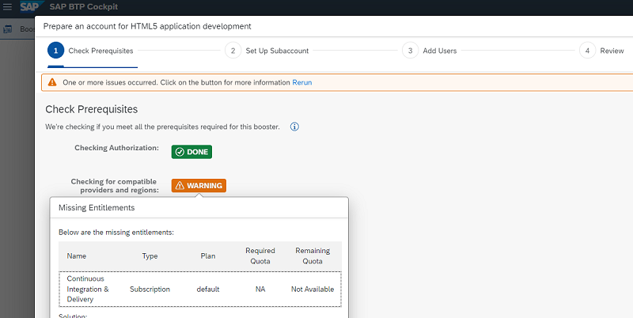

**Note:**
This step is only necessary for an Enterprise Account (e.g. pay-as-you-go Account with free-tier service plans)
SAP BTP Trial comes with preconfigured HTML5 application development.

# Run Booster - Part 1
 
A SAP BTP Booster is a wizard-based UI, which automates the administration steps to set up BTP services instead of configuring all necessary services manually.  
For this HTML5 mission you can run the Booster **"Prepare an Account for HTML5 development".**

### Step 1 - Prerequisites Check

1. Open your SAP BTP Cockpit of your Global Account.

2. Make sure you have the Global Account Administrator role for your Global Account.  
   Select **"Users"** in the left navigation pane, and click on your **user**.  
   A second detail view will open.  
   The "Role Collection" **Global Account Administrator** must be assigned to your user.

    

3. Select **Boosters** in the left-handed navigation pane.

4. Search for the booster **Prepare an Account for HTML5 development**.

    

5. Select the Booster and click **Start**. 

6. You will see the start screen of the booster. Select the **Components** tab in the booster and notice the required services and subscriptions. 

7. Press **Start**. It will start the first step of the booster, which just checks the prerequisites.

8. **Option 1 - Booster will fail**

    In case the booster step will fail, the booster execution will stop.  
    In this example, we have an enterprise subscription account, with 4 missing **entitlements**.   
    (Note: Continuous Integration & Delivery service is optional)

    
   
    Click on the red **"Failed"** button to see the root cause.  
    Click the provided link to **Service Assignements** or  
    Click **Cancel** and navigate to your **Global Account**  and select **Service Assigements**. 
   
    

    Check, that you have all required entitlements for 
    * Cloud Foundry Runtime (including **free "Quota"**, means not already assigned to another subaccount)
    * Business Application Studio
    * Build Workzone Service and
    * Optional: Continuous Integration & Delivery Application
    * Free HTML5 Application Repository Service (which you will use later in the mission)
    
     

9. **Option 2 - Booster passes**

    If all prerequisites are fullfilled, you will get a success message
    
    
    
    In case, you do not have the Continuous Integration & Delivery Application, you will get a warning, which you can ignore. It is optional for this misison.
    
    
    

Before proceeding to step 2, configuring the booster, you may check in [SAP Discovery Center](https://discovery-center.cloud.sap/viewServices?showFilters=true&provider=all&regions=all) for which regions and infrastructure providers the required services are available and which region and provider you like to choose.
