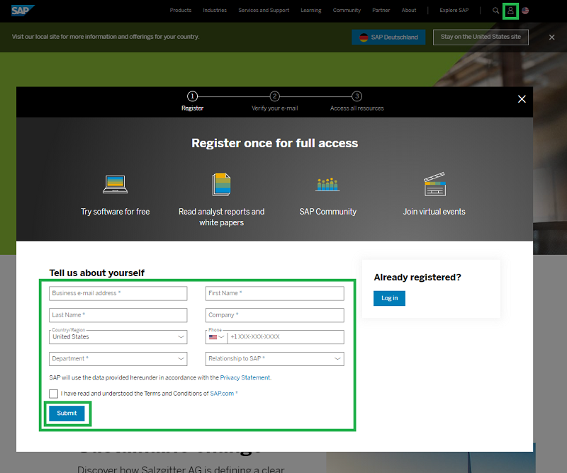
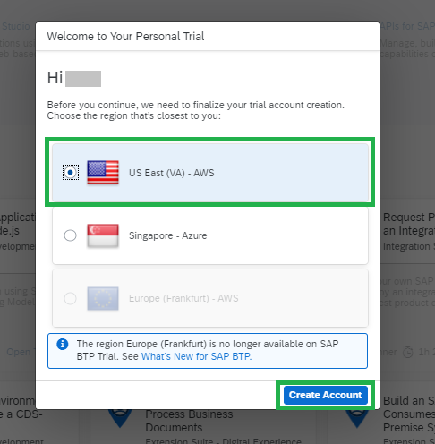
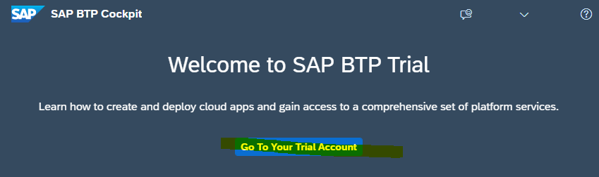
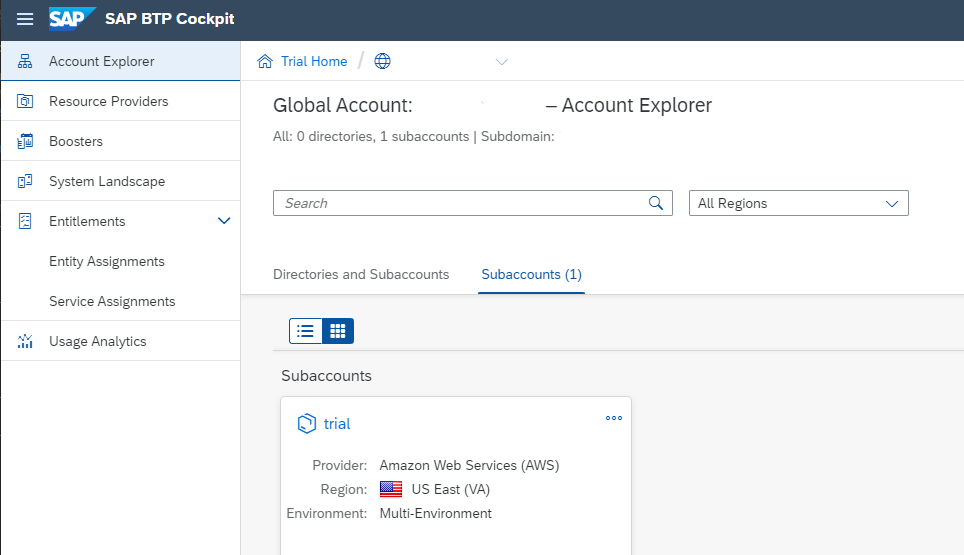

## Sign up for a free Trial Account for SAP BTP

**Note:** You can skip this step in case you already have an SAP BTP Trial account.

SAP BTP trial account comes already with preconfigured entitlements for **Cloud Foundry Runtime**, **SAP Business Application Studio** and **SAP Launchpad Service** and 
you have the SAP BTP **global account administrator** privilege.

In the next steps, you will create an SAP Universal ID and get a SAP BTP trial account .

**Procedure**

1. Visit https://www.sap.com/ and click the **Log On** icon in the upper-right corner.

2. If you already have an SAP account (e.g. a P, S, C, D or I number) click **`Log in`** and prvoide username and password. 

3. If you do not have an account yet, provide your registartion information and click **`Submit`** to create an account. 

    

4. Access your [BTP Trial Cockpit](https://cockpit.hanatrial.ondemand.com/trial/#/home/trial)  
   If you access a new account you will have to choose your **Region**.   
   Click **Create Account**.   
 
    

5. It will take a minute to provide the trial account. You will see a progress window during this time.   
   Choose **`Continue`** once the account is provisioned.

6. Choose **`Go To your Trial Account`** in your "Welcome to SAP BTP Trial" page.  

    

7. The **Account Explorer** in your SAP BTP Cockpit will open.  
   It shows your **Global Account** and your Trial **Subbaccount**. In both accounts you will work in this tutorial.
   
    

