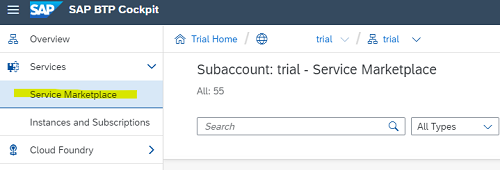
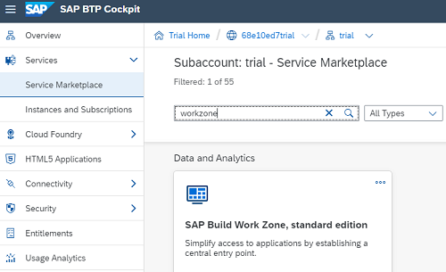
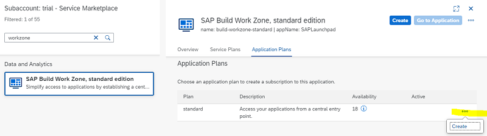
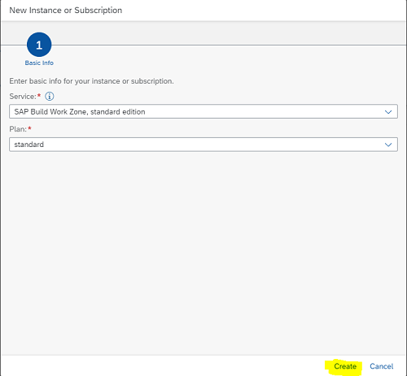
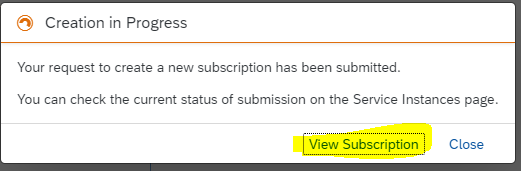
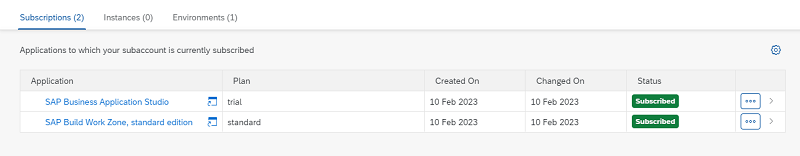
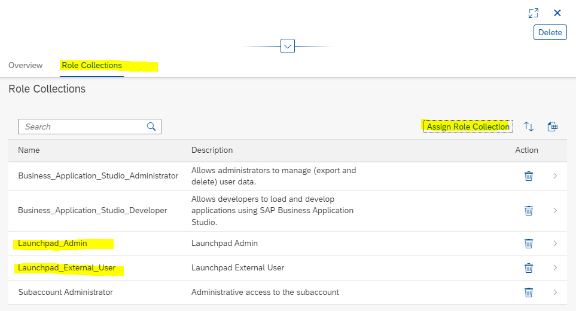
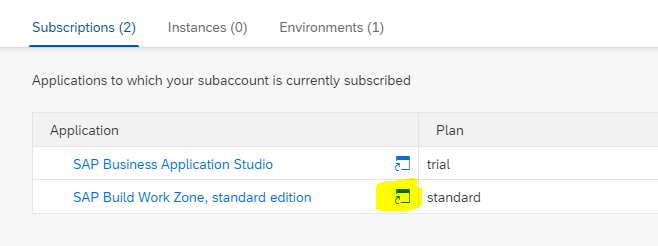
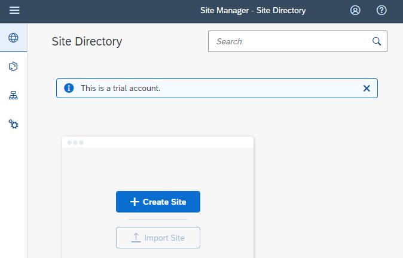

## Setup SAP Build Work Zone Service in your Trial Account

SAP Build Work Zone enables you to easily build business sites that provide centralized access to applications, such as the hello world app you will create.

### Subscribe to the SAP Build Work Zone Service

SAP Build Work Zone Service it not pre-configured in your BTP trial account. You first need to subscribe the service.

SAP Build Work Zone Service can be subscribed with two types of standard plans:  
>**Application Plans** are needed to access your (UI5) applications from a central entry point.  
>**Service Plans**  are used to integrate with other services. Service plans are not part of this tutorial.
 

**Procedure**

1. In your trial subaccount click **Service Marketplace** in the left navigation panel under **Services**.  
   The Service Marketplace provides you access to all services you are entitled to.

     
  
2. Enter <code>workzone</code> in the search box and click on the tile **SAP Build Workzone, standard edition**.  
  
     

3.  A service configuration page opens right-handed.  
    Select the tav **Applications Plans**.  
    click the **Actions** icon **...**  and select **Create**.

    

4. A **New Instance or Subscription** dialog box opens.  
   Here you can select your **Service Plan** for the service.   
   However in a Trial Account you can only select "Standard".   
   Click **Create**.

     

5. You'll get the confirmation that your subscription is being created. Click **View Subscription**. 

    
   
6.  You are redirected to the **Instances and Subscriptions** overview page of your Subaccount.  
    The tab **Subscriptions** should be preselected.   
    You are now subscribed to the service **SAP Build Work Zone, standard edition**.  
    The service **SAP Business Application Studio Service** has been automatically subscribed with the creation of the trial account.

    
   

### Assign yourself to the Work Zone Admin role

In order to administrate the Work Zone service, users must be assigned to the **Launchpad_Admin** role. 

**Procedure**

1. Navigate in the left handed navigation pane of the BTP Cockpit to **Security --> Users**. Click on users.

2. In a trial account you will basically see your own user. Click on your user. 

3. A configuration window will open right-handed.  
   Select **Assign Role Collection**.  
   Select the role collection **Launchpad_Admin** and **Launchpad_External_User**.  
   Note: The required role collections were automatically created with the subscription to the Launchpad Service.  

     

You've now been assigned to the **Launchpad_Admin** role collection and you can access the SAP Work Zone service and execute your admin tasks.  

### Access SAP Build Workzone service 

You are now ready to access the **Site Manager** of the Work Zone service.

1. In the left-handed navigation pane, select **Instances and Subscriptions**. 

2. In **Subscriptions** click  **Go To Application** icon of the  Work Zone service. 
  
     

3. The Work Zone **Site Manager** with the **Site Directory** will open.  
   In the Site Directory, you can create and manage your Work Zone sites. 
   You will create a Site for your Hello World app later in this mission.

     
     

