# Set-up SAP Business Application Studio

### Preparation

1. Click Instances and Subscriptions under Services

2. Select the tab Subscriptions, and click on SAP Business Application Studio. You will be forwarded to your SAP Business Application Studio Home Page with automatic login to the application.

   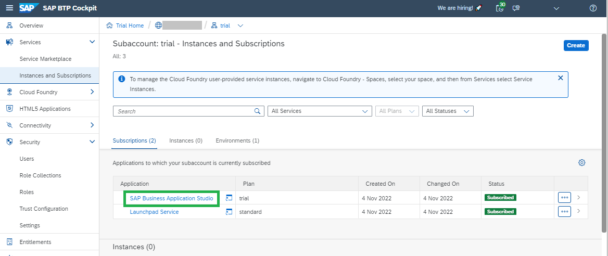

3. Please, accept the Privacy Statement

4. Optional: Discover the SAP Business Application Studio home page.

   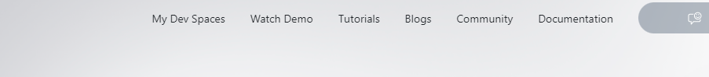

### Create a Dev Space in SAP Business Application Studio

1. Click on **Create Dev Space** on the SAP Business Application Studio home page.

   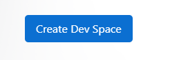

2. Provide a name of your choice for the Dev Space (for example, "devfiori") in the upper left corner.  
   Select the application type **SAP Fiori**.  
   Do not select any additional SAP Extensions here. 
   
   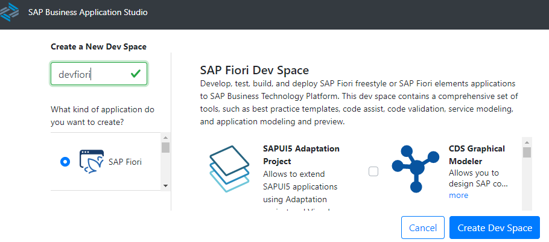

3. Click again **Create Dev Space** in the lower right corner.  
   You will be forwarded to an overview of your dev space(s).  
   It may take some time until the newly created dev space is started.  
   Once started the status changes from "STARTING" to "RUNNING” and the dev space name (in this case "devdemo") will turn into a blue hyperlink.
   
   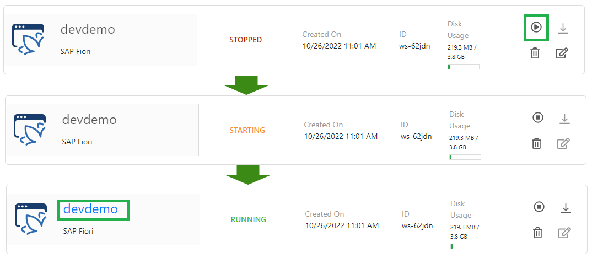

4. Click on the dev space link (e.g. "devfiori") to enter the space.

   After a few seconds ... you will see the **Get Started** page of your dev space.  
   You can always get it back under Help --> Get Started.

    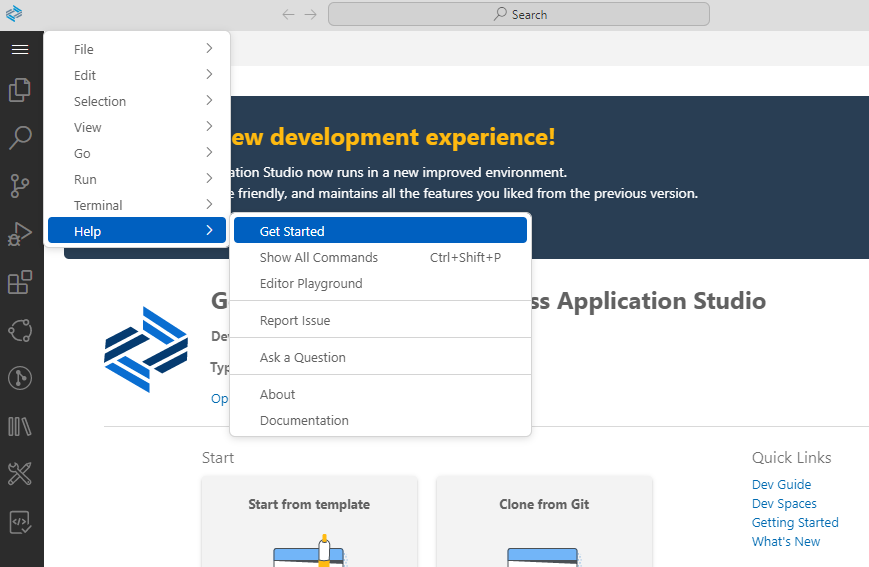

### Connect your SAP Business Application Studio with your Cloud Foundry Environment

You need a connection from your Dev Space to your Cloud Foundry subaccount to deploy your application into the HTML5 Repository of your Subaccount. 

1. Switch back to your SAP BTP cockpit and click on Overview of your subaccount (top left).

2. Check the **API Endpoint** and **Org Name** and your **Space**. Keep the page open or note the values.

    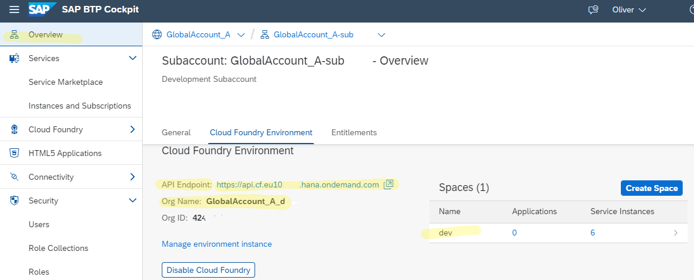
 

**Procedure for Connecting**

1. Switchback to SAP Business Application Studio. In the tabs, click on View in the menu and select Command Palette ... .

   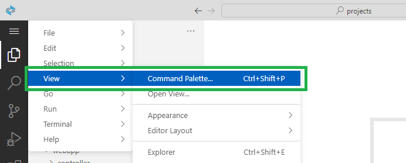

2. Search or Select CF: Login to Cloud Foundry.

   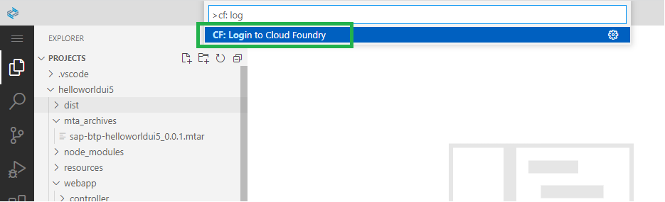
 
3. Enter your Cloud Foundry API endpoint.  
   (Note: when you copy&paste the API endpoint from the cockpit, make sure to remove spaces at the beginning or end of the URL).

4. Enter your SAP BTP account Email and Password when prompted. 

   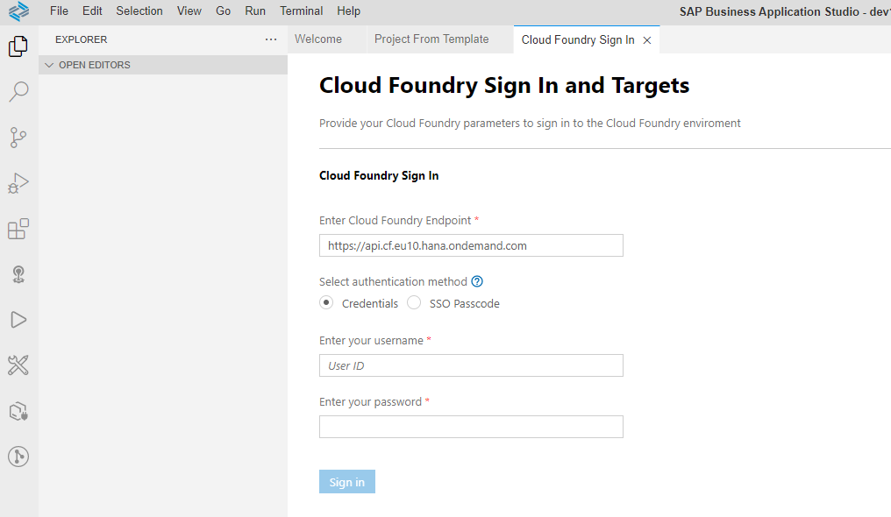

5. Select your Cloud Foundry Org (predefined).

6. Select the Space name (predefined).

   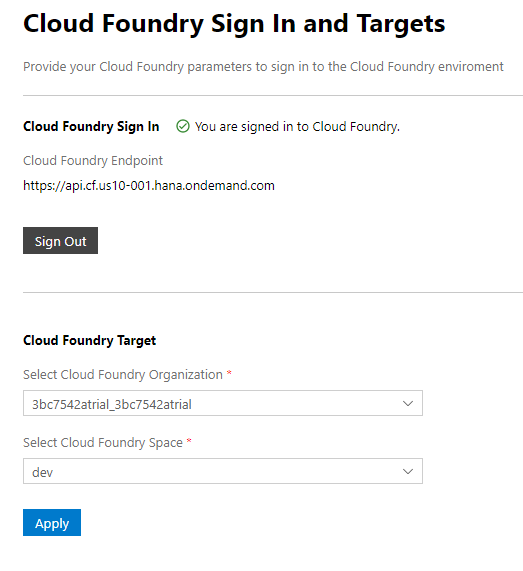

**Result**

Now we have successfully created a connection between your SAP Business Application dev space and your SAP BTP Cloud Foundry space.
 

 
