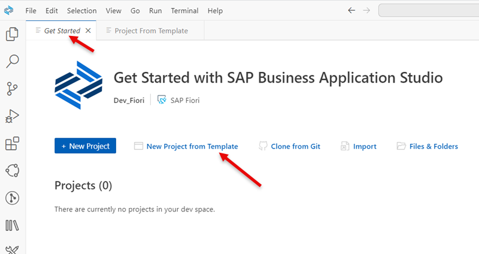
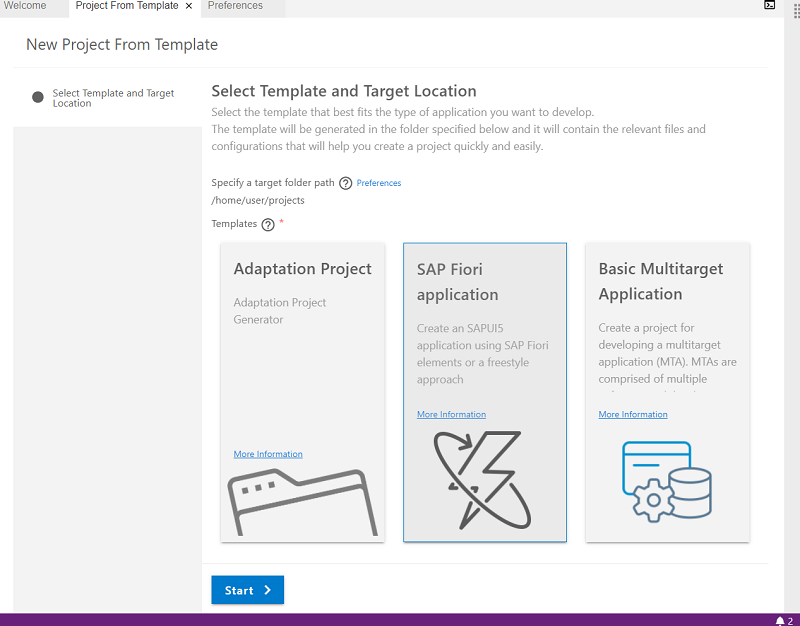
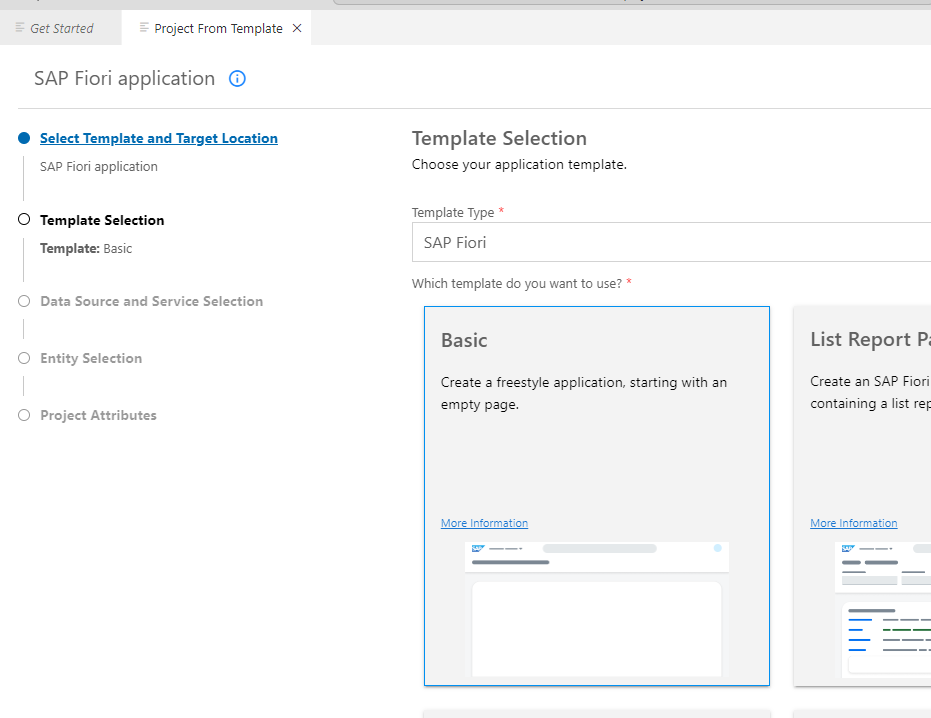
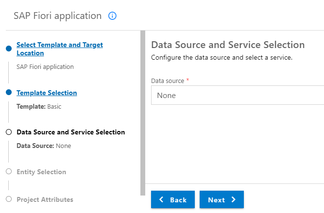
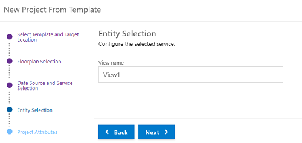
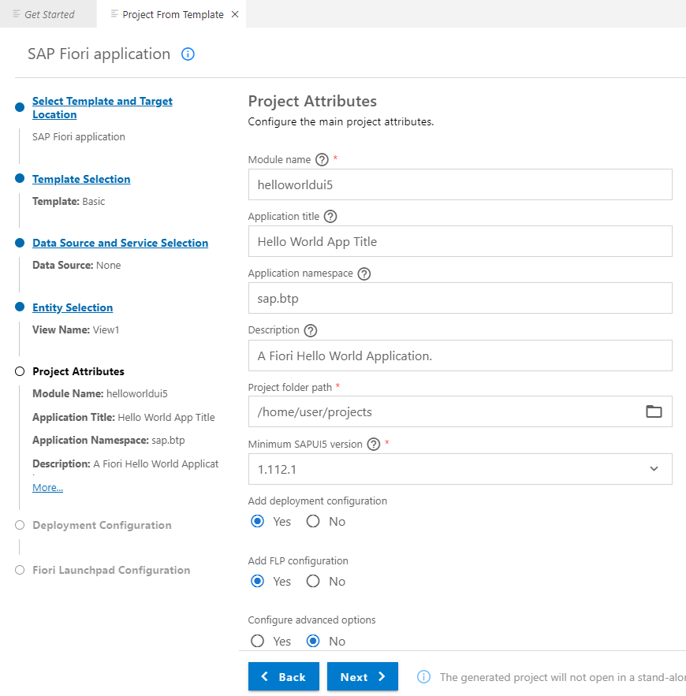
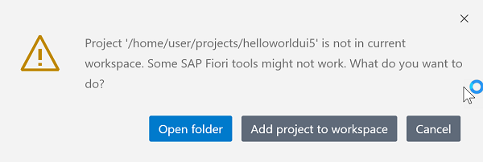
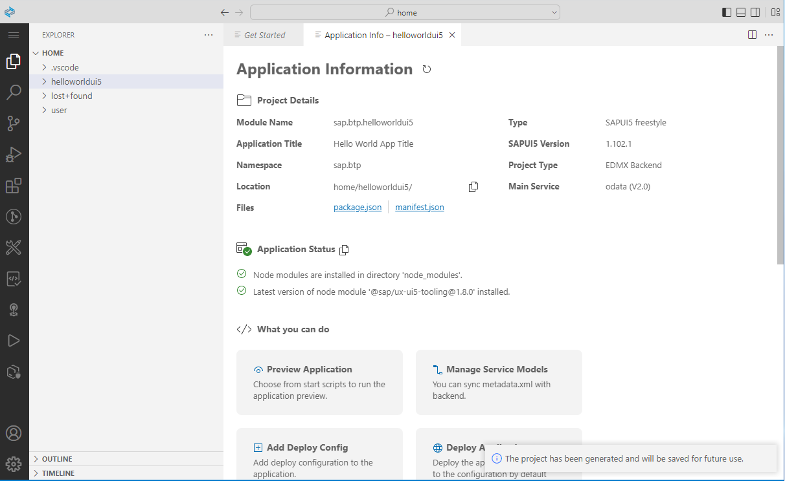
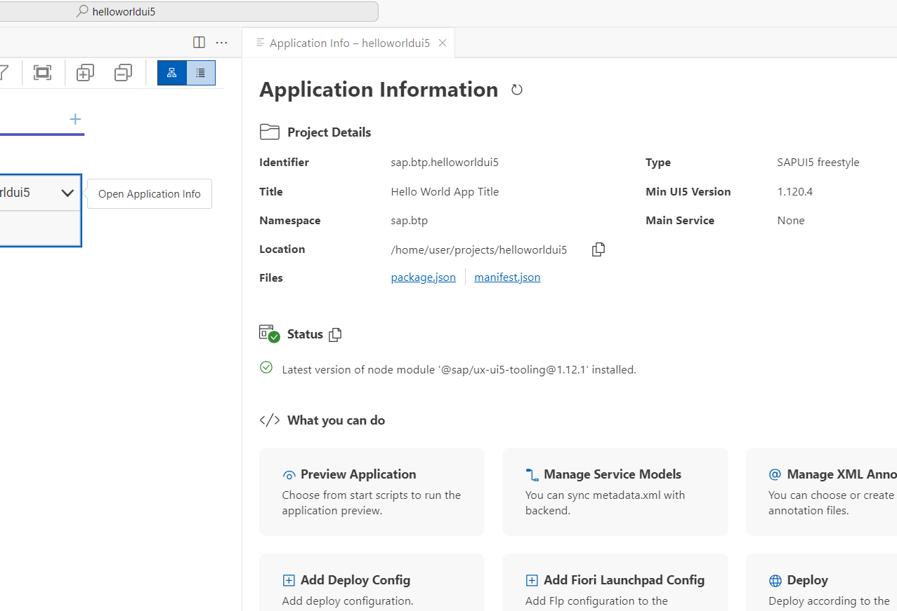
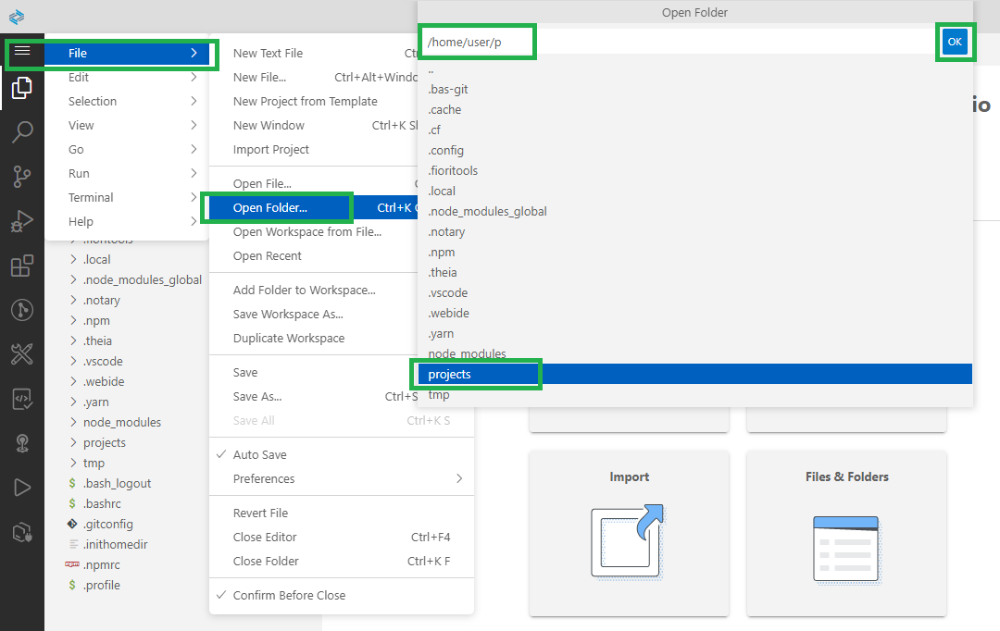

# Create an SAP Fiori Application with "Start from template"

**Procedure**

1. Click on **Start from template** in the Welcome tab to create the project.

   

2. In the New Project Wizard select **SAP Fiori Application**. Click **Start**.

   

3. In the **Template Selection** keep template type "Fiori" and choose **Basic** 

   Choose **Next**.  

   

4. In the **Data Source and Service Selection** choose **None** for Data source, because you create a "Hello World" without data binding.

5. Choose **Next**.

   

6. Under **Entity Selection** name your SAPUI5 view. 

   This name will appear in the launchpad service for the app. 

   Keep <code>"View1"</code> for now. 

   Choose **Next**

   

7. In the next step, **Project Attributes** choose names and a description for your "Hello World" app (examples see figure): 

   Module name <code>helloworldui5 </code>

   Application title <code>Hello World App Title </code>

   Application namespace <code>sap.btp </code>

   Description: <code>A Fiori Hello World application  </code>

   Keep **Project folder path** and **Minimum SAPUI5 version**.

   Add deployment configuration to MTA project <code>Yes </code>

   Add FLP configuration <code>Yes</code>

   Configure advanced options <code>No</code>

   Choose **Next**.
    
   

8. In the next step, **Deployment Configuration** choose **Cloud Foundry** as a target.

   Choose **None** for Destination Name. 
   
   Choose <strong>Add application to managed application router?</strong> <code>Yes</code> 

   (This is the standard html5 repository from the SAP Work Zone service and eases deployment). 

   Choose **Next**.

   

9. The **SAP Build Work Zone** service needs some **Fiori Launchpad Configuration** data about the app. 

   Choose names for the entries Semantic Object, Action, and Title (examples see figure)
   
   Semantic Object: <code>helloworld </code>
   Action: <code>show </code> 
   Title: <code>showhelloworld </code>  

   

10. Choose **Finish**.  
    **Note**: It will take some time until all dependencies are installed.

11. Click on **Open folder** or **add project to workspace** (note: the concept of workspaces is not part of this tutorial).

    

12. After your App is generated, you should see the "Storyboard" of your Fiori application and in the Explorer.

    Right click on the Fiori app and choose "Open Application Info".

    

13. In the "Application Info" you can see additional details of your app and you can start from here additional tasks.

    

14. Optional: Open your Projects folder via menu: File > Open Folder ... and enter "/home/user/projects".

    
 
15. Click **OK**.

