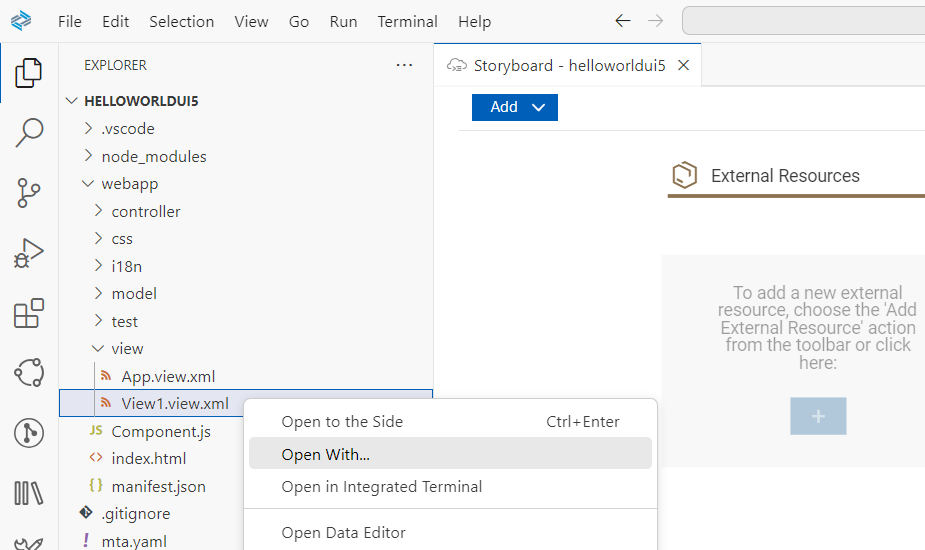
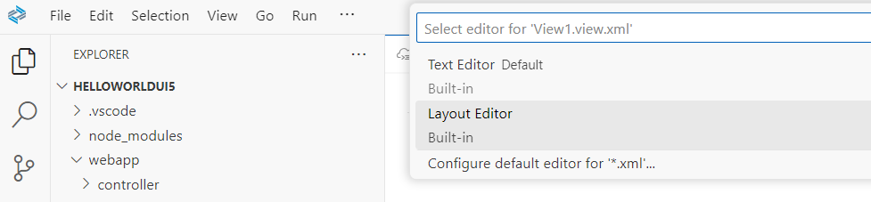
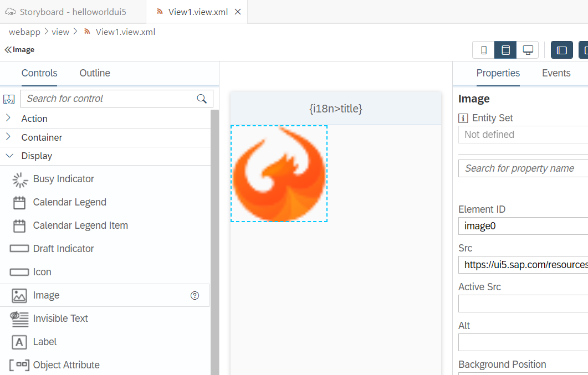
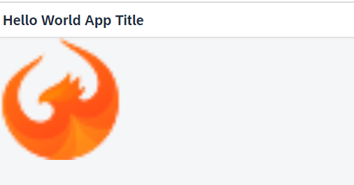
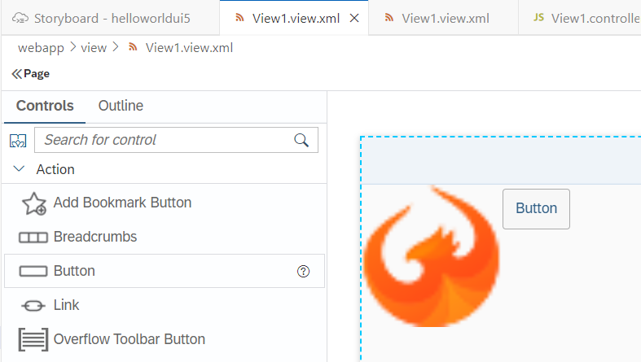
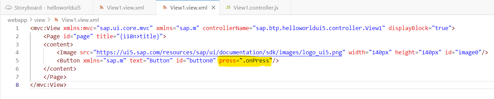
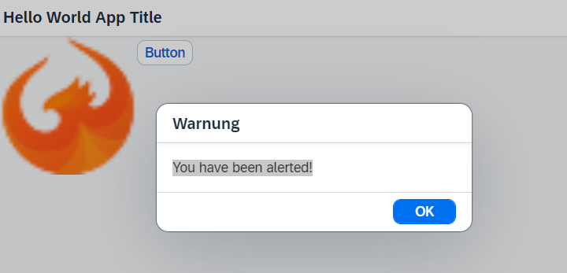

# Preview and Extend your Application


### Preview your Application 

**Procedure**

1. Right click on the project folder "webapp" and choose **Preview Application**. 

   


2. Choose npm script: **start-noflp fiori run --open "intex.html?sap-ui-xx-viewCache=false"**

   

3. A new browser tab opens with your app:

  


### Optional: Change the i18n title of your application

**Procedure**

1. Go to **Explorer** in the left navigation pane.

2. Open folder "**webapp**" and subfolder **view** and your **View1**. 

   Click on View1.view.xml and see where the title is defined

   

3. Open folder "**webapp**" and subfolder **i18n**. 

   Change `title=Hello World App Title` to whatever you like:

   

   You will see the changes in the application preview accordingly.


### Optional: Add some Content to your Application

**Procedure**

1. Open SAP Business Application Studio and open your project "helloworldui5".
  
    
2. Open your view `helloworldui5/webapp/view/View1.view.xml`. 

   Right-click your `View1.view.xml` and select "Open With..."

   
   

3. You have now the option to use the "Text Editor" or the "Layout Editor".

   For this beginner tutorial, you choose "Layout Editor":

   


4. Add a predefined image to your application, using drag&drop:

   https://ui5.sap.com/resources/sap/ui/documentation/sdk/images/logo_ui5.png

   

5. Preview your application.

   

6. Add a button to your app, using drag&drop.

   

   Optional: Preview the app, the button will not work.

7. Add an event to your button using the **Text Editor**.

   Add the event definition `press=".onPress"` to your button.

   

8. Add some action to your button.

   Open your `helloworldui5/webapp/controller/View1.controller.js`.

   Extend your controller with the eventhandler `onPress`.

   Note, that you also need to add the libraries **MessageBox** and **MessageToast**.
   
   ```
   sap.ui.define([
      "sap/ui/core/mvc/Controller",
      "sap/m/MessageBox",
      "sap/m/MessageToast"
   ],
      /**
      * @param {typeof sap.ui.core.mvc.Controller} Controller
      */
      function (Controller, MessageBox, MessageToast) {
         "use strict";

         return Controller.extend("sap.btp.helloworldui5.controller.View1", {
               onInit: function () {
               },
               onPress: function () {
                  MessageBox.alert("You have been alerted!");
               }    
         });
      });
      
   ```
                                          
                                                       
 9. Preview your app and press the button:
 
    
