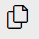

# Preview and Extend your Application


### Preview your Application 

**Procedure**

1. Right click on the project folder "webapp" and choose **Preview Application**. 

   


2. Choose npm script: **start-noflp fiori run --open "intex.html?sap-ui-xx-viewCache=false"**

   

3. A new browser tab opens with your app:

  


### Optional: Change the i18n title of your application

**Procedure**

1. Go to **Explorer** in the left navigation pane.

2. Open folder "**webapp**" and subfolder **view** and your **View1**. 

   Click on View1.view.xml and see where the title is defined

   

3. Open folder "**webapp**" and subfolder **i18n**. 

   Change `title=Hello World App Title` to whatever you like:

   

   You will see the changes in the application preview accordingly.


### Optional: Add some Content to your Application

**Procedure**

1. Open SAP Business Application Studio and in case open again the **Explorer** (the pages icon on the top left)
  
    
    
2. Open your view `helloworldui5/webapp/view/View1.view.xml`. <br>
   Add an [IllustratedMessage](https://sapui5.hana.ondemand.com/#/entity/sap.m.IllustratedMessage) and a [Button with MessageBox](https://sapui5.hana.ondemand.com/sdk/#/entity/sap.m.MessageBox/sample/sap.m.sample.MessageBox) to oyur page.
   
   Replace the code in your View1.view.xml
   
   ```
   <mvc:View controllerName="sap.btp.helloworldui5.controller.View1"
        xmlns="sap.m"
        xmlns:mvc="sap.ui.core.mvc" 
        displayBlock="true">
        <Page id="page" title="{i18n>title}">
              <IllustratedMessage id="ilm1" enableVerticalResponsiveness="true" illustrationType="sapIllus-SuccessBalloon">
            <additionalContent>
              <Button id="but1" 
                          text="Alert"
                      class="sapUiSmallMarginBottom"
                      press=".onAlertMessageBoxPress"
                      width="280px"
                      ariaHasPopup="Dialog" />
            </additionalContent>
          </IllustratedMessage>
            <content />
        </Page>
   </mvc:View>

   ```
3. Preview your application. The button will not work:

   

3. You fired an [XML event](https://sapui5.hana.ondemand.com/sdk/#/topic/b0fb4de7364f4bcbb053a99aa645affe.html) 
   by clicking the button with `press=".onAlertMessageBoxPress"`. <br>
   Open your `helloworldui5/webapp/controller/View1.controller.js`. <br>
   Extend your controll with the eventhandler `onAlertMessageBoxPress`. <br>
   Note, that you also add the libraries **MessageBox** and **MessageToast**.
   
   ```
   sap.ui.define([
       "sap/ui/core/mvc/Controller",
       "sap/m/MessageBox",
       "sap/m/MessageToast"
   ],
        /**
         * @param {typeof sap.ui.core.mvc.Controller} Controller
         */
        function (Controller, MessageBox, MessageToast) {
            "use strict";

            return Controller.extend("sap.btp.helloworldui5.controller.View1", {
                onInit: function () {
                },
                onAlertMessageBoxPress: function () {
                    MessageBox.alert("You have been alerted!");
                }
         });
    });
   
   ```
   
4. Open your `helloworldui5/webapp/manifest.json`. <br>
   Check the `"sap.ui5":` definitions. sap.m and sap.ui.core is already defined for this webapp. View and controller can use it. 
                                                       
   ```
      "sap.ui5": {
        "flexEnabled": true,
        "dependencies": {
            "minUI5Version": "1.112.1",
            "libs": {
                "sap.m": {},
                "sap.ui.core": {},                                                    
   ```                                                    
                                                       
 5. Preview your app:
 
    
