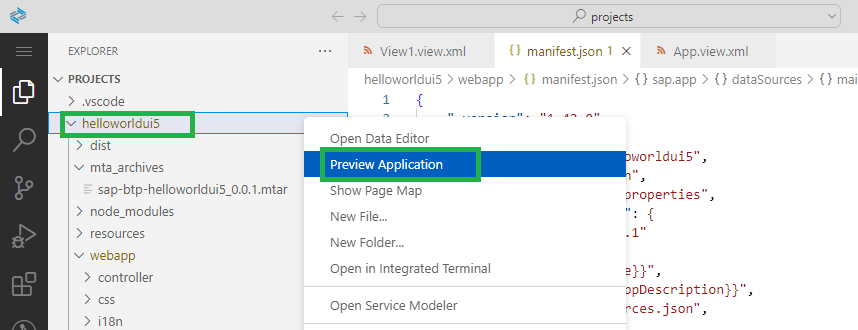
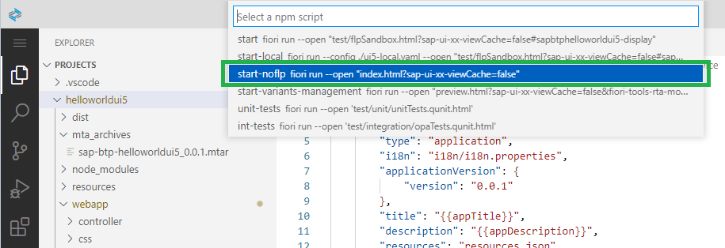
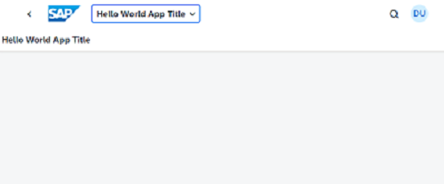
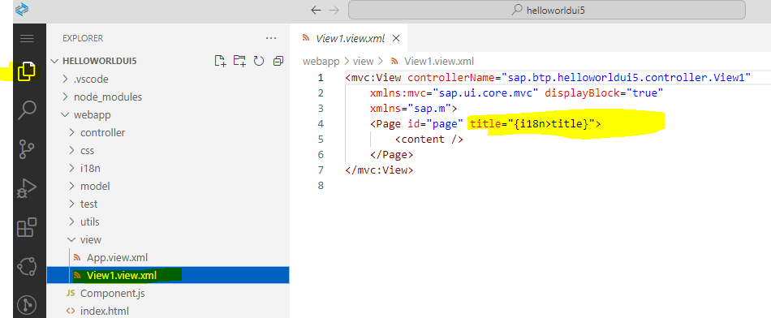

# Test and Preview your Application in SAP Business Application Studio

**Procedure**

1. Right click on your project folder "helloworldui5" and choose **Preview Application**. 

     

2. Choose npm script: **start-noflp fiori run --open "intex.html?sap-ui-xx-viewCache=false"**

    

3. A new browser tab opens with your app:

    

**Change the title of the application view to "HelloWorld"**

1. Go to **Explorer** in the left navigation pane.

2. Open folder "**webapp**" and subfolder **view** and your **View1**.  
   Click on View1.view.xml.  

    

3. Change ``{i18n>title}`` to ``HelloWorld`` or sth. else.

   You will see the changes in the application preview accordingly.

 

 

 
