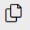
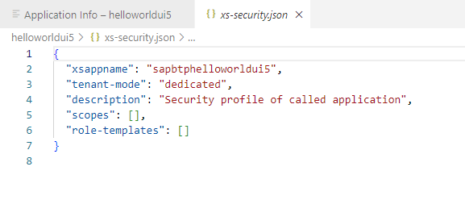
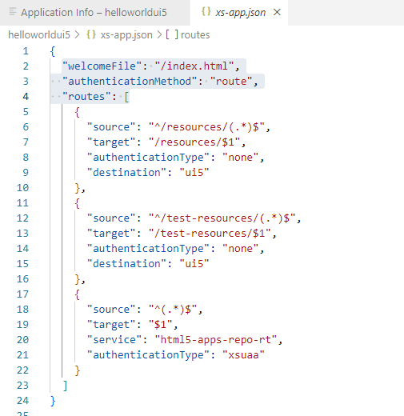
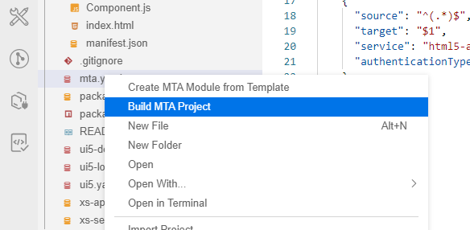
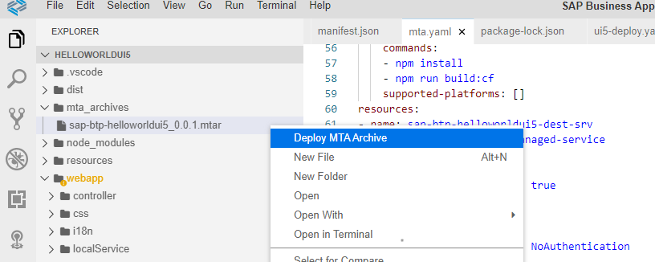
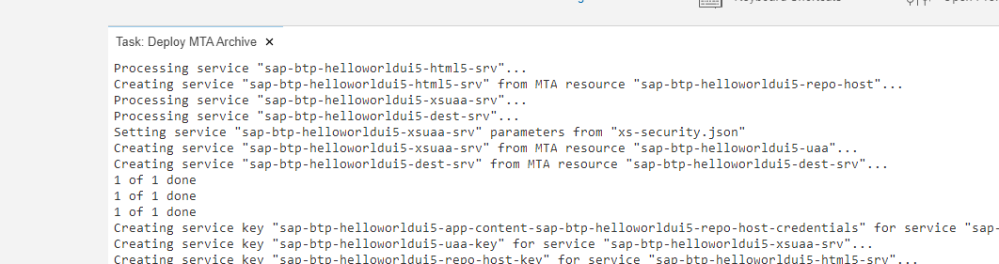
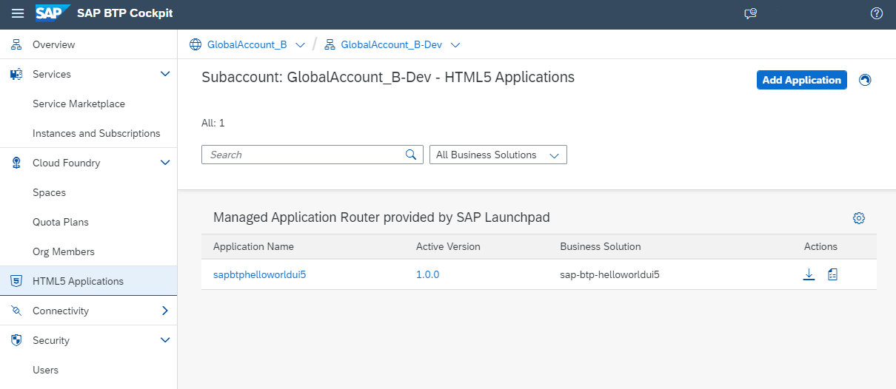

## Build and Deploy your Application in Cloud Foundry Runtime

**Procedure**

1. Go back to your browser window or tab "SAP Business Application Studio" and in case open again the **Explorer** (the pages icon on the top left)&nbsp;
  
     

2. Open the <em>xs-security.json</em> file.  
   You see that you did not define yet "scopes", no "role-templates" and no "role-collections".  
  
     

3. Open the <em>xs-app.json</em> file.  
   You see `"authenticationMethod": "route",` means Authentication type is defined in the route configuration. You can also switch it to `"none"` , which disables authentication for all routes.  
   The webapp matches the regular expression `"source": "^(.*)$",` and will use the `"service": "html5-apps-repo-rt",` which is the HTML5 Application Repository of BTP.  
   "authenticationType": "xsuaa" means user have to be authenticated against the BTP XS User and Authentication and Authorization service (XSUAA). The value can be `"xsuaa", "basic" or "none"`. 
  
     
     

   For more information, see SAP Help Portal [Application Router Configuration](https://help.sap.com/docs/SAP_HANA_PLATFORM/4505d0bdaf4948449b7f7379d24d0f0d/5f77e58ec01b46f6b64ee1e2afe3ead7.html) and [@sap/approuter on npmjs](https://www.npmjs.com/package/@sap/approuter).

 
4. Build your application in SAP Business Application Studio.  
    Right-click on the **mta.yaml** file and choose **Build MTA project**.  
    With this a folder "mta_archives" and a mtar file is created.

    

    You will get the following INFO Message:

    ``INFO the MTA archive generated at: /home/user/projects/helloworldui5/mta_archives/sap-btp-helloworldui5_0.0.1.mtar``
  
    > **Alternative**: Build your application via the command line  
    > Right-click on the <strong>mta.yaml</strong> file and choose <strong>Open in Terminal</strong>
    > Type "dir" in the console to show the files in the directory.  
    > check if the <em>mta.yaml</em> file is available. Type command ``'mbt build'``.

    For more details, see [Building and Deploying Multitarget Applications](https://help.sap.com/docs/SAP%20Business%20Application%20Studio/9d1db9835307451daa8c930fbd9ab264/97ef204c568c4496917139cee61224a6.html?locale=en-US) on SAP Help Portal.  

5. Deploy the HelloWorld application to your SAP BTP dev space. 

    Make sure you are logged into your Cloud Foundry subaccount (described under step "Prepare your SAP Business Application Studio").  
    Expand the project folder **mta_archives** and right-click on the built file **sap-btp-hellowordlui5_0.0.1.mtar** and select **Deploy MTA Archive**.
  
      

    Deployment target is the Cloud Foundry subaccount you are logged into. 
    
    
6. After the deployment is triggered, you can see the progress of the deployment in the terminal under **Task: Deploy MTA Archive**. 

    It takes a while to complete the task. You will see a success message in the console once it's done.  
    If not, check the previous steps again. 
  
    

  
7. Switch to your **subaccount </strong>in the SAP BTP Cockpit**.     
   Select **HTML5 Application** on the left navigation pane.   
   You will see the deployed application in the repository.  
   Click on the application name "**saphelloworldui5**. Your deployed app will open in a new window.

   

