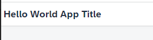

## Protecting your application

**Procedure**

1. Open SAP Business Application Studio and in case open again the **Explorer** (the pages icon on the top left)&nbsp;
  
    

2. Open the <em>xs-security.json</em> file. <br />
   You see that you did not define yet "scopes", no "role-templates" and no "role-collections". <br>
  
     

   Add "scopes", "role-templates" and "role-collections".
   The scope itself is defined in the application's security descriptor (xs-security.json), for example, "$XSAPPNAME.Display" or "$XSAPPNAME.Create". In your case, the only thing you do with the app is to view it, so you choose "$XSAPPNAME.View" . Role collections group authorizations for resources and services.
 
   ```
    {
      "xsappname": "sapbtphelloworldui5",
      "tenant-mode": "dedicated",
      "description": "Security profile of called application",
      "scopes": [
        {
        "name": "$XSAPPNAME.Display",
        "description": "Display the app as Platform or Business User"
        }
      ],
      "role-templates": [
        {
        "name": "HelloWorldDisplayRole",
        "description": "Hello World Display Role Template",
        "scope-references": [
            "$XSAPPNAME.Display"
        ]
        }
      ],
      "role-collections": [
            {
            "name": "HelloWorldDisplayRoleCollection",
            "description": "Hello World Display Role Collection",
            "role-template-references": [
            "$XSAPPNAME.HelloWorldDisplayRole"
                ]
            }
        ]
    }

   ```
  

3. Open the <em>xs-app.json</em> file. <br />

   

   Add a scope to the route for the webapp. The authorization scope is required to access the target path. 
   
   Add the scope definition:

   ```
    {
      "source": "^(.*)$",
      "target": "$1",
      "service": "html5-apps-repo-rt",
      "authenticationType": "xsuaa",
      "scope": "$XSAPPNAME.Display"
    }
   ```  


   For more information, see SAP Help Portal [Application Router Configuration](https://help.sap.com/docs/btp/sap-business-technology-platform/application-security-descriptor-configuration-syntax) and [@sap/approuter on npmjs](https://www.npmjs.com/package/@sap/approuter).


 
4. Build your application in SAP Business Application Studio. <br>
   Right-click on the **mta.yaml** file and choose **Build MTA project**. <br>
   With this a folder "mta_archives" and a mtar file is created.

   

   You will get the following INFO Message:

   ``INFO the MTA archive generated at: /home/user/projects/helloworldui5/mta_archives/sap-btp-helloworldui5_0.0.1.mtar``
  
   > **Alternative**: Build your application via the command line <br>
   > Right-click on the <strong>mta.yaml</strong> file and choose <strong>Open in Terminal</strong>
   > Type "dir" in the console to show the files in the directory. <br>
   > check if the <em>mta.yaml</em> file is available. Type command ``'mbt build'``.


5. Deploy the HelloWorld application to your SAP BTP dev space. 

   Make sure you are logged into your Cloud Foundry subaccount (described under step "Prepare your SAP Business Application Studio"). <br>
   Expand the project folder **mta_archives** and right-click on the built file **sap-btp-hellowordlui5_0.0.1.mtar** and select **Deploy MTA Archive**.
  
     

   Deployment target is the Cloud Foundry subaccount you are logged into.<br>
    
    
6. After the deployment is triggered, you can see the progress of the deployment in the terminal under **Task: Deploy MTA Archive**.  <br>
   It takes a while to complete the task. You will see a success message in the console once it's done. If not, check the previous steps again.<br>
  

  
7. Open your deployment target, your **Subaccount** in the SAP BTP Cockpit. <br>   
   Select **HTML5 Applications** on the left navigation pane.  <br>
   You will see the deployed application in the repository. <br>
   Click on the application name "**saphelloworldui5**. Your deployed app will open in a new window. <br>
   What you will see is: `Forbidden`.

8. Open Security --> Roles and search for "hello". You will see the new created role "HelloWorldViewerRole" from the role template "HelloWorldViewerRole".

9. Open Security --> Role Collections and search for "hello". You will see the new created role collection "HelloWorldViewerRoleCollection". <br>
  
10. Open Security --> Users and select your user. Scroll down in the detail screen and select "Assign Role Collection" in the Role Collection context menue `...`. <br>
   Assign HelloWorldViewerRoleCollection to your user.

11. Start your application again. Ususally you still see "Forbidden". You have to log-out and log-in again into the web application. The easiest way is to close the browser completely and open again, or use a second browser.   

   


