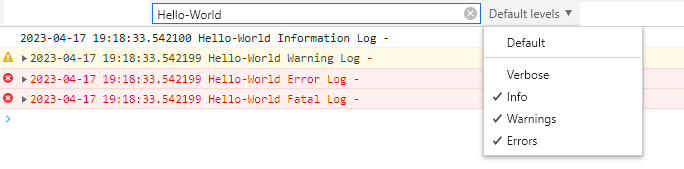
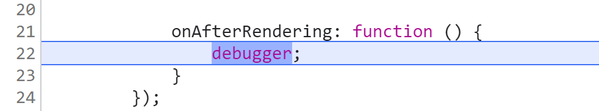
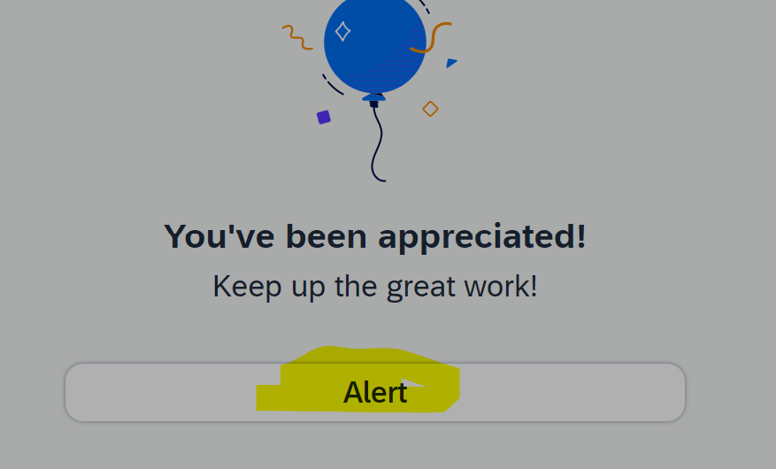
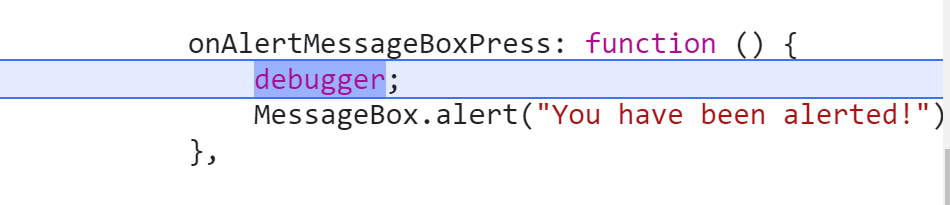
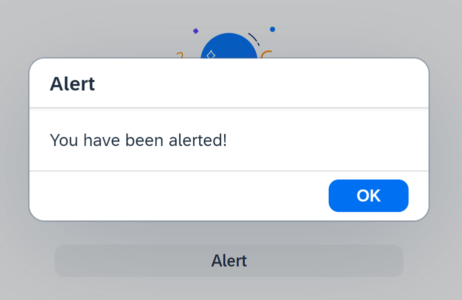

## Logging your Application

**Procedure**

1. Open SAP Business Application Studio and open the **Explorer** (the pages icon on the top left)
  
    
   

2. Open your `helloworldui5/webapp/Component.js` file. <br>
   You need to add the [sap/base/Log](https://sapui5.hana.ondemand.com/sdk/#api/module:sap/base/Log) API to your webapp in order to use write logs to the console. <br>
  
   Add `"sap/base/Log"` to `sap.ui.define`  <br>
   Add `Log` as additional function parameter and  <br>
   Add an example for each **Log Severity** 
 
   ```JavaScript
   sap.ui.define([
            "sap/ui/core/UIComponent",
            "sap/ui/Device",
            "sap/btp/helloworldui5/model/models",
            "sap/base/Log"
         ],
         function (UIComponent, Device, models, Log) {
            "use strict";

            return UIComponent.extend("sap.btp.helloworldui5.Component", {
                  metadata: {
                     manifest: "json"
                  },

                  init: function () {
                     // call the base component's init function
                     UIComponent.prototype.init.apply(this, arguments);

                     Log.info("Hello-World Information Log");
                     Log.debug("Hello-World Debug Log");
                     Log.warning("Hello-World Warning Log");
                     Log.error("Hello-World Error Log");
                     Log.fatal("Hello-World Fatal Log");

                     // enable routing
                     this.getRouter().initialize();

                     // set the device model
                     this.setModel(models.createDeviceModel(), "device");

                  }
            });
         }
      );
   ```

3. Open `helloworldui5/webapp/index.html` . <br>
   You have to add the **Log Level** `data-sap-ui-logLevel="debug"` to your index.html.


   ```JavaScript
      <script
          id="sap-ui-bootstrap"
          src="resources/sap-ui-core.js"
          data-sap-ui-logLevel="debug"
         
          ....
   ```

4. Run your app. Open the **console** of your browser for example with "F12" and scroll down. <br>
   Search for "Hello-World" to find your logs and set the "Default-Levels".

   


## Debugging your Application 

### Set a Breakpoint

Breakpoints are helpful when you debug the event handling of an SAPUI5 object. You can either set breakpoints in:
* The developer tools of your browser (usually F12),
* In the SAPUI5 Diagnostics window (Ctrl + Shift + Alt + S) under [Debugging](https://sapui5.hana.ondemand.com/sdk/#/topic/c9b0f8cca852443f9b8d3bf8ba5626ab#loioc9b0f8cca852443f9b8d3bf8ba5626ab)
* In your Business Application Studio (remove breakpoint before release).

Setting a breakpoint in the code of you app is quite comfortable, as youcan do it quickly rather then finding it in the browser.

In this example you choose your View1.controller.js where you control your View1. 

**Procedure**

1. Open SAP Business Application Studio and open the **Explorer** (the pages icon on the top left)
  
    
   

2. Open your `helloworldui5/webapp/controller/View1.controller.js` file. <br>

3. Add `debugger;` to your controller function (in this example at 2 different places):

   ```JavaScript
   function (Controller, MessageBox, MessageToast) {
        "use strict";
        
        return Controller.extend("sap.btp.helloworldui5.controller.View1", {
            onInit: function () {
            },

            onAlertMessageBoxPress: function () {
                debugger;
                MessageBox.alert("You have been alerted!");
            },

            onAfterRendering: function () {
                debugger;
            }
        });
    });

   ``` 

4. Do not forget to remove the `debugger;` before releasing your app.

5. Preview your app. Open the Developer Tools of your Browser. 
   Refresh your Browser. 
   The app will stop at the first breakpoint.

   

   Click in the Browser "Resume Script Execution" (F8).

   Click "Alert" Button in your Hello-World app. 

   

   The app will stop at the second breakpoint.
    
   

   Click in the Browser "Resume Script Execution" (F8). The popup will come up.

   

6. Congrats! And dont forget to remove `debugger;` when done.
