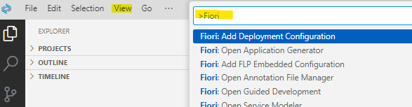
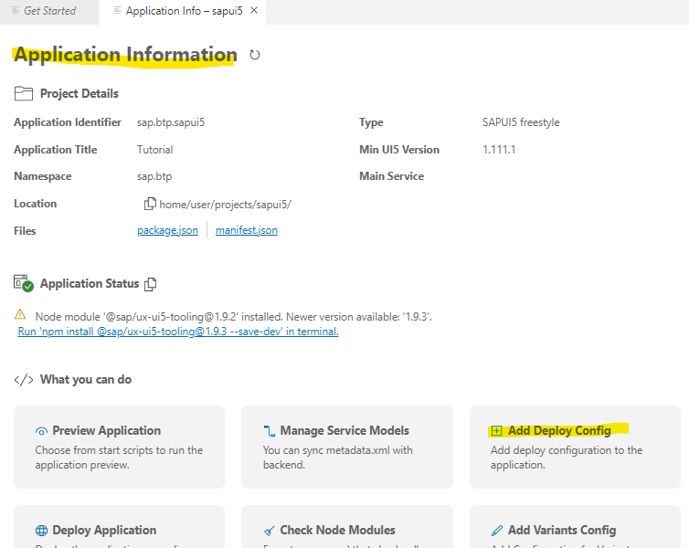
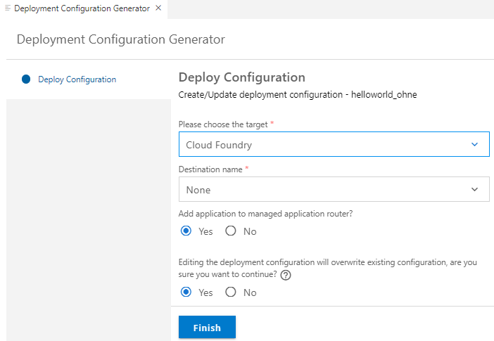

## Add Deployment and FLP Configuration to your Fiori/SAPUI5 Project


This tutorial shows how to add or change a deployment configuration or a SAP Build Work Zone configuration (formerly known as Fiori Launchpad or FLP) to a Fiori Project in Business Application Studio.

Thsi guide allows to skip these 2 steps if you create a Fiori project from template and execute it later.


### Prerequisites

> Note: If you are not yet familiar with the basics of SAP BTP, Subaccounts for html5 development, Business Application Studio and SAP Fiori Tools, complete this very detailed guide on SAP Discovery Center first: [Get started on SAP BTP creating a "Hello World" app with SAPUI5/Fiori](https://discovery-center.cloud.sap/missiondetail/3585/3628/).

Set-up your Subaccount with Cloud Foundry Environment for HTML5 development including Business Application Studio and create a SAP Fiori Dev Space.


### Open your Business Application Studio

1. Open your BAS
2. Open your Fiori Dev Space.
3. Optional: This step is only needed if you want to deploy your app into your Cloud Foundry html5 repository.
   Connect to your Cloud Foundry endpoint of your CF subaccount. 
   Start the command palette from the menu View > Find Command, search for cf:login, and select the command CF:Login to Cloud Foundry.
   Enter the Cloud Foundry endpoint you want to use. Enter your email and your password to proceed.
   Next, you need to select the Cloud Foundry Organization and space you want use.


### Add Deployment Configuration 

1. Open your Business Application Studio (BAS)
2. Open the Get Started Home Page (you can reopen it always navigating to Menu Bar --> Help --> Get Started). <br>
   Type in the search fiels **Fiori**. A list of available Fiori commands drops down. <br>
   Choose **Fiori: Add Deployment Configuration**.

   

3. Choose from the next drop down list your target Fiori project. 

4. Alternative: Choose from the Command Palette the command **Fiori: Open Application Information** and select "Add Deploy Config".

   

4. Choose "Yes" for "Add deployment configuration", choose as target "Cloud Foundry", destination: "None" and "Yes" for "Add to managed application router". <br>
   If a deployment Configuration already exists, you will get an addition warning.

   

5. Choose "Finish". The configuration will be added to your Project as **mta.yaml** .

6. You can open mta.yaml with standard **MTA Editor** or the with a Text Editor. <br>
   For the text-editor, right click on your mta.yaml and choose **Open with...**. Then choose Text-Editor from a drop down list.


### Add SAP Build Work Zone Configuration


**Prepare your parameters**

For the SAP Build Work Zone Configuration (formerly Fiori Launchpad Configuration or FLP Configuration) you have to provide 3 parameters:

* Semantic Object:      a unique name of your choice
* Action:               an action "ID of your choice, for example	"display"
* Title:              	Your Title of an application
* Subtitle (Optional):	Your Subtitle to be used by the tile


Unfortenately, there is no Fiori Command for the FLP Configuration. <br>
You have 2 Options:

<br>

**Option 1**

1. Open your BAS. Open in teh Menu Bar **View --> Terminal** (or type CTRL + `).
2. Change directory to your project root folder, e.g. `cd myprojectwithoutflp`  (autocomplete with CTRL + SPACE).
3. type `npx fiori add --help` and see the help from SAP Fiori tools CLI.

   You can use the command for creating a deploy-configuration, or for generating or updating your Fiori Launchpad configuration

   ```
   SAP Fiori tools CLI.

   COMMAND NAME:

       add - Create or update a target configuration

   USAGE:

       fiori add [SUBCOMMAND] [...OPTIONS]

   SUBCOMMANDS:

       flp-config - Generate or update Fior Launchpad configuration

                                                                                                                                                        
           --object             -o         Semantic object                                                                                                 
           --action             -a         Action                                                                                                          
           --title              -t         Title displayed on Fiori Launchpad tile                                                                         
           --subtitle           -s         Subtile displayed on Fiori Launchpad tile                                                                       
           --overwrite          -f         Overwrite existing FLP config (y/n)      
   ```

4. It is sufficient to provide the object nad complete the other step in a dialog. For example:
   
   `npx fiori add --object myuniquename

5. The FLP configuration will be added to your manifest.json.

<br>

**Option 2**

1. Open manifest.json in your project. <
2. Add "crossNavigation" section to your manifest.json in section "sap.app"
3. Replace my-org-myproject out of your projectID and namespace, e.g in this case out of **my.org.myproject**.
4. Replace semanticObject, action, title and subtitle as shown above.
5. In this example title and subtitle is a reference from i18n.properties. <br>
   Add in i18n.properties 2 lines: <br>
   flpTitle=mytitle <br>
   flpSubtitle=  (you can leave it empty) <br>

```
{
    "_version": "1.49.0",
    "sap.app": {
        "id": "my.org.myproject",
        ...
        },

        "crossNavigation": {
            "inbounds": {
                "my-org-myproject-inbound": {
                    "signature": {
                        "parameters": {},
                        "additionalParameters": "allowed"
                    },
                    "semanticObject": "uniquename",
                    "action": "someactionname",
                    "title": "{{flpTitle}}",
                    "subTitle": "{{flpSubtitle}}",
                    "icon": ""
                }
            }
        }
    },
    "sap.ui": {
```

<br>

You successfully finished the tutorial!


