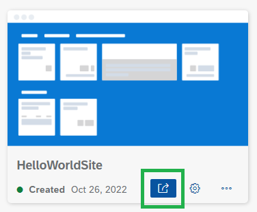
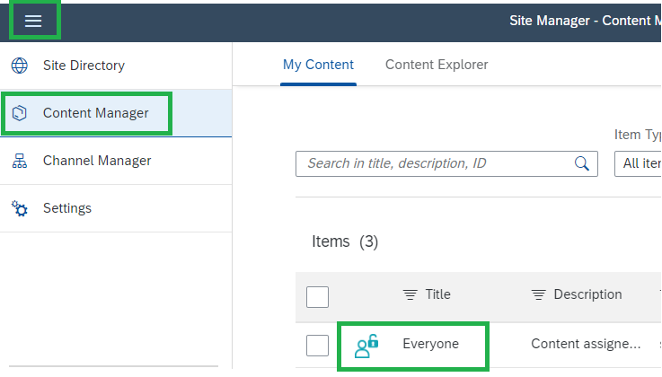
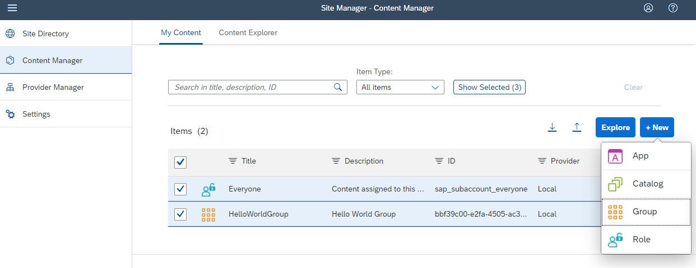

# Integrate your HelloWorld app into Build Work Zone

### Open Launchpad Site Manager

1. Switch back to your **Subaccount** in your SAP BTP Cockpit.

2. Navigate to **Services --> Instances and Subscriptions** in the left navigation pane.

3. Select the tab **Subscriptions**, and choose **Launchpad Service**.  Launchpad Site Manager opens in a new window.

     
  

   If you get the error message "Access Denied". Your user has not been assigned the role collection <strong>Launchpad_Admin</strong>. 
   Go to <strong>Role Collections</strong>, click on <strong>Launchpad_Admin</strong> and assign the email address of your user 
   (as described under step "Add yourself to the Launchpad Admin role").
  

### Create a Launchpad Site**
  
1. Click **Create Site** to create a new Launchpad site.

2. Enter a site name, for example, "**HelloWorldSite**" and select **Create**.

    You will be forwarded to the "Site Editor" showing the Settings of the created HelloWorldSite.

3. Navigate back to the Site Directory.
  
    You can navigate the new site with the **Go to site button**.
  
    
  
    **Note:** You can see the the new site is still empty.

4. Open the former browser tab "Site Directory" and navigate to **Content Manager** in the left navigation pane.

    You can expand the pane with the button in the top left corner. Predefined is the role **Everyone**.

     
 
5. Create a new entity **Group** by clicking on **+New > Group** enter a name (e.g. "HelloWorldGroup") and click on **Save**. 

     
  
    **Note:** The HelloWorldSite is still empty.

