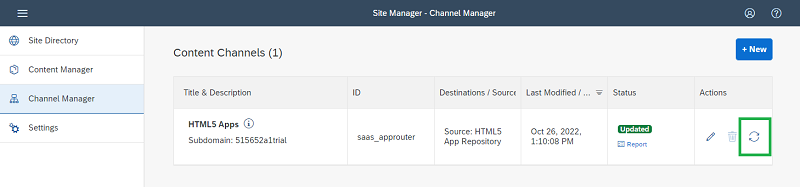
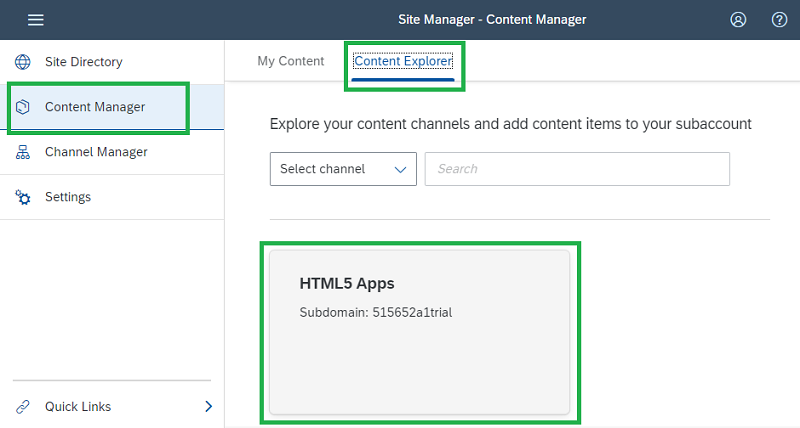
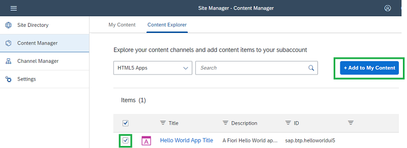
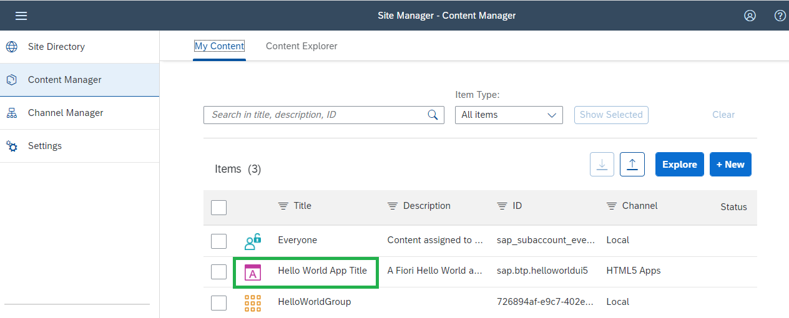
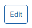
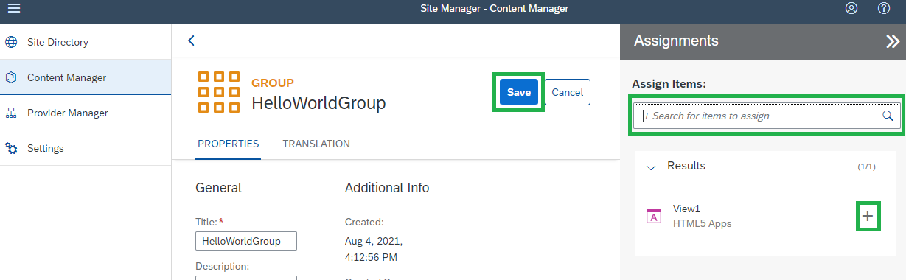
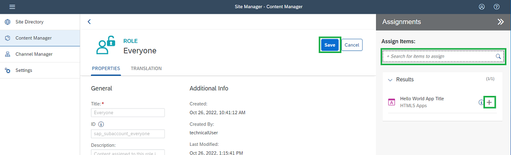
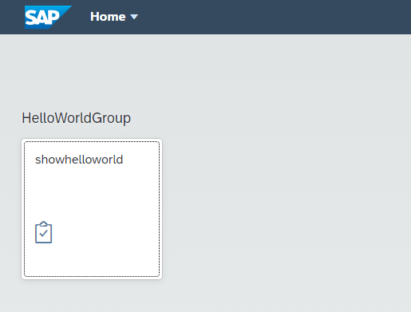

# Add your HelloWorld Application to Work Zone Group and Role

Finally you need to add your App to the Work Zone group and role.

1. Navigate to **Channel Manager** on the left to check your Content Providers and to **refresh** the list of HTML5 Applications. 
  
     
     

  
2. Click on the **Content Manager** and on tab **Content Explorer** tab, and select **HTML5 Apps** to see the list of HTML5 applications you have in your **HTML5 Applications** (the Managed Application Router provided by SAP Launchpad).
  
     
 
    You see the ID of the deployed HTML5 apps and the view name.
    

3. Select your HTML5 application which you see in the list and click the button <strong>+Add to My Content</strong>.
  
     

4. Click on the **My Content** tab on the top left and see your new app <strong>Hello World App Title</strong> in your content.
  
     
  
    *Note:* You can see the Semantic Object we defined in SAP Business Application Studio **helloworld** and the Action **show** in the app details **Navigation**. This is needed for the Launchpad integration.

5. Enter the group <strong>HelloWorldGroup</strong> you just created, click on <strong>Edit.</strong>
  
  
     
  
6. Click into the <strong>Assign Items</strong> search bar.

7. After clicking <strong>into the search bar</strong>, you will see the HTML5 App <strong>Hello World App Title</strong>.

8. Click the **+ button** for your app

9. Don't forget to <strong>Save</strong>.
  

     
  
10. Go back to Content Manager and click on the <strong>Everyone</strong> role (you can also create your company-specific roles) and click on the button <strong>Edit</strong>.
  
        
  
11. In the <strong>Assignments</strong> section, <strong>click in the search bar</strong> and add your app with the <strong>+ button</strong>.
  
     
  
12. Don't forget to <strong>Save</strong>.
13. Go to the <strong>Site Directory</strong> in the left navigation pane. Open your "HelloWorldSite".

    Start by clinking on it. You will see your newly created app in the Launchpad.
  
     
  

**Well done! You have successfully created a Build Work Zone site, giving necessary roles and groups, and added your HTML5 application to the site**

