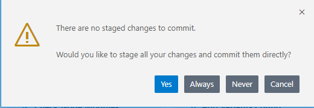
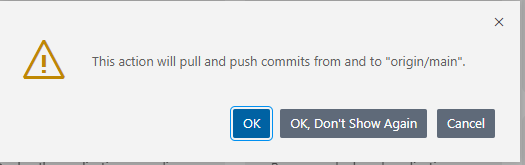

## Add Source Control with Cloning from Git Repository

The second way in BAS to add Git source control to your project and to establish a connection to a remote Git repository is to **Clone a repository from Git**.
in BAS you can do this manually, using a the terminal or u use the BAS wizard.

### Step 1- Clone a Repository from GitHub

    
1. Create a new empty repository in your GitHub organization or user.  
   If you like, call the repo `btp-clone-repo`.  
   It is just empty.  
   Copy the HTTPS URL from the repo. E.g: `https://github.com/someorganization/btp-clone-repo.git`.  

2. Open a the Dev Space in your BAS. You will see the **Get Satrted** home page.  
       Select `Clone Repository`or `Clone from Git`.  
    Provide the HTTPS repository URL of your GitHub repo.   

    

   **Hint:** If don´t see the Getting Started tab, you can reopen it.
    Go to the left-handed navigation pane **menue icon** or top **menue bar** (depending on the configuration of your BAS), select **Help** and open **Get Started** again.  
    
     

3. Choose a project folder to clone your GitHub repository into.  Typically this is **/home/user/projects**

    

4. Provide your Git username, which has access to the remote Git repository.

   

5. Provide passoword (if possible, not recommended) or your Personal Access Token (PAT, see "Prerequisites").

   

6. Save your settings for the session or as plaintext for the project.

    

7. As a result, you will a Git initialized new project in your workspace. In this case called **BTP-CLONE-REPO**.  
   Note, that the footer line is blue and indicates the Git branch you are in: **main**.

    
    
    
You may now create a new Fiori/UI5 hello world app from the scratch by clicking **Start from Template**

 

### Step 2- Create an SAP Fiori Application with "Start from template" 
    
These steps are also described in detail in the previous section "Create an SAP Fiori Application with **Start from template**".

1. Click on Start from template in the "Get Started" tab to create the project.   
   you can reopen the Get Started tab in the Menu Bar --> Help --> Get Started  
    
   
    
2. In the New Project Wizard select SAP Fiori Application.

3. In the Floorplan Selection choose the following:  
For the field Application Type choose SAPUI5 freestyle from the drop-down. ****
Select SAPUI5 Application as floorplan. 
Choose Next. 

4. In the Data Source and Service Selection choose None for Data source, because we just create a "Hello World" without data binding. Choose Next.

5. Under Entity Selection name your SAPUI5 view. This name will appear in the launchpad service for the app. We keep "View1" for now.

6. In the next step, Project Attributes choose names and a description for your "Hello World" app (examples see figure):

    Module name `helloworldclone`  
    Application `title Hello World Git App Title`  
    Application namespace `sap.btp`  
    Description: `A Fiori Git application`  
    **Note:** your project root folder ist now **/home/user/projects/btp-clone-repo** and we name the module now **helloworldclone**

    

7. In the next step, Deployment Configuration choose Cloud Foundry as a target.  
   Choose None for Destination name.  
   Choose Add application to managed application router? Yes. This is the standard html5 repository from launchpad service and eases deployment.  

8. The launchpad service needs some Fiori Launchpad Configuration data about the app (optional).  
   Choose names for the entries Semantic Object, Action, and Title (examples see figure)  
   Semantic Object: <code>helloworld </code> 
   Action: <code>show </code> 
   Title: <code>showhelloworld </code>  

9. Choose **Finish**.

11. After your App is generated, you should see in the Explorer the new folder **"helloworldclone"** under the folder **BTP-CLONE-REPO**.  
**Note:** Everything is **"U"**, means untracked in BAS Git branch "main" and also not pushed to the remote Git repo.

    

12. (Optional) You may also check everything in **GitLens** in BAS. 
    Click the small GitLens icon in the left-handed navigation pane and check your **Branches** and **Remotes**

    

 

### Step 3 - Commit your Changes to Git and Push to your Remote Repository     
    
1. Click on the smal **Git icon** in the left-handed navigation pane. your **Source Control** opens.
   Optional: Check all new or changed files.

2. Click on `Commit`.

    
    
3. You will get a Warning, that you did not stage your changes to commit. This is a Git feature. You have to tell Git explicetely which files you want to commit.
   You just choose `Yes` or `Always` if you know want to commit all changes always.
   
   
   
4. Your changes will be "commited" to your main branch in the BAS.  
    This does not mean, that you have already pushed your changes to your remote repo.
    You may check this and refresh your remote repo. It is still empty.
   
   
5. Click on **`Sync Changes`**. This will push your changes to your remote repo.

    
    
    **Note:** Sometimes **Sync Changes** does not appear if you want to sync to a new and empty Git repository.  
    Make a small change in your webapp --> index.html or view.xml and switch then to Commit&Push:
    
    
    
     
    
    
6. You will get a warning again. Click **OK**.

    
    
     
    
7. As a result your files will change from "Untracked" to tracked.    

   
   
    

8. Check now also your remote repo. You see its filled with your project now.

 
 
 
 

