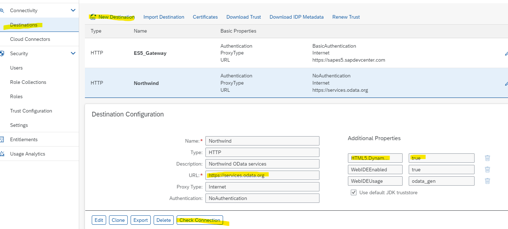
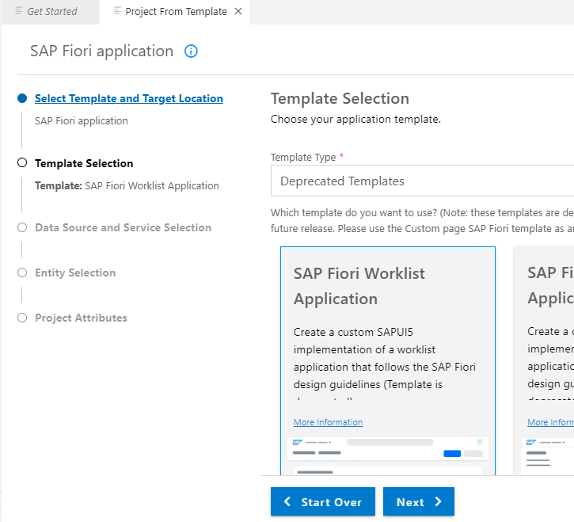
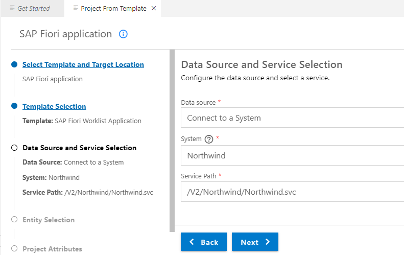
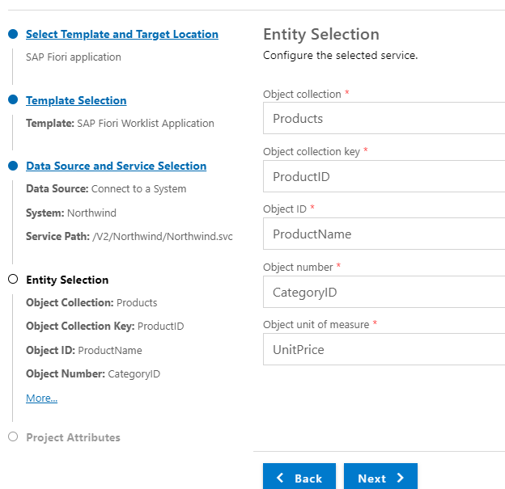
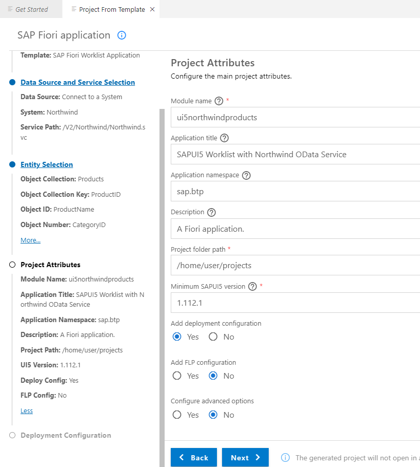
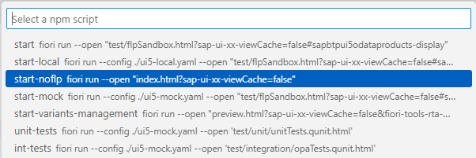
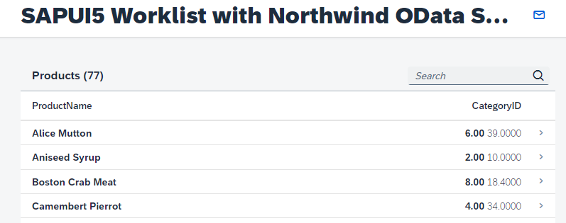
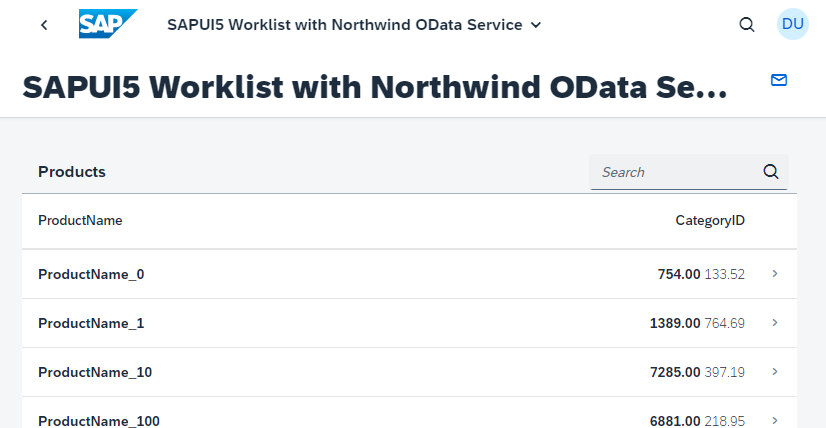

## Develop a SAPUI5 Freesytle App with Nortwind Products OData service

Note: This tutorial is for educational and training purposes and is not suitable for productive use.

<br>

**Prepare**

Open the [SAPUI5 Demo Kit web page](https://sapui5.hana.ondemand.com/#/topic) as a reference. <br>
Open the SAPUI5 Demo Kit [Column List Item Sample](https://sapui5.hana.ondemand.com/#/entity/sap.m.ColumnListItem/sample/sap.m.sample.Table) and [Defining Column Width](https://sapui5.hana.ondemand.com/sdk/#/topic/6f778a805bc3453dbb66e246d8271839) as a reference. <br>
Open [SAP Fiori Tools User Guide](https://help.sap.com/docs/SAP_FIORI_tools/17d50220bcd848aa854c9c182d65b699/f09752ebcf63473e9194ea29ca232e56.html?locale=en-US) as a reference. <br>
If you want to learn more about OData, you can complete the tutorial [Get an Introduction to OData](https://developers.sap.com/group.scp-6-odata-intro.html).


### About ODATA Service Northwind - Products

An easy way to develop **training** applications with SAP Business Application Studio with SAP Fiori Tools is to use a public ODATA services. 

This tutorial uses the public Northwind OData **V2** services. <br>
https://services.odata.org/V2/Northwind/Northwind.svc/  <br>
https://services.odata.org/V2/Northwind/Northwind.svc/$metadata  <br>

Some helpful queries used in this tutorial <br>
https://services.odata.org/V2/Northwind/Northwind.svc/Categories <br>
https://services.odata.org/V2/Northwind/Northwind.svc/Products <br>
https://services.odata.org/V2/Northwind/Northwind.svc/Products(11)/ProductName <br>
This service will be important, as we need a third table to get the CategoryName for the ProductID <br>
https://services.odata.org/V2/Northwind/Northwind.svc/Products?$expand=Category <br>


> Hint: You can check the database design and relations for example with [XOData (external link)](https://pragmatiqa.com/xodata/)


## Develop a SAPUI5 Freestyle App using Categeries and Products

### Prequisites

> Note: If you are not yet familiar with the basics of SAP BTP, Subaccounts for html5 development, Business Application Studio and SAP Fiori Tools, complete this very detailed guide on SAP Discovery Center first: [Get started on SAP BTP creating a "Hello World" app with SAPUI5/Fiori](https://discovery-center.cloud.sap/missiondetail/3585/3628/).

Set-up your Subaccount with Cloud Foundry Environment for HTML5 development including Business Application Studio and create a SAP Fiori Dev Space.

<br>

### Create a Destination in BTP Cockpit 

**Note:** this step is optional and not required if you do not want to deploy your applciation.

1. Enter your BTP account 
   * For trials: https://account.hanatrial.ondemand.com
   * For enterprise accounts: https://emea.cockpit.btp.cloud.sap/cockpit/

2. Choose your Global Account (in case you have more than one)

3. Go to your subaccount, which has the necessary entitlements for Cloud Foundry runtime and Business Application Studio at least.

4. Go to **Connectivity**  --> **Destinations** in the left-handed Cockpit navigation pane.

5. Choose **New Destination**, keep the "Blank Template".

6. Provide the following parameters for the Nortwind service:

   Field Name     | Value
   :------------- | :-------------
   Name           | **`Northwind`**
   Type           | **`HTTP`**
   Description    | **`Northwind OData services`**
   URL            | **`https://services.odata.org`**
   Proxy Type     | **`Internet`**
   Authentication | **`NoAuthentication`**

   And the following *Additional Properties*

   Property Name     | Value
   :------------- | :-------------
   `HTML5.DynamicDestination`           | **`true`**
   `WebIDEEnabled`           | **`true`**

   > Do **not** use the entire path for the URL.  The URL should only be `https://services.odata.org`


   

 7. Check your connection.

<br>

### Prepare your BAS

1. Open your BAS
2. Open your Fiori Dev Space.
3. Optional: This step is only needed if you want to deploy your app into your Cloud Foundry html5 repository.
   Connect to your Cloud Foundry endpoint of your CF subaccount. 
   Start the command palette from the menu View > Find Command, search for cf:login, and select the command `CF:Login to Cloud Foundry`.
   Enter the Cloud Foundry endpoint you want to use. Enter your email and your password to proceed.
   Next, you need to select the Cloud Foundry Organization and space you want use.

### Create a Project from Template with an SAP Fiori List-Detail Application Template 

1. Open your Business Application Studio (BAS)
2. Open the Get Started Home Page (you can reopen it always navigating to Menu Bar --> Help --> Get Started).
3. Select **Start from template**.
4. Select **SAP Fiori Application** and press "Start".
5. Select **SAPUI5 freestyle** as Application Type.
6. Select SAP Fiori **SAP Fiori Worklist Application**.

   

7. In the step **Data Source and Service Selection** select as **Data Source**: 
   * Option A: "Connect to a System" to use the backend Northwind definition. Choose if you want to deploy your app to the backend. <br>
     Choose "Northwind". <br>
     The Service Path is `V2/Northwind/Northwind.svc/`. (wait until the system has checked the provided path)
   * Option B: "Connect to an OData Service" if you dont want to deploy your app.
     The OData V2 service URL is: https://services.odata.org/V2/Northwind/Northwind.svc/ . <br>
     The service metadata will be loaded in the background. 

   

8. Press "Next".

9. Next step is the Service entity selection. You need 1 entity set for the master and the detail view. <br>
    
    **Note:** The Worklist template comes preconfigured for a standard use case. It does not always fit to the service used. So make your best guess. You can change it later.

    For <br>
    **Object collection** select the "table" "Products" <br>
    **Object collection key** select "Product"ID" <br>
    **Object ID** select "ProductName" (just shows the Product name in the list) <br>
    **Object number** select "CategoryID" or "None" <br>
    **Object unit of measure** select "UnitPrice" or "None" <br>


    

    <br>

10. Provide the Project Atrributes <br>
    Modul name: ui5northwindproducts   <br>
    Application title: as you like <br>
    Application namespace: sap.btp  <br>
    Description: as you like <br>
    Project folder path: keep the standards <br>
    Minimum SAPUI5 version: Same, keep it <br>
    Add deployment configuration: "YES" (it is optional, in case you want to deploy to BTP Cloud Foundry runtime) <br>
    Skip FLP and advanced options. You can add FLP configs also later.  <br>

    

11. Choose **Next** or **Finish**. 

12. if you choosed add deployment configuration: "Yes", the Deployment Configuration step screen will appear.
    Target: Choose "Cloud Foundry <br>
    Destination Name: "Northwind" (or "None" if you did not choose to deploy) <br>
    Add application to managed application router?: "Yes" (keep it, this will ease deployment) <br>

13. Choose **Finish**

14. The project will be generated. This takes a minute.

15. Choose "open folder" if asked. You do not use workspaces in this tutorial.

<br>

### Preview your new Application

1. Open your project folder in BAS from Menu Bar with **File --> Open Folder**.

2. Right-click you app **ui5northwindproducts** and select **Preview Application**.

3. Choose **start-noflp** as option (you may also try out other options).

   

4. Disable your pop-up blocker if necessary.

5. Enjoy your app on localhost. Columns and content are not yet perfect. 
   You will do this later in the tuorial.

   


### Optional preview with "start-mock"

There is also the option to start this application just with local mockdata. 

1. Check your folder home/user/project/ui5odataproducts/webapp/localservice. <br>
   The Fiori project generator stored the metadata.xml in your project. So SAPUI5 can create mock-data out of it.

2. Right-click you app ui5odataorders and select **Preview Application**.

3. Choose **start-mock** as option.
   
4. Enjoy the result. Note: It shows also how the redesigned app will look like.

   

<br>

### Examine your SAPUI5 freestyle Worklist Application

**Examine the important files of your project**

1. Open in BAS **Explorer** your folder `home/user/projects`.

2. Open your project `ui5northwindproducts`.

3. You see the folder "webapp" and a couple of config files, which are not relevant for the webapp, but for the UI5 project, using BAS and Fiori Tools:
   * ui5.yaml with the variants -mock, -local and -deploy. Note the backend parameters.
   * xs-security.json contains the security profile of the application. You did not define in this example scopes, roles and attributes.
   * xs-app.json is used to configure the application routing. Note "welcomeFile": "/index.html",  and "source": "^(.*)$", with the cloud foundry service "html5-apps-repo-rt" and the "authenticationType": "xsuaa", which means user have to be authenticated (other option is "none").
   * package.json mainly contains a couple of run configurations. Note the option **start-noflp**, which you have already used.

**Examine the important files of your webapp**

1. Open the webapp folder of your project.
2. Open "index.html", thats your standard home page. 
3. Open manifest.json. Thats your app descriptor.  <br>
   The manifest.json file contains static information about the webapp.  <br>
   It contains mainly the id of the application, the "dataSources" used and the `"routing": { ... } ` definition, which defines when your Worklist.view.xml or Object.view.xml will be called.<br>
   For example, you call the target "object" with the View "Object", when you provide "Products/{objectId}" in the URL. <br>
   This configuration is ok for this tutorial, you can keep it.

4. Open the webapp folder **view**, and open **Worklist.view.xml**. <br>
   
5. Check the items definition for the list-view. It will call the `/Products` from Northwind (Concatenate with Backend destination and Northwind Service URL to https://services.odata.org/V2/Northwind/Northwind.svc/Products). This is fine, you will keep it.

   ```
        items="{
            path: '/Products',
            sorter: {
                path: 'ProductName',
                descending: false
            }
   ```
   
   Check definition of the <table>, <colums> and <items> of this view. 


5. Open **Object.view.xml**. <br>   

6. Check the data source for the Object view. It gets the data from the Worklist view. <br>
   Check the definition of the <semantic:headerContent> in this view. It shows already some data. But in the formatting of the template.  You will change this later.

<br>


## Redesign your Application

We want basically show 4 columns in the detail-view and remove unnecessary template left-overs.

### Changes in the i18n.properties file

You make a small change to see the impact.

1. Open your project folder --> webapp --> i18n.properties

2. Change `worklistTableTitle=SAPUI5 Worklist with Northwind OData Service` to `worklistTableTitle=Manage Products`.

> Tip: You can search in BAS for semantic:headerContent simply by pressing CTRL + F.

We will change other text values directly in Views, for a better training experience.


### Changes in Worklist.view.xml

1. In the <Table> definition, extend the items query in order to get the CategoryName later:
 
   ```
                items="{
                    path: '/Products',
                    parameters: {expand: 'Category'},
                    sorter: {
                        path: 'ProductName',
                        descending: false
                    }

   ```

2. Replace colums and items with your new defition:

```
                <columns>
                    <Column id="nameColumn1">
                        <Text text="{i18n>tableNameColumnTitle}" id="nameColumnTitle1"/>
                    </Column>
                    <Column id="nameColumn2">
                        <Text text="CategoryID" id="nameColumnTitle2"/>
                    </Column>
                    <Column id="nameColumn3">
                        <Text text="Price" id="nameColumnTitle3"/>
                    </Column>
                </columns>

                <items>
                    <ColumnListItem id="CLItem1"
                        type="Navigation"
                        press=".onPress">
                        <cells>
                            <ObjectIdentifier id="ObjId1"
                                title="{ProductName}"/>
                            <ObjectIdentifier  id="ObjId2"
                                title="{Category/CategoryName}"/>
                            <ObjectNumber  id="ObjId3"
                                number="{
                                    path: 'UnitPrice',
                                    formatter: '.formatter.currencyValue'
                                }"
                                unit="EUR" />
                        </cells>
                    </ColumnListItem>
                </items>
```

<br>


### Changes in the Object.view.xml


1. Changes to the Worklist product details in `<semantic:headerContent>`. <br>
   Paste the following code (you may save your old code locally if you want to compare it later). <br>

   ```
        <semantic:headerContent>
            <ObjectAttribute id="OAtt1"
                title="UnitsInStock "
                text="{UnitsInStock}"/>
            <ObjectNumber id="ONum2"
                number="{
                    path: 'UnitPrice',
                    formatter: '.formatter.numberUnit'
                }"
                unit="EUR" />
        </semantic:headerContent>
   ```

   For more ideas on objects to show, visit [SAPUI5 Samples](https://sapui5.hana.ondemand.com/#/controls)
            


6. Preview your Application. Looks much better, isn`t it?

   

<br>


### Conclusion

The tutorial shows how to use a public odata provider to create a Fiori freestyle app in Business Application Studio. The code above can be used as a starting point for learning SAP Fiori Tools in BAS. 