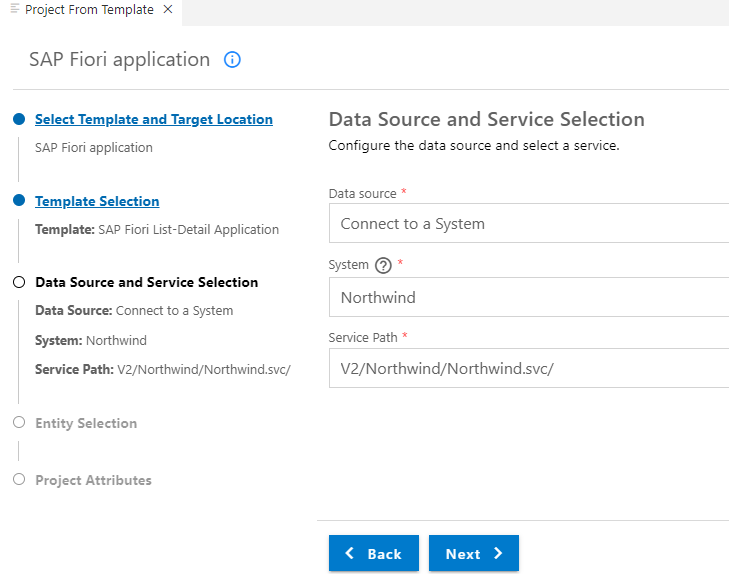
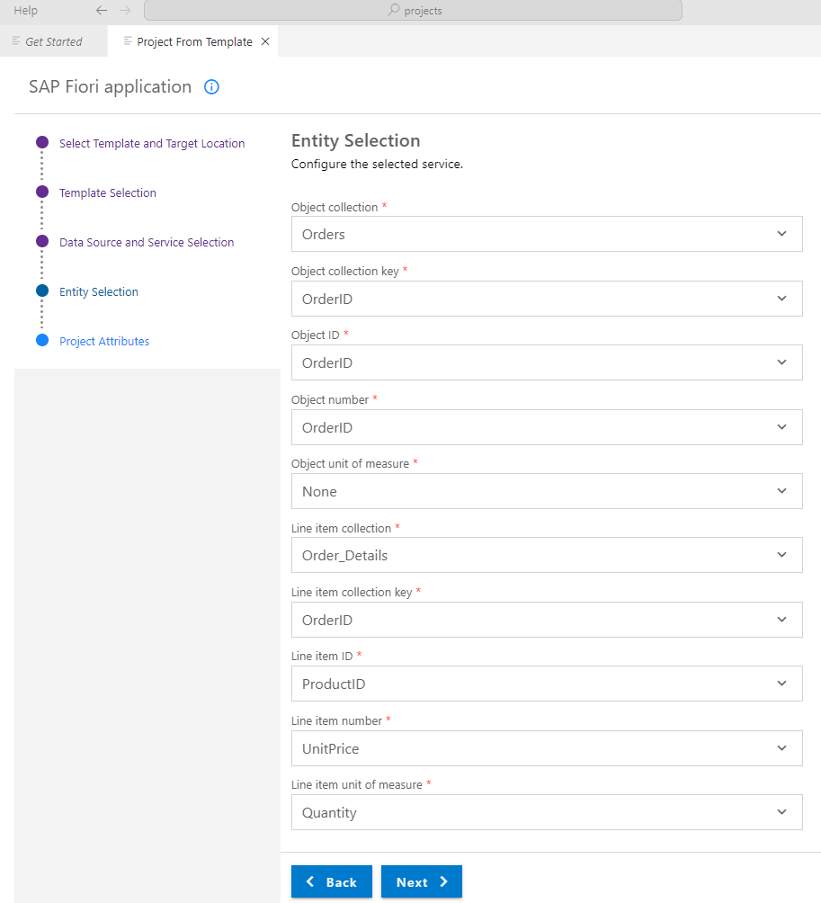
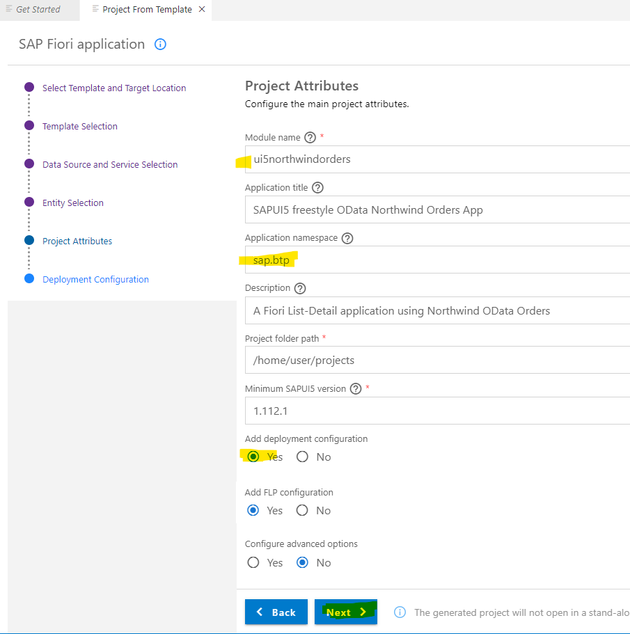
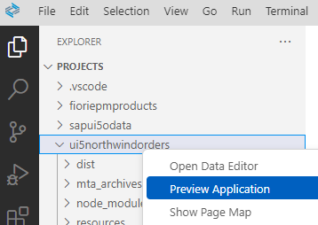
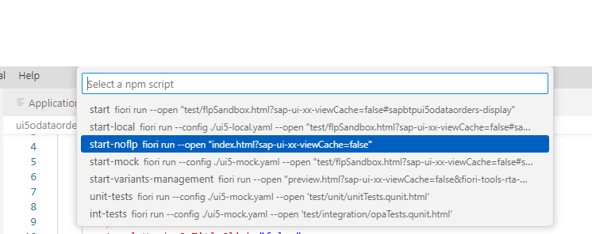
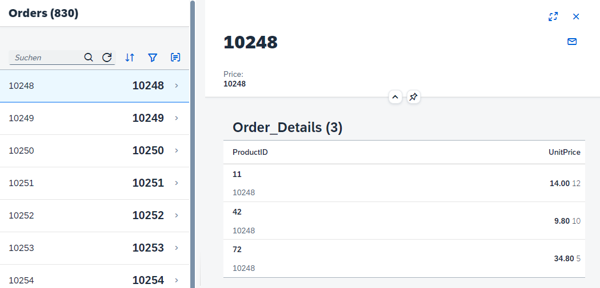
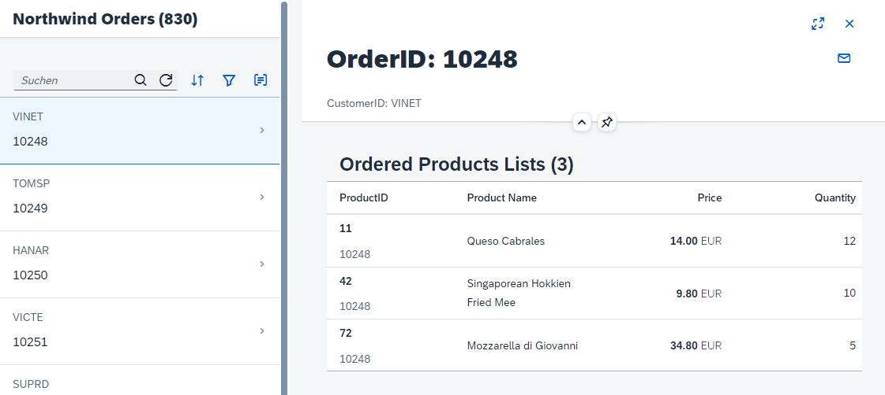

## Develop a SAPUI5 Freesytle App with Nortwind Orders OData service

Note: This tutorial is for educational and training purposes and is not suitable for productive use.
SAP Fiori Templates used in this tutorial are deprecated.

<br>

**Prepare**

Open the [SAPUI5 Demo Kit web page](https://sapui5.hana.ondemand.com/#/topic) as a reference. <br>
Open the SAPUI5 Demo Kit [Column List Item Sample](https://sapui5.hana.ondemand.com/#/entity/sap.m.ColumnListItem/sample/sap.m.sample.Table) as a reference. <br>
Open [SAP Fiori Tools User Guide](https://help.sap.com/docs/SAP_FIORI_tools/17d50220bcd848aa854c9c182d65b699/f09752ebcf63473e9194ea29ca232e56.html?locale=en-US) as a reference.
If you want to learn more about OData, you can complete the tutorial [Get an Introduction to OData](https://developers.sap.com/group.scp-6-odata-intro.html).


### About ODATA Services Northwind - Orders

An easy way to develop **training** applications with SAP Business Application Studio with SAP Fiori Tools is to use a public ODATA services. 

This tutorial uses the public Northwind OData **V2** services. <br>
https://services.odata.org/V2/Northwind/Northwind.svc/  <br>
https://services.odata.org/V2/Northwind/Northwind.svc/$metadata  <br>

Some helpful queries used in this tutorial <br>
https://services.odata.org/V2/Northwind/Northwind.svc/Orders <br>
https://services.odata.org/V2/Northwind/Northwind.svc/Orders(10248)/Order_Details <br>
This service will be important, as we need a third table to get the productname for the ProductID <br>
https://services.odata.org/V2/Northwind/Northwind.svc/Orders(10248)/Order_Details?$expand=Product <br>


> Hint: You can check the database design and relations for example with [XOData (external link)](https://pragmatiqa.com/xodata/)

<br>

## Develop a SAPUI5 Freestyle app using Northwind Orders

### Prequisites

> Note: If you are not yet familiar with the basics of SAP BTP, Subaccounts for html5 development, Business Application Studio and SAP Fiori Tools, complete this very detailed guide on SAP Discovery Center first: [Get started on SAP BTP creating a "Hello World" app with SAPUI5/Fiori](https://discovery-center.cloud.sap/missiondetail/3585/3628/).

Set-up your Subaccount with Cloud Foundry Environment for HTML5 development including Business Application Studio and create a SAP Fiori Dev Space.

<br>

### Create a Destination in BTP Cockpit 

**Note:** this step is optional and not required if you do not want to deploy your applciation.

1. Enter your BTP account 
   * For trials: https://account.hanatrial.ondemand.com
   * For enterprise accounts: https://emea.cockpit.btp.cloud.sap/cockpit/

2. Choose your Global Account (in case you have more than one)

3. Go to your subaccount, which has the necessary entitlements for Cloud Foundry runtime and Business Application Studio at least.

4. Go to **Connectivity**  --> **Destinations** in the left-handed Cockpit navigation pane.

5. Choose **New Destination**, keep the "Blank Template".

6. Provide the following parameters for the Nortwind service:

   Field Name     | Value
   :------------- | :-------------
   Name           | **`Northwind`**
   Type           | **`HTTP`**
   Description    | **`Northwind OData services`**
   URL            | **`https://services.odata.org`**
   Proxy Type     | **`Internet`**
   Authentication | **`NoAuthentication`**

   And the following *Additional Properties*

   Property Name     | Value
   :------------- | :-------------
   `HTML5.DynamicDestination`           | **`true`**
   `WebIDEEnabled`           | **`true`**

   > Do **not** use the entire path for the URL.  The URL should only be `https://services.odata.org`


   

 7. Check your connection.

<br>

### Prepare your BAS

1. Open your BAS
2. Open your Fiori Dev Space.
3. Optional: This step is only needed if you want to deploy your app into your Cloud Foundry html5 repository.
   Connect to your Cloud Foundry endpoint of your CF subaccount. 
   Start the command palette from the menu View > Find Command, search for cf:login, and select the command `CF:Login to Cloud Foundry`.
   Enter the Cloud Foundry endpoint you want to use. Enter your email and your password to proceed.
   Next, you need to select the Cloud Foundry Organization and space you want use.

### Create a Project from Template with an SAP Fiori List-Detail Application Template 

1. Open your Business Application Studio (BAS)
2. Open the Get Started Home Page (you can reopen it always navigating to Menu Bar --> Help --> Get Started).
3. Select **Start from template**.
4. Select **SAP Fiori Application** and press "Start".
5. Select **Deprecated Templates** (formerly SAPUI5 freestyle) as Template Type.
6. Select SAP Fiori **List-Detail Application**.
7. In the step **Data Source and Service Selection** select as **Data Source**: 
   * Option A: "Connect to a System" to use the backend Northwind definition. Choose if you want to deploy your app to the backend. <br>
     Choose "Northwind". <br>
     The Service Path is `V2/Northwind/Northwind.svc/`. (wait until the system has checked the provided path)
   * Option B: "Connect to an OData Service" if you dont want to deploy your app.
     The OData V2 service URL is: https://services.odata.org/V2/Northwind/Northwind.svc/ . <br>
     The service metadata will be loaded in the background. 

   

8. Press "Next".

9. Next step is the Service Entity Selection. You need 2 entity sets, one for the list view and one for detail view. <br>
    
   **Note:** The List-Detail template comes preconfigured for a standard use case for list-detail applications. It does not always fit to the service used. So make your best guess. You will change it later.
    

   For <br>
   **Object collection** select the "table" "Orders" <br>
   **Object collection key** select "OrderID" <br>
   **Object ID** select "OrderID" (again, we do not want to sort by CustomerID, you change this later) <br>
   **Object number** select "OrderID" (as we dont have a price in Northwind Orders) <br>
   **Object unit of measure** select "OrderID" (as we dont have a Unit in Northwind Orders) <br>

   For  <br>
   **Line item collection** select the "table" "Order_Details" <br>
   **Line item collection key** select "OrderID" <br>
   **Line item ID** select "ProductID" <br>
   **Line item number** select "UnitPrice" <br>
   **Line item unit of measure** select "Quantity" <br>

    

    <br>

10. Provide the Project Atrributes <br>
    Modul name: ui5northwindorders   <br>
    Application title: as you like <br>
    Application namespace: sap.btp  <br>
    Description: as you like <br>
    Project folder path: keep the standards <br>
    Minimum SAPUI5 version: Same, keep it <br>
    Add deployment configuration: "YES" (it is optional, in case you want to deploy to BTP Cloud Foundry runtime) <br>
    FLP: "Yes" (optional, you can add FLP configs also later)
    Advanced options: "No" .  <br>

    

11. Choose **Next** or **Finish**. 

12. if you choosed add deployment configuration: "Yes", the Deployment Configuration step screen will appear.
    Target: Choose "Cloud Foundry <br>
    Destination Name: "Northwind" (or "None" if you did not choose to deploy) <br>
    Add application to managed application router?: "Yes" (this make deployment much easier) <br>

14. Choose **Finish**

15. The project will be generated. This takes a minute.

16. Choose "open folder" if asked. You do not use workspaces in this tutorial.

<br>

### Preview your new Application

1. Open your project folder in BAS from Menu Bar with **File --> Open Folder**.

2. Right-click you app **ui5northwindorders** and select **Preview Application**.

   

3. Choose **start-noflp** as option (you may also try out other options).

   

4. Disable your pop-up blocker if necessary.

5. Enjoy your app on localhost. Not very human-readable so far. 
   The List-view and the Detail-view could be improved. You will do this later in the tuorial.

   


<br>

### Examine your SAPUI5 freestyle List-Detail Application

**Examine the important files of your project**

1. Open in BAS **Explorer** your folder `home/user/projects`.

2. Open your project `ui5northwindorders`. <br>

3. You see the folder "webapp" and a couple of config files, which are not relevant for the webapp, but for the UI5 project, using BAS and Fiori Tools:
   * ui5.yaml with the variants -mock, -local and -deploy. Note the backend parameters.
   * xs-security.json contains the security profile of the application. You did not define in this example scopes, roles and attributes.
   * xs-app.json is used to configure the application routing. Note "welcomeFile": "/index.html",  and "source": "^(.*)$", with the cloud foundry service "html5-apps-repo-rt" and the "authenticationType": "xsuaa", which means user have to be authenticated (other option is "none").
   * package.json mainly contains a couple of run configurations. Note the option **start-noflp**, which you have already used.

**Examine the important files of your webapp**

1. Open the webapp folder of your project.
2. Open "index.html", thats your standard home page. 
3. Open "manifest.json". Thats your app descriptor.  <br>
   The manifest.json file contains static information about the webapp.  <br>
   It contains mainly the id of the application, the "dataSources" used and the `"routing": { ... } ` definition, which defines when your List.view.xml or Detail.view.xml will be called.<br>
   For example, you call the target "object" with the View "Detail", when you provide "Orders/{objectId}" in the URL. <br>
   This configuration is ok for this tutorial, you can keep it.

4. Open the webapp folder **view**, and open **List.view.xml**. <br>
  
    > Tip: You can search in BAS for your search text simply by pressing CTRL + F. Either in the Project folder or in the Editor.
   
5. Check the items definition for the list. It will call the `/Orders` from Northwind (Concatenate with  Backend destination and Northwind Service URL to https://services.odata.org/V2/Northwind/Northwind.svc/Orders ). 
   This is fine, you will keep it.

   ```
   items="{
        path: '/Orders',
        sorter: {
            path: 'OrderID',
            descending: false
        },
   ```
   
   Check definition of the <List> and <items> of this view. You will change this later.


5. Open **Detail.view.xml**. <br>   

6. Check the data source for the detail list: <br>
   `items="{Order_Details}"` <br>
   This definition just shows a flat Order_details list from Northwind. The ProductName is missing. You will change this later.
   
   Check the definition of the <items> shown in this view. It show already basic data. The Productname is missing and the UnitPrice has no currency. You will change this later.  
   ``` 
    <items>
        <ColumnListItem>
            <cells>
                <ObjectIdentifier
                    title="{ProductID}"
                    text="{OrderID}"/>
                <ObjectNumber
                    number="{
                        path: 'UnitPrice',
                        formatter: '.formatter.currencyValue'
                    }"
                    unit="{Quantity}" />
            </cells>
        </ColumnListItem>
    </items>
   ``` 


<br>


## Redesign your Application

We want to see the OrderID and CustomerID on the List-view and the ProductID, ProductName and the UnitPrice on the corresponding Detail-view.

### Optional: Changes in the manifest.json file

As you use a deprecated template, correct the settings: 

1. Open ui5northwindorders/webapp/manifest.json

2. Search for 

```
"sap.ui5": {
        "flexEnabled": true,
```
3. Set it to `false`.


### Changes in the i18n.properties file

You make a small change to see the impact.

1. Open your project folder --> webapp --> i18n.properties

2. Change `listTitleCount=Orders ({0})` to `listTitleCount=Northwind Orders ({0})`

> Tip: You can search in BAS for semantic:headerContent simply by pressing CTRL + F.

We will change other text values directly in Views, for a better training experience.


### Changes in List.view.xml

You add CustomerID in the list. This means removing the number and numberUnit fields from our master list and adding customer ID in the list item. 

```
   <items>
       <ObjectListItem
		   type="Navigation"
		   press=".onSelectionChange"
		   title="{OrderID}"
	   	   intro="{CustomerID}">
	   </ObjectListItem>
   </items>
```
<br>


### Changes in the Detail.view.xml

1. Make a small change in the Title of the detail view. Rename 

   ```
   <semantic:titleHeading>
   <Title
        text="{OrderID}"
        level="H2"/>
    ``` 

    to for example `text="OrderID: {OrderID}"`. <br>
    Note: This change is not i18n enabled.


2. Next, add the customer ID at the top of the detail view instead of price total, which we dont know anyways. 
   To do this change the contents of the `<semantic:headerContent>` tag in Detail.view.xml to: 

   ```
    <semantic:headerContent>
	    <ObjectAttribute title="CustomerID" text="{CustomerID}"/>
    </semantic:headerContent>
   ```

   >Tip: You can search in BAS for semantic:headerContent simply by pressing CTRL + F.


3. Change your data source in the `<Table>` definition.  <br>
   Change `items="{Order_Details}" `  to  <br>
   `items="{path: 'Order_Details', parameters: {expand: 'Product'} }"` <br>
   Otherwise you cannot show the ProductName.


4. Next make changes to the order details in `<columns>` and `ColumnListItem`. <br>
   Paste the following code (you may save your old code locally if you want to compare it later).

   ```
                <columns>
                    <Column>
                        <Text text="{i18n>detailLineItemTableIDColumn}"/>
                    </Column>
                    <Column>
                        <Text text="Product Name"/>
                    </Column>
                    <Column hAlign="End">
                        <Text text="Price"/>
                    </Column>
                    <Column
                        minScreenWidth="Tablet"
                        demandPopin="true"
                        hAlign="End">
                        <Text text="Quantity"/>
                    </Column>
                </columns>
   ```

   Note: we defined also a minimum screen size for tablets, and allow the app to hide the last column if necessary with `demandPopin="true"` .


5. Change also the related items for the columns:

    ```
                <items>
                    <ColumnListItem>
                        <cells>
                            <ObjectIdentifier
                                title="{ProductID}"
                                text="{OrderID}"/>
                            <Text
						        text="{Product/ProductName}" />
					        <ObjectNumber
                                number="{
                                    path: 'UnitPrice',
                                    formatter: '.formatter.currencyValue'
                                }"
                                unit="EUR" />
                             <Text
						        text="{Quantity}" />
                        </cells>
                    </ColumnListItem>
                </items>
    ```                    


6. Preview your Application. Looks much better, isn`t it?

   

<br>


## Build and Deploy your Application


#### Optional: Enhance your App with a BTP Backend Destination

If you did not use the BTP Destination Service as Data Source when you created the app, you canadd this information to your project.

1. Run in the menue bar of BAS **View** --> **Command Palette** (Ctrl + Shift +P). 

2. Select **Fiori: Add Deployment Configuration**

3. Choose you project.

4. Choose Northwind as Destination name.

5. Choose "Yes", overwrite your settings and press "Finish".


This will do the following changes. <br>
In the  **/ui5northwindorders/xs-app.json** file:

```
{
  "welcomeFile": "/index.html",
  "authenticationMethod": "route",
  "routes": [
    {
      "source": "^/V2/(.*)$",
      "target": "/V2/$1",
      "destination": "Northwind",
      "authenticationType": "none",
      "csrfProtection": false
    },
...

```

In the `ui5.yaml` file:

   ```
        backend:
          - path: /V2
            url: https://services.odata.org
            destination: Northwind
   ```

### Build, Deploy and Run your App

1. Select the mta.yaml file of project 

2. right click and select Build MTA.


### Conclusion

The tutorial shows how to use a public odata provider to create a Fiori app in Business Application Studio. The code above can be used as a starting point for learning SAP Fiori Tools in BAS. 
