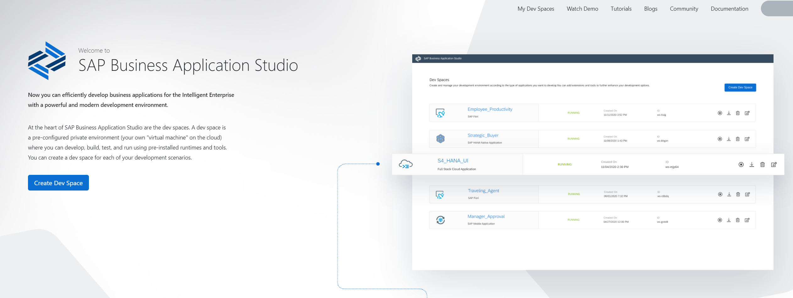
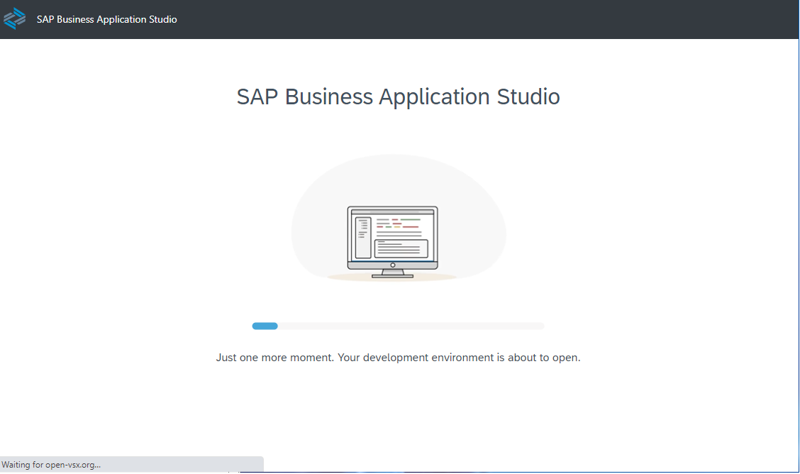

## Set-up SAP Business Application Studio

**Preparation**

1. Click Instances and Subscriptions under Services

2. Select the tab Subscriptions, and click on SAP Business Application Studio. You will be forwarded to your SAP Business Application Studio Home Page with automatic login to the application.

   
 

3. Please, accept the Privacy Statement

   
 

4. Browse the SAP Business Application Studio home page.

   

 
 

**Create a Dev Space in SAP Business Application Studio**

1. Click on Create Dev Space on the SAP Business Application Studio home page (or select "My Dev Spaces" if you already have one).

   

 

2. Enter a name of your choice for the space (for example, "devdemo") in the upper left corner and choose the application type SAP Fiori (Choosing SAP Fiori eases the creation of a deployable application compared to application type "Basics"). You don't have to select any additional SAP Extensions here. 
 

3. Click again **Create Dev Space** in the lower right corner. 

   
   
   You will be forwarded to an overview of your dev space(s).

   It may take some time until the newly created dev space is started. Once started the status changes from "STARTING" to "RUNNING” and the dev space name (in this case "devdemo") will turn into a blue hyperlink.
    

4. Click on the dev space link (e.g. "devdemo") to enter the space.

   

   After a few seconds ...

   

   ... you will see the Welcome Page of your dev space:

   

 
