## Add your Project to a Git Source Control and Remote Repository 

SAP Business Application Studio (BAS) enables you to connect and interact with the **Git source control** system, letting you connect and interact with **remote Git repositories**.
Using SAP Business Application Studio, you can connect to all public git services, such as GitHub, GitLab, and BitBucket.

There are two different ways to add a Git Remote Repository. You can either add a **Remote Repository** to an existing project (recommended for this tutorial) or you can **Clone a Repository** from GitHub. However cloning needs some additional configuration in CI/CD service.
 

In this section you will add the  Hello World UI5 project to Business Application Studio Source Control, commit and push the project and changes to a remote Git repository.

**Note:** To work with the Git view in SAP Business Application Studio, you need to store or cache credentials. Doing this requires you to entrust your credentials to SAP and to a third party.

    <h3>Step 1 - Create a new and empty Github Repository </h3>

 

This step describes how to create a Github repository in which you can store the source code of your project. You need to have a user in a public GitHub to execute the steps below.

> **Warning:**
> 
> Create a **new, fresh and empty repository**. Do not  use an existing repository, which has already commits. 
> Do not create a README.md file or anything else for the new repo (for example, your BAS project already contains a README.md file). 
You would need to merge two commit histories before you can proceed, which you should only do if you are already pretty familiar wit Git. 
And the procedure to do so is not part of this mission.

 

**Procedure**

1. Open your github home page.

2. Click on *New* in the **Repository** tab to create a new repository.

    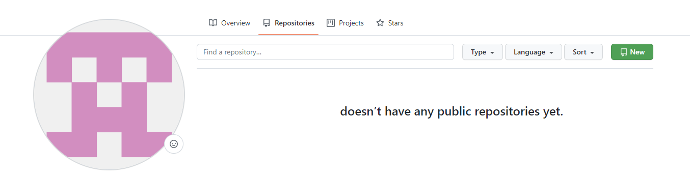
   
 

3. Enter a GitHub organization (can also be your user) and the name of the repository. 
    For example, `Gitorg/btp-helloworld-app`.  
    **Do not check the checkbox Intialize this repository with a README**.

5. Click on create repository. 

    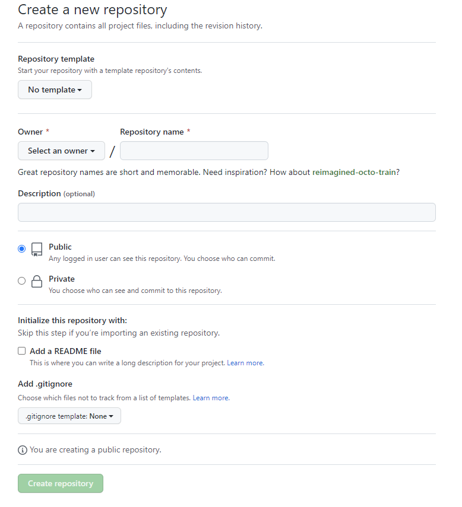

 

5. **Do not create any files.**
   Copy the github url of the newly created Git repository.

    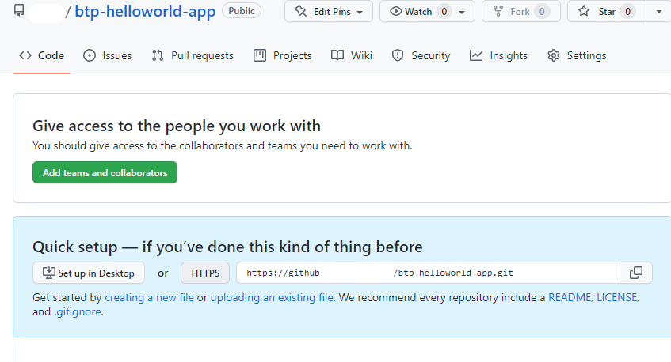

 

<h3>Step 2 - Generate a Personal Access Token    </h3>

 
This step might be necessary if your GitHub repository does not accept Git password.
  
In this mission you will connect to a public GitHub Repository using **basic authentication** with GitHub **Personal Access Token (PAT)**.

**Procedure**  
  
You can create a PAT in GitHub following these [instructions (external link)](https://docs.github.com/en/authentication/keeping-your-account-and-data-secure/creating-a-personal-access-token). Other Git providers will have different ways of creating PATs.

**Note:** SAP Business Application Studio can connect to on premise Git repositories or public Git repositories using Cloud Connector. 
Connecting to on premise repositories is not part of this mission (see [Connecting to a Corporate Git Repository](https://help.sap.com/docs/SAP%20Business%20Application%20Studio/9d1db9835307451daa8c930fbd9ab264/d54ddfc1bc4f45b19dabfa0950799685.html?locale=en-US) on SAP Help Portal).
 

<h3>Step 3 - Add a Remote Repository to your HelloWorld Project  </h3>

 

In this step you add the remote repository you just created on GitHub to your HelloWorld UI5 Project from the previous section of the mission.

**Procedure**

1. As described in the previous sections of the mission, open your BTP subaccount again.
2. Open the service Business Application Studio again.
3. If your Dev Sapce has stopped, click start to start your dev space again and open your dev space once it has started.
4. Open your workspace or project from folder **/home/user/projects/helloworldui5**. 
5. Navigate in the left-handed pane to **GitLens**.
   you can see, that you did not yet configire a **Remote**
   
   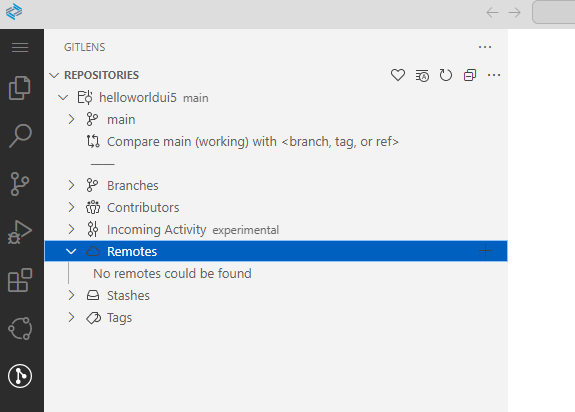
   
    
   
 6. Add a Remote configuration by pressing the **"+" Button**.
    Provide any name for your remote.

   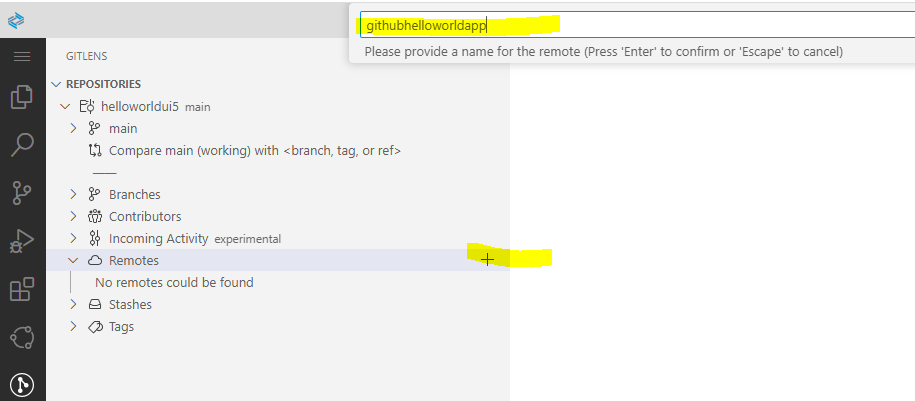

     
 
7. Provide the repository URL of your GitHub Repository

   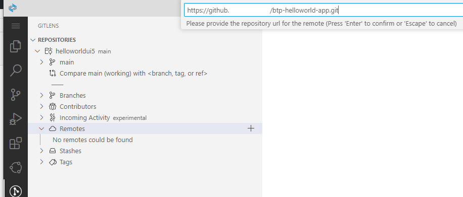

     
    
8. Provide GitHub user name and password (or PAT - personal access token).

   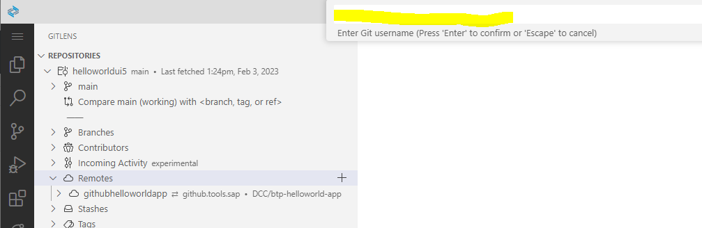
   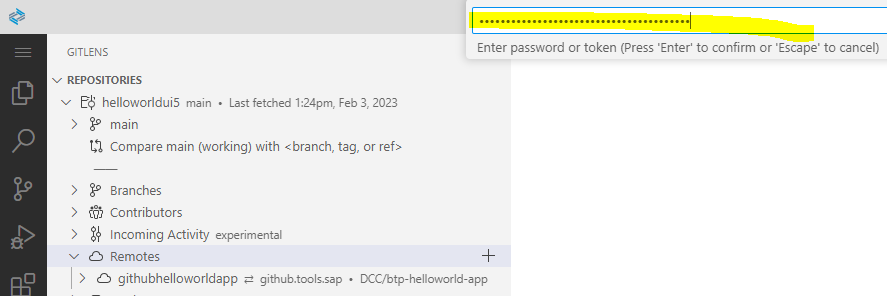

9. Save GitHub credentials for this session or as plaintext in your devspace.

   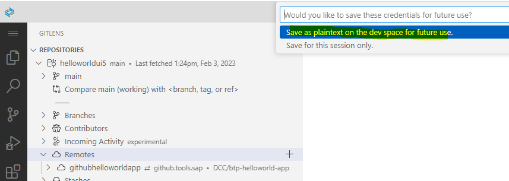

10. Iy you made any mistake, delete your remote definition and repeat. 
    You will have to use terminal, which you can start preconfigured from the context of your remote entry
    
     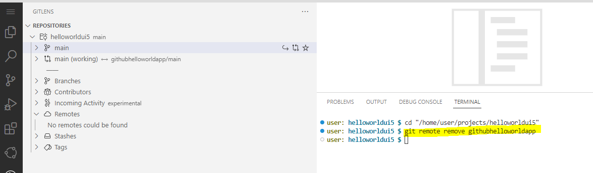
    
11. Check the result of your configuration.
    You see the **hellowordui5** project is now green, means in the status of Git "untracked".
    Your remote repository is still empty.
    
     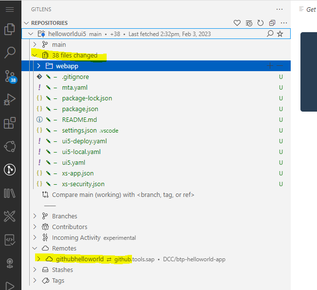

     

12. Next step is to **Commit** your files in Git. 
    Select the icon **"Source Control"** in the left-handed navigation pane.
    Provide a commit text (in this case we typed "initial commit") and press **"Commit"**.
    If you get a warning, that you did not **"stage your changes"** all commits, press **"Yes"** to proceed.
        
    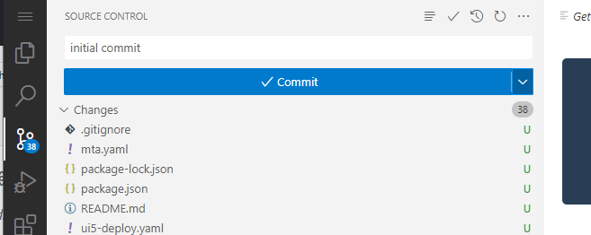
    
    
13. Check your remote repo. It is still empty. 
    The commit updates only the Git status of your local project. 
    To change this, you must **Publish the Branch** to your remote repository.
    To do so, choose "Source Control" again, provide some text and publish your branch. 
    
    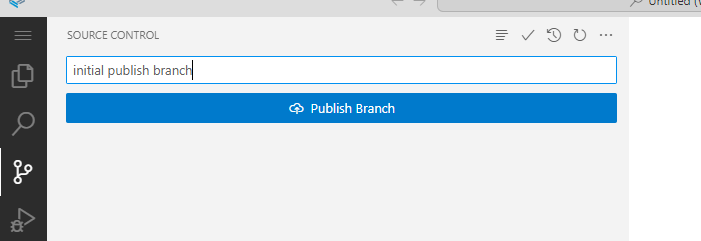
    
     
    
    Naviagte to your remote repo. You will se its now updated.
    
     

    <h3>Step 4 - Make Changes in your Project and Commit to your Remote Repository</h3>

 

In this section we want to change the existing Hello World project, track the changes, commit in Git, sync and push changes to the remote Git repo.

**Procedure**

1. Open your project in the **Menu (Bar)** from the file folder "/home/user/projects/helloworldgui5" if not done so already.

2. Click on the left-handed icon **Explorer** and navigate to your view "View1".  

     
     
      
    
3. Right-click on **View1** and choose **Open With**. 
   you have the option to use the either the **Text Editor** or the **Layout Editor**. Try both. 
   We will do the changes in the Text Editor, which is much easier for the small task.
   
   
   
4. Change the Page Title to **"Hello World"**. Using a static name will also increase the performance slightly.

    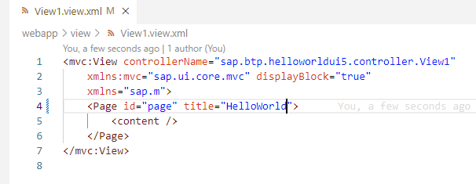
    
 
    
5. Navigate back to your Source Control using the icon "Source Control".  
   You will see you changes under `Changes`.   
   You can also switch from "Commit" to "Commit&Push" by clicking the small dropdown icon next to the "Commit" button.   

   

 

6. Check your updated Remote repository on GitHub.

   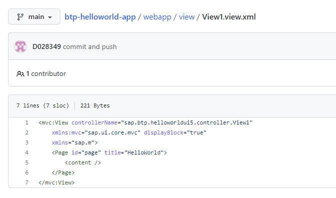

 

